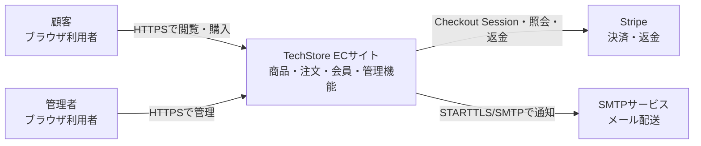
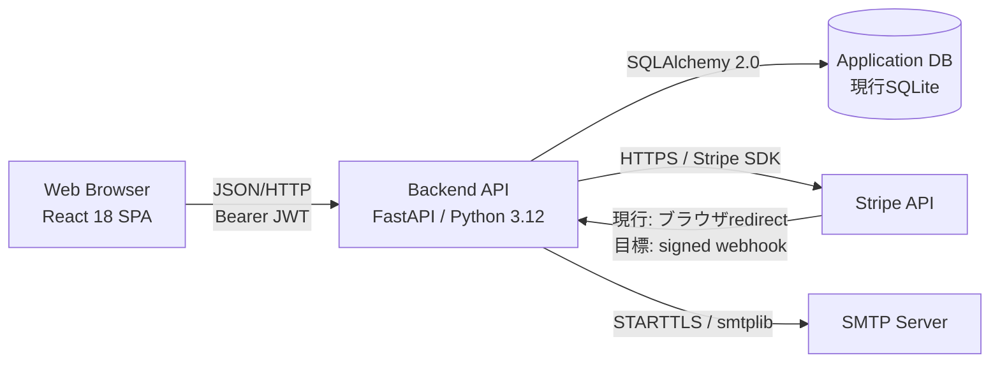

# アーキテクチャ概要

## 1. 対象とビューポイント

対象はTechStore ECサイトの実行時システム全体である。本書は利用者・外部システムとの境界を示すコンテキストビューと、React、FastAPI、DB、外部サービスの責務を示すコンテナビューを提供する。Python内部の詳細は[モジュール設計](../internal_design/02_module_design.md)を参照する。

| ステークホルダー | 主な関心事 | 対応ビュー/文書 |
|---|---|---|
| 顧客 | 購入の正確性、個人情報、決済、通知 | コンテキスト、セキュリティ、シーケンス |
| 管理者 | 在庫・注文・返金・売上の整合性 | コンテナ、データ、トランザクション |
| 開発者 | 責務分離、変更影響、テスト容易性 | コンテナ、モジュール、ADR |
| 運用者(将来) | 配備、監視、復旧、シークレット | デプロイ、運用監視 |

## 2. System Context

凡例: 四角は人またはソフトウェアシステム、矢印は主要な通信方向を表す。GitHub Actions等の開発基盤は実行時境界外のため省略する。

## 3. Container

| コンテナ | 責務 | 主な技術 | 永続状態 |
|---|---|---|---|
| Web Browser | UI、画面状態、API呼び出し、JWT保持 | React/Vite | localStorageのJWT(再評価対象) |
| Backend API | 認証、業務ルール、外部連携、DB更新 | FastAPI、SQLAlchemy、Pydantic | 原則なし。レート制限は現行プロセス内状態 |
| Application DB | 会員、商品、カート、注文等 | SQLite | あり |
| Stripe | カード決済・返金 | Stripe Checkout/API | システム境界外 |
| SMTP | メール配送 | SMTP/STARTTLS | システム境界外 |

## 4. 主要データフローと信頼境界

| フロー | 境界 | 主な保護・課題 |
|---|---|---|
| Browser → API | 信頼できない入力 | Pydantic検証、認証・認可。XSS時のlocalStorage JWT流出リスク |
| API → DB | アプリ/永続層 | トランザクション、制約、競合制御。現行SQLiteは単一構成向け |
| API → Stripe | 外部事業者 | TLS、APIキー、所有者照合。Webhook・冪等性が未実装 |
| API → SMTP | 外部事業者 | STARTTLS、認証情報。配信結果・再試行・バウンス未管理 |

## 5. 横断的設計判断

| 判断 | 現状 | 根拠/状態 |
|---|---|---|
| SPA + JSON API | 採用 | 学習目的とUI/API分離 |
| JWT Bearer | 採用済み | 60分有効。保存方式は未決 |
| Stripe Checkout | 採用 | カード情報を保持しない |
| SQLAlchemy ORM | 採用 | 2.0スタイルへ統一済み |
| SQLite | 開発・テストで採用 | 本番DBは未決定 |
| 同期処理 | 現行 | メール・Stripeを同期呼び出し。キュー/Outbox未導入 |

重要な不可逆または横断的な判断は、今後`docs/deliverables/architecture/adr/`へADRとして記録する。

## 6. 既知のアーキテクチャリスク

- Stripe決済確定がブラウザリダイレクト依存で、Webhook正経路がない
- 在庫・クーポンに競合制御がなく、同時注文で整合性を失う可能性がある
- DBとStripe/SMTPをまたぐ処理にOutbox、補償ジョブ、冪等性記録がない
- JWTをlocalStorageへ保存し、本番シークレットのfail-closedがない
- 本番デプロイ、監視、バックアップ、RTO/RPOが未決定

詳細は[エラー・トランザクション設計](../internal_design/04_error_handling_design.md)、[デプロイ設計](02_deployment_design.md)を参照する。
