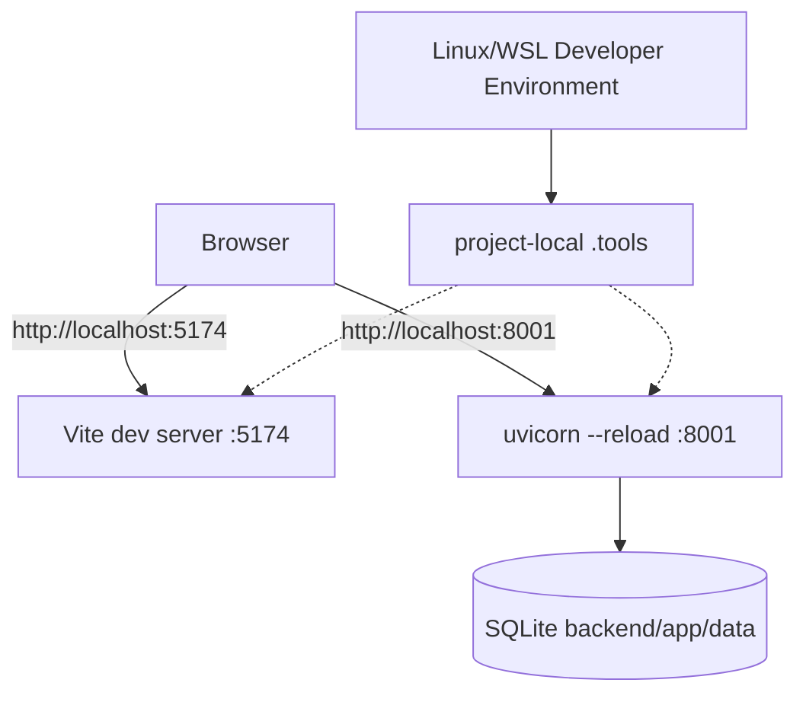

# デプロイ・構成設計

## 1. 環境の状態

| 環境 | 状態 | 用途 | データ |
|---|---|---|---|
| local | 実装済み | Linux/WSL上の開発、手動確認 | `backend/app/data/ec_site.db` |
| test | 実装済み | pytest/Vitest/Playwright | 一時SQLite、モック外部サービス |
| CI | 実装済み | lint、test、build、監査、OpenAPI差分 | GitHub-hosted runner上の一時データ |
| staging | 未定義 | 本番相当前検証 | 未定 |
| production | 未定義 | 商用運用 | 未定 |

localはDockerを使わず、`.tools/`の固定版toolchainからbackend/frontendをホストプロセスとして起動する。設定はroot `.env`から注入する。productionで既知の開発用SECRET_KEYや設定不足を使うことは`config.py`が拒否する。

## 2. ローカル構成

`make dev`が両プロセスを起動し、`Ctrl+C`で子プロセスも終了する。外部公開を意図した構成ではない。

## 3. 構成値一覧

| 変数 | 使用箇所 | 必須性/既定値 | 機密 | 備考 |
|---|---|---|---|---|
| `APP_ENV` | `config.py` | `local` | いいえ | `local/test/staging/production`のみ |
| `DATABASE_URL` | `config.py`, `database.py` | local未設定時はSQLite | 条件付き | productionでは明示必須 |
| `SECRET_KEY` | `config.py`, `auth.py` | localは開発用fallback | はい | productionでは32文字以上が必須 |
| `FRONTEND_URL` | `config.py` | `http://localhost:5174` | いいえ | メールリンク・redirect用 |
| `CORS_ORIGINS` | `config.py`, `main.py` | 未設定時は`FRONTEND_URL` | いいえ | productionはHTTPSのみ |
| `STRIPE_ENABLED` | `config.py` | キー設定時のみ有効 | いいえ | `true`時はsecret key必須 |
| `STRIPE_SECRET_KEY` | `config.py` | 任意 | はい | 未設定時はStripe機能無効 |
| `EMAIL_DELIVERY` | `config.py`, `email_utils.py` | localは`console` | いいえ | `console/disabled/smtp` |
| `SMTP_HOST` | `config.py` | smtp選択時必須 | いいえ | SMTP接続先 |
| `SMTP_PORT` | `email_utils.py` | `587` | いいえ | STARTTLS |
| `SMTP_USER` | `email_utils.py` | 任意 | 条件付き | SMTP認証 |
| `SMTP_PASSWORD` | `email_utils.py` | 任意 | はい | ログ出力禁止 |
| `FROM_EMAIL` | `email_utils.py` | local既定値あり | いいえ | 本番は検証済みdomain |
| `LOG_LEVEL` | `logging_config.py` | `INFO` | いいえ | 許容値を検証 |
| `VITE_API_URL` | frontend | local既定値あり | いいえ | browser公開設定 |

root `.env.example`を設定項目の正本とし、gitignoredのroot `.env`だけに実値を置く。

## 4. 本番化ゲート

productionの配布方式は未決定であり、コンテナ採用を前提にしない。次を完了してADRと本書へ反映するまで本番運用可能とは扱わない。

1. host、region、domain、process supervisor、frontend配信方式を決定する
2. TLS終端とHTTPからHTTPSへのredirectを構成する
3. 本番DB、永続storage、versioned migrationを導入する
4. secret管理機構を選び、既定secretとconsoleメールを拒否する
5. Stripe Webhookの署名、冪等性、再試行を実装する
6. backup、復旧試験、RPO/RTOを定義する
7. health check、log、metrics、alert、連絡先を定義する
8. reloadと開発依存を除いたrelease起動手順を定義する
9. stagingでmigration、決済、メール、復旧を検証する

## 5. スケール上の制約

- プロセス内rate limitはworker/instanceごとに分裂する
- SQLiteは複数instance共有を前提としない
- local file DBは単一host外の永続性・可用性を保証しない
- sessionはJWTでstatelessだが、DBとrate limitが水平scaleを制約する

これらを解消するまでは単一backendプロセスを前提とする。ただし単一プロセスであることは可用性を保証しない。
