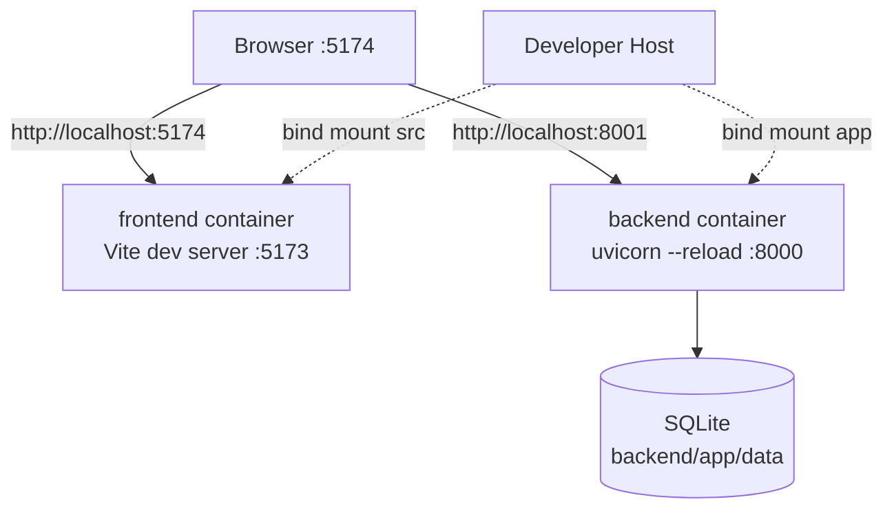

# デプロイ・構成設計

## 1. 環境の状態

| 環境 | 状態 | 用途 | データ |
|---|---|---|---|
| local | 実装済み | 開発、手動確認 | `backend/app/data/ec_site.db` |
| test | 実装済み | pytest/Vitest/Playwright | 一時SQLite、モック外部サービス |
| CI | 実装済み | lint、テスト、build、監査、OpenAPI差分 | GitHub-hosted runner上の一時データ |
| staging | 未定義 | 本番相当前検証 | 未定 |
| production | 未定義 | 商用運用 | 未定 |

現行Docker ComposeとDockerfileは開発用である。`uvicorn --reload`、Vite dev server、ソースbind mount、既知の開発用SECRET_KEYを使うため、本番デプロイ構成として使用してはならない。

## 2. ローカル構成

公開ポートはfrontend `5174→5173`、backend `8001→8000`。Docker内部でfrontendからbackendへ通信するのではなく、ブラウザがホスト公開ポートへ直接アクセスする。

## 3. 構成値一覧

| 変数 | 使用箇所 | 必須性/既定値 | 機密 | 備考 |
|---|---|---|---|---|
| `DATABASE_URL` | `database.py` | 任意。未設定はSQLite | 条件付き | 本番では明示必須にする |
| `SECRET_KEY` | `auth.py` | 現行は開発用既定値 | 必須 | 本番は未設定時起動失敗へ変更する |
| `FRONTEND_URL` | `config.py` | `http://localhost:5174` | いいえ | メールリンク・Stripe redirect用 |
| `STRIPE_SECRET_KEY` | `config.py` | 任意 | 必須 | 未設定時はStripe機能無効 |
| `SMTP_HOST` | `email_utils.py` | 任意 | いいえ | 未設定時は本文を標準出力するため本番禁止 |
| `SMTP_PORT` | `email_utils.py` | `587` | いいえ | STARTTLS |
| `SMTP_USER` | `email_utils.py` | 任意 | 条件付き | SMTP認証 |
| `SMTP_PASSWORD` | `email_utils.py` | 任意 | 必須 | ログ出力禁止 |
| `FROM_EMAIL` | `email_utils.py` | `noreply@techstore.local` | いいえ | 本番では検証済みドメインを使用 |
| `LOG_LEVEL` | `logging_config.py` | `INFO` | いいえ | ログ設計参照 |
| `VITE_API_URL` | frontend | 開発既定値あり | いいえ | build時設定 |

`CORSMiddleware.allow_origins`は現行`http://localhost:5174`へハードコードされ、`FRONTEND_URL`と連動していない。本番構成値へ統合する必要がある。

## 4. 本番化ゲート

次を完了するまで、本システムを本番運用可能とは扱わない。

1. ホスティング、リージョン、責任者、ドメインを決定する
2. TLS終端とHTTP→HTTPSリダイレクトを構成する
3. 本番用DB、永続ストレージ、Alembic等のマイグレーションを導入する
4. シークレット管理機構を選び、既定シークレット・コンソールメールをfail-closedにする
5. Stripe Webhookの公開URL、署名シークレット、冪等性、再試行を実装する
6. バックアップ、復旧試験、RPO/RTOを定義する
7. ヘルスチェック、ログ・メトリクス、アラート、オンコール/連絡先を定義する
8. 本番イメージから`--reload`と開発依存を除外し、非root・read-only等のhardeningを行う
9. ステージングでマイグレーション、決済、メール、復旧を検証する

## 5. スケール上の制約

- プロセス内レート制限はworker/instanceごとに分裂する
- SQLiteは複数インスタンス共有を前提としない
- ローカルファイルDBはコンテナ再配置時の永続性を保証しない
- セッション自体はJWTでステートレスだが、DBとレート制限が水平スケールを制約する

これらを解消するまでは単一backendプロセスを前提とする。ただし、単一プロセスであることは可用性を保証しない。
