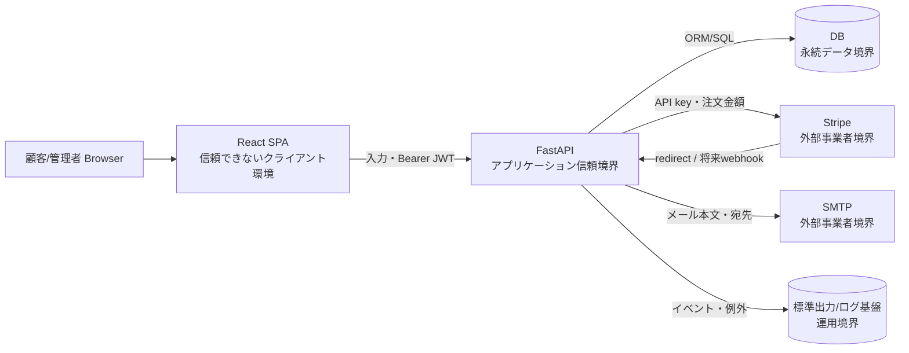

# セキュリティ・プライバシー設計

## 1. 目的・基準・保証水準

認証、注文、決済、個人情報を扱うTechStoreのセキュリティ境界、脅威、対策、残存リスク、個人データのライフサイクルを定義する。初期の検証目標はOWASP ASVS 5.0 Level 1相当とし、本番化時はリスクに応じて追加要件を選定する。準拠を宣言する文書ではなく、ギャップを追跡する基準として使用する。

## 2. 保護対象資産

| 資産ID | 資産 | 機密性 | 完全性 | 可用性 |
|---|---|---:|---:|---:|
| AST-001 | 認証情報(JWT、パスワードハッシュ、リセット/確認トークン) | 高 | 高 | 中 |
| AST-002 | 顧客情報(メール、氏名、住所、電話) | 高 | 高 | 中 |
| AST-003 | 注文・注文明細・返品理由 | 高 | 高 | 高 |
| AST-004 | 在庫・クーポン・売上 | 中 | 高 | 高 |
| AST-005 | Stripe APIキー、SMTP認証情報、JWT署名鍵 | 最高 | 最高 | 高 |
| AST-006 | PaymentIntent/Checkout Session識別子 | 高 | 高 | 中 |
| AST-007 | 監査・障害ログ | 高 | 高 | 中 |

## 3. データフローと信頼境界

ブラウザ、リクエスト入力、URLクエリ、Stripeからの将来Webhookは信頼しない。DBに保存済みの値も、表示・メール埋め込み時には無条件に安全とみなさない。

## 4. 現行コントロール

| 領域 | 現行設計 | 状態 | 検証 |
|---|---|---|---|
| パスワード | Argon2idで新規ハッシュ。bcryptは既存検証のみ、成功時再ハッシュ | 実装済み | `tests/test_auth.py` |
| 認証 | HS256 JWT、60分、`sub`でユーザー特定 | 部分実装 | 認証テスト |
| 認可 | 所有者条件、`get_current_admin` | 部分実装 | APIテスト |
| レート制限 | login/registerをIP単位固定窓で制限 | 部分実装 | `tests/test_rate_limit.py` |
| 入力検証 | Pydanticと一部業務チェック | 部分実装 | APIテスト/OpenAPI |
| 決済情報 | カード情報を保持せずStripe Checkoutへ委任 | 実装済み | Stripeテスト |
| 依存関係 | lockfile、Dependabot、pip-audit、CodeQL、Gitleaks | 実装済み(CI実行結果は要確認) | CI |
| 通信 | 要求はHTTPS/STARTTLS。ローカルHTTP | 本番未実装 | デプロイ設計 |
| シークレット | root `.env`/実行環境から注入し、production必須値・機能有効時の資格情報を起動時検査 | 部分実装 | `tests/test_config.py`、Secret Manager未定 |
| ログ | Stripe/SMTP/返金/レート制限を記録 | 部分実装 | 構造化・保持・マスキングなし |

## 5. 認証・セッション設計

### 5.1 パスワード

- 新規登録・リセット・再ハッシュはArgon2idを使用する
- 既存bcryptはログイン検証に限り許可し、成功時にArgon2idへ置換する
- 平文パスワードを保存・ログ出力しない
- 現行は最小長・漏えいパスワード・最大長の業務ポリシーが未定義であり、本番化前に決定する

### 5.2 JWT

現行JWTは`sub`と`exp`のみで、issuer、audience、jti、サーバー側失効管理を持たない。退会はユーザーの`is_active`確認で拒否できるが、パスワード変更・権限変更時の即時失効はできない。

JWTはfrontendのlocalStorageへ保存される。XSSが成立すると読取可能である。次のいずれかを本番化前に決定する。

1. 短命アクセストークンをメモリ保持し、ローテーション付きrefresh tokenを`HttpOnly; Secure; SameSite` Cookieへ保存する
2. Cookieセッション方式へ移行し、CSRFトークン/Origin検証を組み合わせる
3. localStorageを継続する場合、残存リスクを明示承認し、厳格なCSP等を実装する

### 5.3 リセット・確認トークン

現行はランダムトークンをDBへ平文保存し、メールリンクと照合する。DB漏えい時に有効トークンを利用できるため、生成直後以外は平文を保持せず、SHA-256等の一方向ダイジェストを保存する方式へ移行する。単回使用と期限失効は現行実装済みである。

## 6. 認可マトリクス

| 対象 | 未認証 | 顧客 | 管理者 |
|---|---:|---:|---:|
| 商品・レビュー閲覧、クーポン検証、config | 許可 | 許可 | 許可 |
| カート、注文、配送先、お気に入り、レビュー投稿 | 拒否 | 自分のデータのみ | 自分のデータのみ |
| `/users/me`, `/auth/me`, 確認メール再送 | 拒否 | 自分のみ | 自分のみ |
| `/admin/*` | 拒否 | 拒否 | 許可 |

IDOR対策として、顧客所有リソースはIDだけで取得せず`user_id == current_user.id`を同一クエリ条件に含める。例外はテストで検証する。

## 7. 脅威・リスク登録簿

| 脅威ID | 分類 | シナリオ | 影響 | 現行対策 | 状態/必要対策 |
|---|---|---|---|---|---|
| THR-001 | 情報漏えい | XSSでlocalStorage JWTを窃取 | なりすまし | React既定escape | 高・保存方式/CSPを要決定 |
| THR-002 | なりすまし | 既定SECRET_KEYでJWTを偽造 | 全権限奪取 | productionは明示設定・32文字以上を起動時検査 | 低減・Secret Manager導入は本番化ゲート |
| THR-003 | 情報漏えい | DBから平文リセット/確認トークンを取得 | アカウント奪取 | 有効期限・単回使用 | 高・ダイジェスト保存へ移行 |
| THR-004 | 情報漏えい | SMTP未設定時に本文・リンクを標準出力 | トークン/個人情報漏えい | `EMAIL_DELIVERY`を環境別に検査しproductionのconsoleを拒否 | 低減・本番SMTP/通知基盤は未決定 |
| THR-005 | サービス拒否/認証突破 | 複数IP・複数workerでレート制限回避 | 総当たり | プロセス内IP制限 | 中・共有ストア/段階的制限 |
| THR-006 | 改ざん | ブラウザredirectを完了せず/再送し決済と注文を不整合化 | 金銭・注文不整合 | Session照会・user_id照合 | 重大・署名Webhook/冪等性 |
| THR-007 | 改ざん | 同時注文で在庫・クーポン上限を競合 | 過販売・過剰割引 | アプリ事前チェック | 高・条件付き更新/ロック/制約 |
| THR-008 | 情報漏えい | Stripe例外文字列をAPI応答へ露出 | 内部情報開示 | ログあり | 中・固定外部メッセージ化 |
| THR-009 | 権限昇格 | 管理者/所有者チェック漏れ | 他者データ操作 | 依存性注入・所有者条件 | 中・認可マトリクス自動テスト |
| THR-010 | 否認 | 金銭処理に相関ID・不変監査記録なし | 調査不能 | 一部ログ | 高・監査イベント/保持/改ざん防止 |
| THR-011 | 情報漏えい | ログにメール、Session ID、例外を長期保存 | PII/識別子漏えい | 未定 | 高・マスキング、アクセス制御、保持期間 |
| THR-012 | サプライチェーン | 依存・CI Actionの侵害 | ビルド/実行侵害 | lock、監査、CodeQL | 中・Action SHA固定/SBOM検討 |

## 8. シークレット・構成

- `SECRET_KEY`, `STRIPE_SECRET_KEY`, `SMTP_PASSWORD`を機密として管理し、コード、生成文書、ログへ値を含めない
- 本番ではシークレット管理サービスまたは実行環境のsecret機構から注入し、未設定・既知値なら起動を失敗させる
- キーの所有者、ローテーション周期、緊急失効、アクセス監査は運用設計で定める
- frontendへ渡る`VITE_*`は公開値であり、シークレットを置かない

## 9. 個人データ台帳

| データ | 保存先 | 利用目的 | 現行保持/削除 | 第三者/外部送信 |
|---|---|---|---|---|
| メールアドレス | users、ログ | 認証・通知・サポート | 退会時匿名化。ログ保持未定 | Stripe、SMTP |
| パスワードハッシュ | users | 認証 | 退会時ランダム値へ置換 | なし |
| 氏名・住所・郵便番号・電話 | addresses | 配送 | 退会時削除 | 現状外部配送なし |
| 注文・明細・顧客ID | orders/order_items | 注文、返金、売上 | 退会後も匿名化ユーザーに紐づけ保持。期間未定 | Stripeへ金額/識別子の一部 |
| 返品理由 | orders | 返品審査 | 注文と同期間。自由記述PIIの可能性 | なし |
| レビュー・投稿者ID | reviews | 商品評価 | 退会後も保持。期間未定 | 公開画面にコメント・匿名化メール |
| お気に入り・カート | favorites/carts | 利便機能 | 退会時削除 | なし |
| リセット/確認トークン | users、メール | 本人確認 | 使用/期限で無効化。現行DB平文 | SMTP |
| PaymentIntent/Session ID | orders、ログ、Stripe | 決済照合・返金 | 期間未定 | Stripe |
| IPアドレス | プロセス内レート制限、ログキー | 不正利用防止 | 窓経過でメモリ削除。ログ保持未定 | ログ基盤 |

保持期間、法的根拠、問い合わせ窓口、開示・訂正・削除手順、バックアップからの削除は未定義であり、本番公開前の必須決定事項とする。開発者向け本書は顧客向けプライバシーポリシーを代替しない。

## 10. セキュリティ本番化ゲート

- THR-002、003、004、006、007を解消する
- JWT/Cookie方式とCSRF/CSPを決定・実装する
- ASVS選定項目とテストの対応表を作る
- TLS、CORS、trusted proxy、secure headersを本番構成で検証する
- ログのマスキング、保持、アクセス権、アラートを定義する
- 個人データ保持期間と顧客向けプライバシーポリシーを定義する
- 侵害時対応、シークレットローテーション、依存脆弱性対応手順を運用文書へ記載する
