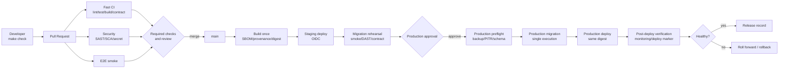

# CI/CD・DevSecOps ToBe 設計案

## 1. 目的と位置付け

本書は、変更の作成から本番反映までを、安全・再現可能・監査可能にする開発基盤のToBe像を定義する。対象はGitHubのリポジトリ統制、GitHub Actions、品質・セキュリティゲート、artifact、環境昇格、デプロイ、運用フィードバックである。

現時点ではホスティング、staging/production、artifact形式が未決定である。そのため、本書は製品を先に固定せず、次の2層に分ける。

1. **基盤非依存で今すぐ整備する層**: PR品質ゲート、リポジトリ保護、依存・秘密・コード検査、E2E、証跡
2. **実行基盤決定後に具体化する層**: immutable artifact、OIDC、staging/production、DB migration、段階リリース、rollback

ローカルtoolchainは[開発環境ToBe設計](04_development_environment_tobe.md)、配布構成は[デプロイ・構成設計](02_deployment_design.md)、セキュリティ要求は[セキュリティ・プライバシー設計](03_security_privacy_design.md)、リリース手順は[リリース・DBマイグレーション設計](../operations/04_release_migration.md)を正本とする。本書はこれらを自動化パイプラインへ接続する。

本書は[CI/CD・DevSecOps ToBe設計テンプレート](../../templates/architecture/cicd_devsecops_tobe_template.md)に基づく。CI/CDとリポジトリ統制の導入順序は本書を正本とし、開発環境文書と差がある場合は本書を優先して両方を更新する。

## 2. 設計原則

- **Pull Requestを変更の入口にする**: `main`への直接pushを通常運用にせず、レビューと必須checkを通過した変更だけをmergeする
- **最小権限を既定にする**: `GITHUB_TOKEN`はworkflow全体で`contents: read`を基本とし、書込み権限は必要なjobだけへ付与する
- **信頼境界を分離する**: fork由来PRや未信頼コードを、secretやproduction権限を持つjobで実行しない。`pull_request_target`でPRコードをcheckout・実行しない
- **一度buildして昇格する**: stagingとproductionで再buildせず、同一commitから作成した同一digestのartifactを昇格する
- **長期secretを減らす**: cloud接続はGitHub Actions OIDCと短命credentialを優先し、固定access keyを置かない
- **速い失敗と深い検査を分ける**: PRでは短時間の必須検査、main・定期実行ではE2E、DAST、外部契約等の重い検査を行う
- **再現性を保つ**: lockfile、固定toolchain、frozen installをCIでも使用し、ローカル`make check`との差を小さくする
- **例外を期限付きにする**: 脆弱性や品質ゲートの除外は、所有者、理由、影響、期限、解消条件を記録する
- **コンテナを前提にしない**: 現行方針どおりDocker/Dev Containerは導入しない。将来artifact形式を選ぶ際も、コンテナ採用はADRによる別決定とする

## 3. 現状評価

2026-07-15時点のリポジトリ内設定を基準とする。表の「定義済み」は設定ファイルが存在することを示し、GitHub Actionsでの実行成功やmerge gateの有効化までは保証しない。実行履歴はGitHub Actions、強制状態はruleset等で別途確認する。GitHub側のruleset、environment、security設定はリポジトリファイルだけでは確認できないため「要確認」とする。

| 領域 | 現状 | 評価 | 主な差分 |
|---|---|---|---|
| backend CI | Ruff、format check、OpenAPI・文書整合、pip-audit、pytest/coverage | workflow定義済み、実行履歴要確認 | job timeout、結果artifact、変更範囲最適化 |
| frontend CI | ESLint、Prettier、Vitest/coverage、production SCA、production build | workflow定義・ローカル検証済み、Actions実行履歴要確認 | build artifact、bundle予算、アクセシビリティ |
| E2E | Playwright 4件、PR用Chromium smoke 2件、失敗診断artifact | workflow定義・ローカル検証済み、Actions実行履歴要確認 | main全件、定期クロスブラウザ |
| SAST | CodeQLのPython/JavaScript `security-extended` | workflow定義済み、実行・merge gate要確認 | alert運用、誤検知抑制、結果SLA |
| SCA | pip-audit、production npm audit、Dependabot、PR dependency review、期限付き例外台帳 | workflow定義・ローカル検証済み、Actions実行履歴要確認 | license方針、Dependabot grouping改善 |
| secret検査 | GitleaksでGit履歴をPR/main/週次検査 | workflow定義・ローカル検証済み、merge gate要確認 | GitHub push protectionの有効化確認、対応手順 |
| Action supply chain | 外部Actionのfull commit SHA固定、Dependabot更新、actionlint | 実装・ローカル検証済み、Actions実行履歴要確認 | zizmor採用評価 |
| repository統制 | workflowはPR対応、CODEOWNERSとSECURITY.mdあり | 部分実装 | ruleset、必須check、review、直push禁止 |
| artifact / SBOM | frontend buildはjob内のみ | 未実装 | versioned artifact、digest、retention、SBOM、provenance |
| CD | deploy workflowなし | 未実装 | environment、OIDC、staging昇格、承認、本番反映 |
| DB migration | `create_all()`、version管理なし | 未実装 | Alembic等、staging rehearsal、expand/contract |
| DAST | なし | 未実装 | staging向けOWASP ZAP baseline等の選定・調整 |
| 監視連携 | 設計のみ | 未実装 | deploy marker、post-deploy smoke、SLI監視、rollback判断 |
| 開発者統一 | project-local toolchain、Makefile | 実装済み | formatter/editorconfig、任意の軽量pre-commit |

## 4. 目標パイプライン

### 4.1 Pull Request CI

PRの必須checkは、10〜15分以内を目標に次を並列実行する。

| Check名（案） | 内容 | 合格条件 |
|---|---|---|
| `backend-quality` | frozen sync、Ruff、format、OpenAPI・文書整合 | 全checkがexit 0 |
| `backend-test` | pytest、coverage | 全成功、既存coverage閾値以上 |
| `frontend-quality` | frozen install、ESLint、formatter、build | 全成功、lockfile差分なし |
| `frontend-test` | Vitest、coverage | 全成功、既存coverage閾値以上 |
| `e2e-smoke` | Chromiumで認証・商品閲覧・主要購入前フロー | 全成功。失敗時trace/reportを保存 |
| `security-code` | CodeQLとcode scanning merge protection | workflow成功かつ新規critical/high alertなし（利用プランとruleset機能を確認） |
| `security-dependency` | dependency review、Python/npm SCA | 新規critical/high脆弱性なし。license policy違反なし |
| `security-secret` | Gitleaks | secret検出0件 |
| `workflow-security` | actionlint、必要に応じzizmor | workflow構文・既知の危険パターンなし |

coverageは数値を上げること自体を目的にせず、既存水準を下げないratchet方式を基本とする。変更された認証・認可・決済・個人情報処理には、対象リスクのテスト追加をレビューで確認する。

### 4.2 main / 定期検査

- main merge後に全CIを再実行し、release候補artifactを1回だけ作成する
- 週次でCodeQL、Gitleaks、全E2E、依存監査を実行する
- staging確立後は、OWASP ZAP等のDAST baselineを定期実行し、初期はreport-onlyで調整してから重大度ゲートへ移す
- 外部サービス契約、バックアップ復元、migration rehearsal、性能試験は、毎PRではなくmain定期またはrelease前に実施する
- 定期jobの失敗は放置せず、issue作成または通知先への連携と対応期限を持たせる

### 4.3 CD

実行基盤決定後、次の責務を分離したreusable workflowまたはjobとして設計する。

1. `build`: 保護された`main`へmergeされ、必須checkを通過したcommitだけから、default branch上のレビュー済みworkflowを使ってartifactを作成し、version、commit SHA、SHA-256 digest、SBOM、provenanceを発行する。release tagは新規buildを起動せず、既存の検証済みartifactへmetadataを付ける用途に限定する
2. `deploy-staging`: OIDCで短命credentialを取得し、stagingへdigest指定で配布する
3. `verify-staging`: health、migration、主要smoke、外部契約、DASTを検証する
4. `preflight-production`: GitHub Environmentの承認後、backup/PITR、schema互換性、容量、中止条件を確認する
5. `migrate-production`: migrationを排他的に1回だけ実行し、version、所要時間、結果を記録する
6. `deploy-production`: migration成功後、同じdigestを段階的にproductionへ昇格する
7. `verify-production`: readinessと非破壊smoke、エラー率・latency・業務不整合を確認し、release記録へ結果を残す

production workflowはPRイベントから直接起動しない。environment secretは対象environmentのjobだけで参照し、migration/deploy jobの同時実行を1つに制限する。deploy前にprovenance/attestation、repository、default branch上のbuild workflow、`main`の検証済みcommit、artifact digestを検証し、任意refからuploadされたartifact、tagから再buildしたartifact、PR由来cache/artifact、検証不能なartifactをproductionへ昇格させない。不可逆migration後はapplicationだけの自動rollbackを行わず、schema互換性を確認してroll-forwardを優先する。

## 5. GitHubリポジトリ統制

`main`のrulesetは次を目標とする。GitHub UI/APIで設定した内容は、設定日・所有者・例外を本書または運用記録へ残す。

- Pull Request必須、通常の直接push禁止
- required checksは安定したjob名で指定する。まず既存checkで保護し、新checkは導入・安定稼働を確認してから段階的に必須化する
- 少なくとも1名のreviewを必須化し、可能なら最終push後の再承認を要求
- stale approvalを破棄し、未解決conversationを残したmergeを禁止
- force pushとbranch deleteを禁止
- 管理者を含むbypassは緊急時だけに限定し、理由を監査可能にする
- `CODEOWNERS`を導入し、`.github/workflows/**`、認証・決済・migration・セキュリティ文書にowner reviewを要求
- GitHub secret scanningとpush protectionを、利用可能なプラン/公開範囲で有効化
- merge方式はsquashまたはrebaseへ統一し、履歴規約とrelease note生成方法を合わせる

## 6. セキュリティとサプライチェーン

### 6.1 必須コントロール

| 分類 | 方針 |
|---|---|
| SAST | CodeQLを継続する。利用可能なプランではcode scanning merge protection/rulesetを重大度付きで設定し、PRの新規critical/highをblockする。alertにはownerと対応期限を設定する |
| SCA | lockfile監査に加え、PRでdependency差分とlicenseを確認する。runtime依存を優先する |
| secret | GitleaksとGitHub push protectionを多層化する。検出時は削除だけでなく資格情報を失効・rotateする |
| Action | 外部ActionはGitHub公式を含めfull-length commit SHAへ固定し、Dependabotで更新する。リポジトリ内local Actionはreview対象にする |
| permissions | workflow既定はread-only。`security-events: write`、`id-token: write`等は必要jobに限定する |
| checkout | build/test jobでは`persist-credentials: false`を基本とし、Git credentialを不要に残さない |
| untrusted input | event本文やbranch名等をshellへ直接埋め込まず、Action入力または中間環境変数として渡す |
| artifact | executable artifactはdigestを記録し、保存期間とアクセス権を定義する。secretを含めず、保護された`main`の検証済みcommitからだけrelease候補を発行する |
| SBOM/provenance | release artifactにSBOMとbuild provenanceを関連付け、commit・workflow・digestを追跡・deploy前検証できるようにする |
| DAST | stagingのみを対象に開始し、productionへの破壊的scanを禁止する |
| IaC | IaC採用時にfmt/validate/planと静的セキュリティ検査を追加し、production applyは承認後に限定する |

現在の`pip-audit`除外`PYSEC-2026-1325`は、識別子だけで永続運用せず、影響評価、上流状況、期限、owner、代替対策を脆弱性例外台帳へ記録する。npmについても、`npm audit`を無条件に自動修正するのではなく、lockfileと互換性を保ったレビュー可能な更新にする。

### 6.2 脆弱性対応SLA（初期案）

| 重大度 | 初動 | 修正または明示判断 |
|---|---:|---:|
| Critical | 24時間以内 | 3暦日以内 |
| High | 2暦日以内 | 7暦日以内 |
| Medium | 5暦日以内 | 30暦日以内 |
| Low | 次回定期見直し | 90暦日以内または受容 |

実悪用、secret漏えい、重大なデータ露出では通常SLAを待たず、即時に失効・封じ込め・影響調査を開始する。その他は実到達可能性、公開範囲、悪用状況、保護対象データを加味して優先度を補正する。受容する場合も期限なし例外にはしない。

## 7. 成果物・証跡・可観測性

- CI失敗時はpytest/Vitest/Playwright report、trace、screenshot等の診断情報を短期間保存する
- releaseごとにcommit SHA、artifact digest、SBOM、workflow run、承認者、migration結果、deploy時刻、post-deploy結果を関連付ける
- artifactとlogの保持期間を情報分類に応じて定義し、token、`.env`、顧客データを保存しない
- deploy markerを監視基盤へ送り、5xx率、p95 latency、Stripe/SMTP失敗、注文不整合を直前releaseと相関できるようにする
- `/health/live`はprocess生存、`/health/ready`はtraffic受付可否を表し、DB等の必須依存をreadinessで検査する。外部サービスを含めるかは障害分離方針として決定する
- JSON構造化log、request/correlation ID、deploy SHAを出力し、PII・token・secretをマスキングする。管理操作・返金・重要認証操作は保持・アクセス制御を持つaudit eventとする
- OpenTelemetry等のvendor-neutralな計装を優先し、request/DB/外部APIのlatencyとerrorを関連付ける。保存先は基盤ADR後に決定する
- workflow成功率、所要時間、flaky test率、変更のlead time、deploy頻度、変更失敗率、復旧時間を継続改善指標として扱う
- flaky testは単なる再実行で隠さず、ownerと期限を付けて隔離・修正する

## 8. 導入ロードマップ

### Phase 0: GitHub設定と利用可能機能の確認（最優先）

- [ ] GitHub側のruleset、required checks、review、secret scanning、push protectionの現状を監査する
- [ ] repositoryのvisibility/planに対し、CodeQL merge protection、dependency review、Environment reviewer/protection、artifact attestationが利用可能か確認し、利用不能な項目は代替ゲートを決定する
- [ ] `main`のPR必須化、force push禁止を設定し、現行の安定したcheckだけを最初の必須checkにする
- [ ] Actionsのリポジトリ既定権限をread-onlyへ設定する
- [ ] CI失敗・Dependabot・security alertのownerと通知先を決める

### Phase 1: PRゲート完成（優先度P0）

- [x] PR向けPlaywright smokeを追加し、失敗時artifactを保存する
- [x] dependency reviewを追加し、新規critical/highのruntime依存をblockする
- [x] 外部Actionをfull commit SHAへ固定する
- [x] workflow/jobへtimeoutを設定する
- [x] actionlintを追加する。zizmor採用要否はPhase 2で評価する
- [x] `.editorconfig`とfrontend formatterを導入し、CIでformat checkする
- [x] `CODEOWNERS`を追加し、workflow・認証・決済・migrationのreview境界を定める
- [x] 脆弱性例外台帳と`SECURITY.md`を作成する
- [ ] 新設checkの安定稼働を確認し、required checksへ段階的に追加する

### Phase 2: 継続的セキュリティとリリース前提（優先度P1）

- [ ] npmを含むSCAとlicense policyを決定する
- [ ] Dependabotの一括groupをruntime/dev、更新種別、security優先度に応じて分割する
- [ ] GitHub security alertのtriage手順とSLAを運用文書へ追加する
- [ ] E2EをPR smoke、main全件、定期クロスブラウザへ分割する
- [ ] axeによる主要画面のアクセシビリティ検査を追加する
- [ ] CI所要時間、flaky test、cache利用を計測し、信頼境界を保った範囲で高速化する
- [ ] Alembic等のversioned migrationを導入し、空DBと既存baseline相当DBのupgradeをCIで検証する
- [ ] liveness/readiness、構造化log、correlation ID、deploy SHAを実装する

### Phase 3: リリース基盤（本番基盤決定後、優先度P0）

- [ ] production host、artifact形式、artifact保管先、DB、process supervisorをADRで決定する
- [ ] 保護された`main`の検証済みcommitからのbuild-once、digest、SBOM、provenance発行とdeploy前検証を実装する
- [ ] GitHub Environmentsにstaging/productionを作り、production approvalを設定する
- [ ] OIDCによる短命credentialでstaging CDを実装する
- [ ] staging smoke、contract、DAST、migration rehearsalを実装する
- [ ] production preflight、排他的なmigration、同一digestの段階昇格、post-deploy確認、roll-forward/rollback手順を実装する

### Phase 4: 運用成熟（本番運用前後）

- [ ] backup/restore、credential rotation、incident response、release演習を定期化する
- [ ] metrics/tracing、audit event、通知経路を実装し、critical alertの到達演習を行う
- [ ] SLI/SLOとerror budgetを決め、CD停止判断へ接続する
- [ ] DORA系指標とsecurity SLAを四半期ごとにレビューする
- [ ] runner、Action、依存、権限、例外台帳を定期監査する

## 9. 採用しない／時期尚早なもの

- ホスティング未決定のままcloud固有deploy workflowを作らない
- production secretをPR CIへ渡さない
- CDを整備する前にDB migration、監視、rollbackを省略した自動本番反映を行わない
- 全検査を毎PRへ詰め込み、遅く不安定なパイプラインにしない
- `latest`タグやbranch名だけをrelease artifactの同一性根拠にしない
- botによる破壊的な依存自動修正をreviewなしでmergeしない
- コンテナ、Kubernetes、self-hosted runner、複雑なmonorepo基盤を目的なく導入しない

## 10. 完了条件

### CI完了条件

- [ ] clean cloneとCIが同じ固定toolchain・lockfile・標準コマンドを使う
- [ ] `main`へ入る全変更がreviewと必須checkを通過する
- [ ] lint、format、unit/integration、coverage、build、契約、E2E smokeがPRで自動検証される
- [ ] SAST、SCA、secret scanが新規critical/highリスクをblockする
- [ ] CI失敗時に担当者が原因を追えるartifactとlogがある

### CD完了条件

- [ ] 保護された`main`のcommit、default branchのbuild workflow、provenanceを検証した同一digestのartifactをstagingからproductionへ昇格できる
- [ ] 長期cloud credentialを使わず、環境ごとに最小権限でdeployできる
- [ ] production反映前に承認、migration rehearsal、staging検証が完了する
- [ ] release、artifact、承認、migration、deploy、監視結果を追跡できる
- [ ] 異常時の中止条件、roll-forward/rollback、連絡先が検証済みである

## 11. 参考資料

- [GitHub Docs: Security for GitHub Actions](https://docs.github.com/en/actions/how-tos/secure-your-work)
- [GitHub Docs: Secure use reference](https://docs.github.com/en/actions/reference/security/secure-use)
- [GitHub Docs: Configuring the dependency review action](https://docs.github.com/en/code-security/how-tos/secure-your-supply-chain/manage-your-dependency-security/configure-dependency-review-action)
- [GitHub Docs: Artifact attestations](https://docs.github.com/en/actions/concepts/security/artifact-attestations)
- [GitHub Docs: Dependency caching reference](https://docs.github.com/en/actions/reference/workflows-and-actions/dependency-caching)
- [OWASP CI/CD Security Cheat Sheet](https://cheatsheetseries.owasp.org/cheatsheets/CI_CD_Security_Cheat_Sheet.html)
- [OWASP Security Culture: Security Testing](https://owasp.org/www-project-security-culture/stable/7-Security_Testing/)
- [OWASP DevSecOps Guideline: Dynamic Application Security Testing](https://owasp.org/www-project-devsecops-guideline/latest/02b-Dynamic-Application-Security-Testing)
