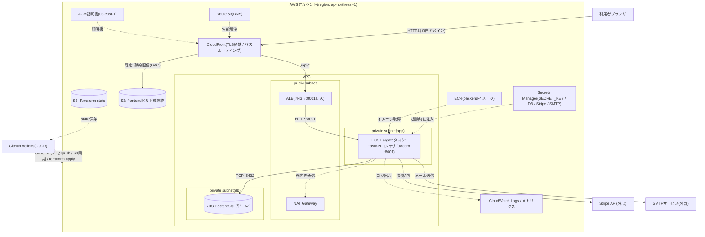

# AWSデプロイ ToBe 設計

## 1. 目的

[ADR-003](adr/ADR-003-aws-container-deployment.md)で決定した方針(backendのコンテナ化 + ECS Fargate、frontendの静的配信、Terraformによる IaC)に基づき、production/stagingの目標構成を定義する。本書は目標構成(ToBe)であり、現行環境の正本は[デプロイ・構成設計](02_deployment_design.md)である。本書の項目が実装されるまで、[02_deployment_design.md](02_deployment_design.md)の本番化ゲートは未達のままとする。

元になったドキュメント: [ADR-003](adr/ADR-003-aws-container-deployment.md)、[デプロイ・構成設計](02_deployment_design.md)、[アーキテクチャ概要](01_architecture_overview.md)、[セキュリティ・プライバシー設計](03_security_privacy_design.md)、[非機能要件](../requirements/06_nonfunctional_requirements.md)

## 2. 前提とスコープ

- 学習目的のため、単一region・単一AZ・単一タスクの最小構成から始める。可用性(Multi-AZ、複数タスク)はスコープ外とし、拡張余地だけ確保する
- regionは`ap-northeast-1`(東京)で確定した(2026-07-15)。独自ドメイン名と月額コスト上限は未確定であり、apply前に決定する
- 開発環境も[ADR-003](adr/ADR-003-aws-container-deployment.md)によりコンテナ(Docker Compose)を採用する方針へ転換する。開発環境の詳細と移行手順は[開発環境ToBe設計](04_development_environment_tobe.md)を正本とし、本書ではbackendのDockerfileを開発・本番で共有することのみ前提に置く
- CI/CDパイプラインの詳細は[CI/CD・DevSecOps ToBe設計](05_cicd_devsecops_tobe.md)へ統合し、本書ではインフラ側の受け口(ECR、OIDCロール)のみ扱う

## 3. 全体構成図

図の種類: C4 Deployment相当(`flowchart`による近似)。スコープ: production環境の実行ノード、ネットワーク境界、永続層、外部サービス。実線=リクエスト/データフロー、点線=設定・イメージ・ログ等の管理系フロー。`subgraph`=ネットワーク/管理境界。



## 4. コンポーネント一覧

| コンポーネント | 役割 | 主な設計判断 |
|---|---|---|
| CloudFront + ACM | TLS終端、静的配信、`/api/*`のALB転送 | HTTP→HTTPSリダイレクトをここで実施(本番化ゲート2) |
| S3(frontend) | `frontend/dist`の配信元 | 公開バケットにせずOACでCloudFrontのみ許可 |
| ALB | backendへのL7ルーティング、ヘルスチェック | セキュリティグループでCloudFront経由以外を拒否 |
| ECS Fargate | FastAPIコンテナの実行(スケール単位=タスク) | 初期は1タスク。`--reload`と開発依存を除いたイメージを使用(本番化ゲート8) |
| ECR | backendイメージレジストリ | タグはgit SHAで不変にする |
| RDS PostgreSQL | 本番DB(永続層) | 単一AZ・最小クラス(db.t4g.micro相当)。自動バックアップ有効(本番化ゲート6) |
| Secrets Manager | `SECRET_KEY`、DB資格情報、Stripe/SMTPキー | タスク定義のsecrets参照で注入し、平文の環境変数に置かない |
| CloudWatch | ログ、メトリクス、アラート(本番化ゲート7) | コンテナはstdout/stderrへ出力する |
| Route 53 | 独自ドメインのDNS | ドメイン未確定のため取得後に構成 |
| NAT Gateway | privateサブネットからの外向き通信(Stripe/SMTP/ECR) | 常時課金が大きい場合、VPCエンドポイント併用または縮小構成を再検討 |

## 5. 設定値の注入方式

[02_deployment_design.md](02_deployment_design.md)の構成値一覧を本番で次のとおり注入する。

| 区分 | 変数 | 注入方式 |
|---|---|---|
| 機密 | `SECRET_KEY`, `DATABASE_URL`, `STRIPE_SECRET_KEY`, `STRIPE_WEBHOOK_SECRET`, `SMTP_PASSWORD`, `SMTP_USER` | Secrets Manager → ECSタスク定義のsecrets参照 |
| 非機密 | `APP_ENV=production`, `FRONTEND_URL`, `CORS_ORIGINS`, `STRIPE_ENABLED`, `EMAIL_DELIVERY`, `SMTP_HOST`, `SMTP_PORT`, `FROM_EMAIL`, `LOG_LEVEL` | ECSタスク定義の環境変数(Terraform管理) |
| ビルド時 | `VITE_API_URL` | frontendビルド時に本番APIのURLを埋め込む(CI/CDで指定) |

`config.py`のfail closed検証(既定SECRET_KEY拒否、非HTTPS origin拒否、consoleメール拒否)は本番起動時の最終防衛線としてそのまま使う。

## 6. Terraform構成方針

- 記述言語はHCL(`.tf`)。ディレクトリは`infra/`配下に置き、アプリコードと分離する

```text
infra/
├── bootstrap/          # tfstateバケット + GitHub OIDCロール(一回限り、ローカルstate)
├── environments/
│   ├── staging/        # 環境ごとのroot module(backend設定・変数値)
│   └── production/
└── modules/
    ├── network/        # VPC、subnet、NAT、セキュリティグループ
    ├── database/       # RDS、Secrets Manager
    ├── backend_app/    # ECR、ECS、ALB
    └── frontend/       # S3、CloudFront、Route 53、ACM
```

- Terraformは固定版(1.15.8)を`make bootstrap`が`.tools/`へ導入する。適用手順と意図的な暫定事項(CloudFront-ALB間HTTP、OIDCロール権限の最小化前)は[infra/README.md](../../../infra/README.md)を正本とする

- tfstateはS3バックエンドに保存し、Terraform 1.10以降の`use_lockfile`でロックする。stateには機密が入りうるためバケットは非公開・暗号化・バージョニング必須
- CI/CDからのAWS認証はGitHub OIDCによる一時資格情報とし、長期アクセスキーを発行しない
- 手作業でのコンソール変更は行わず、差分は`terraform plan`で常に確認する

## 7. 導入ロードマップ

### Phase 0: 決定事項の確定

- [x] regionを決定する(`ap-northeast-1`、2026-07-15確定)
- [ ] ドメイン、月額コスト上限を決定し本書へ反映する
- [ ] [ADR-003](adr/ADR-003-aws-container-deployment.md)をAcceptedにする

### Phase 1: アプリ側の前提整備

- [x] Alembic等によるversioned migrationを導入する(本番化ゲート3)
- [ ] backend本番用Dockerfileを作成し、PostgreSQLへの接続をstaging相当で検証する
- [x] Stripe Webhookの署名検証・冪等性を実装する(本番化ゲート5。実Stripeからの受信検証はstagingで行う)

### Phase 2: Terraform土台と基盤

- [ ] tfstate用S3バケットとGitHub OIDCロールを作成する(コードは`infra/bootstrap/`に実装済み、AWSアカウント準備後にapply)
- [ ] network / database モジュールを実装しstagingへapplyする(モジュールと`infra/environments/`は実装・validate済み、apply待ち)

### Phase 3: アプリ配備

- [ ] backend_app / frontend モジュールを実装し、stagingで全経路(決済、メール、migration)を検証する(本番化ゲート9)
- [ ] CI/CDへplan(PR時)/apply(merge時)とアプリデプロイを統合する

### Phase 4: 運用化

- [ ] 監視・アラート・Runbookを[operations](../operations/)配下へ整備する
- [ ] バックアップ復元試験とRPO/RTOを定義する(本番化ゲート6)
- [ ] productionへ昇格し、[02_deployment_design.md](02_deployment_design.md)の環境表を更新する

## 8. 非目標

- Multi-AZ・オートスケール等の高可用構成(単一タスク構成の制約は[02_deployment_design.md](02_deployment_design.md)第5章のとおり)
- Kubernetes(EKS)の採用
- マルチリージョン、CDNキャッシュ最適化、WAF(将来課題として認識のみ)

## 9. 受け入れ基準

- [ ] [02_deployment_design.md](02_deployment_design.md)本番化ゲート1〜9がすべて満たされ、同書の環境表でstaging/productionが「実装済み」になる
- [ ] インフラ変更がすべてTerraformのplan/applyを経由し、コンソール手作業の差分がない
- [ ] 機密値がGit・タスク定義平文・ログのいずれにも現れない
- [ ] stagingとproductionが同一モジュールから変数差分のみで構築される

## 10. 参考資料

- [AWS: Amazon ECS on AWS Fargate](https://docs.aws.amazon.com/AmazonECS/latest/developerguide/AWS_Fargate.html)
- [AWS: Amazon CloudFront OAC](https://docs.aws.amazon.com/AmazonCloudFront/latest/DeveloperGuide/private-content-restricting-access-to-s3.html)
- [Terraform: Backend Type: s3](https://developer.hashicorp.com/terraform/language/backend/s3)
- [GitHub Docs: Configuring OpenID Connect in Amazon Web Services](https://docs.github.com/en/actions/deployment/security-hardening-your-deployments/configuring-openid-connect-in-amazon-web-services)
