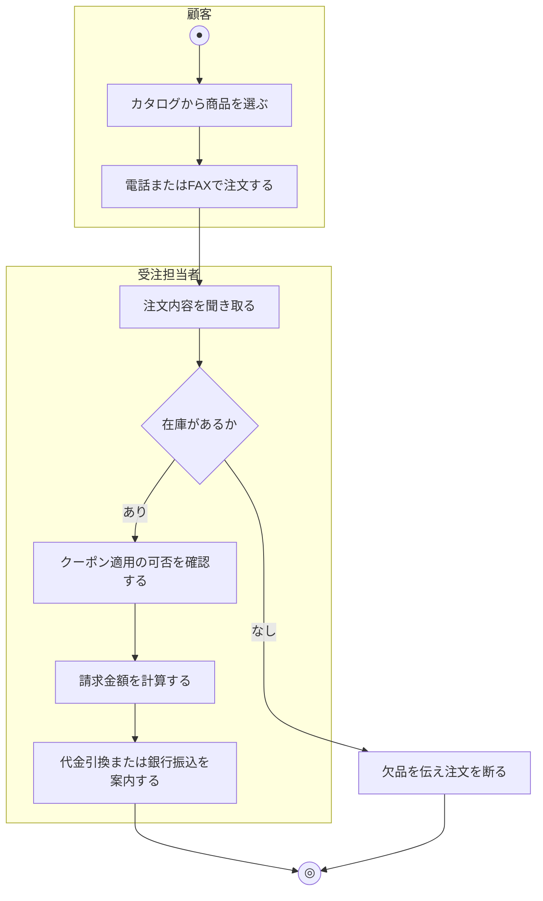

# 業務フロー図: 商品購入業務

[← 業務フロー図一覧に戻る](../01_business_flow.md) / 全体ルール: [[../../../README|docs/README.md]]

### 概要

顧客が商品をカートに追加し、クーポンを適用した上で注文を確定、決済を完了するまでの業務。ECサイトの中核となる業務フロー。

### 登場アクター

- 顧客
- システム(EC_SITE)
- Stripe(決済代行サービス)

### 業務フロー図(As-Is)

現状(システム未導入)を想定した、電話・カタログ注文ベースの業務。



### 課題・問題点

- 在庫確認や金額計算が手作業のため、計算ミスや在庫の二重販売が発生しやすい
- 電話・FAXでの受付は営業時間内に限られ、顧客が注文したいタイミングで注文できない
- クーポン適用可否の判断が受注担当者の目視確認に依存しており、不正利用のチェックが難しい

### 業務フロー図(To-Be)

```mermaid
flowchart TD
    subgraph 顧客
        A((●)) --> B["商品をカートに追加する<br/><<システム化>>"]
        B --> C["クーポンコードを入力する(任意)<br/><<システム化>>"]
        C --> Q{"決済方法を選ぶ<br/><<システム化>>"}
        Q -->|カードで決済(Stripe)| H["決済画面でカード情報を入力する<br/><<システム化>>"]
    end
    subgraph システム
        D{"クーポンが有効か<br/><<システム化>>"}
        E{"カート内商品の在庫が十分か<br/><<システム化>>"}
        F["注文金額(小計・割引・税)を計算する<br/><<システム化>>"]
        G["Stripe決済セッションを作成する<br/><<システム化>>"]
        R["在庫を減算し注文を確定する(カード決済なし)<br/><<システム化>>"]
        I["在庫を減算し注文を確定する(カード決済あり)<br/><<システム化>>"]
        J["注文確認メールを送信する<br/><<システム化>>"]
    end
    subgraph Stripe
        K[カード決済を処理する]
    end
    C --> D
    D -->|無効| L[エラーを表示する]
    D -->|有効/未入力| E
    E -->|不足| M[在庫不足を表示する]
    E -->|十分| F
    F --> Q
    Q -->|カード決済を使わず確定する| R
    Q -->|カードで決済(Stripe)| G
    G --> H
    H --> K
    K -->|支払い成功| I
    K -->|支払い失敗/キャンセル| N[カートに戻る]
    R --> J
    I --> J
    J --> O((◎))
    L --> O
    M --> O
    N --> O
```

### To-Beにおける主な変更点

- 在庫確認・金額計算(小計・クーポン割引・税)・決済処理をすべてシステム化し、24時間いつでも注文可能にする
- クーポンの有効性判定(有効期限・利用回数上限)をシステムが自動判定し、不正利用のリスクを下げる
- 決済方法として「Stripeによるカード決済」と「カード決済を使わない即時確定(代金引換・銀行振込等を想定)」の2経路を用意し、決済はカード決済を選んだ場合のみStripeに委任する(PCI DSS対応の簡略化)。この2経路の分岐は、外部設計フェーズで`frontend/src/App.jsx`(`CartView`)を確認した結果判明したため、業務フロー図(本ドキュメント)に遡って追記した(該当ユースケース: UC-002, UC-003)
