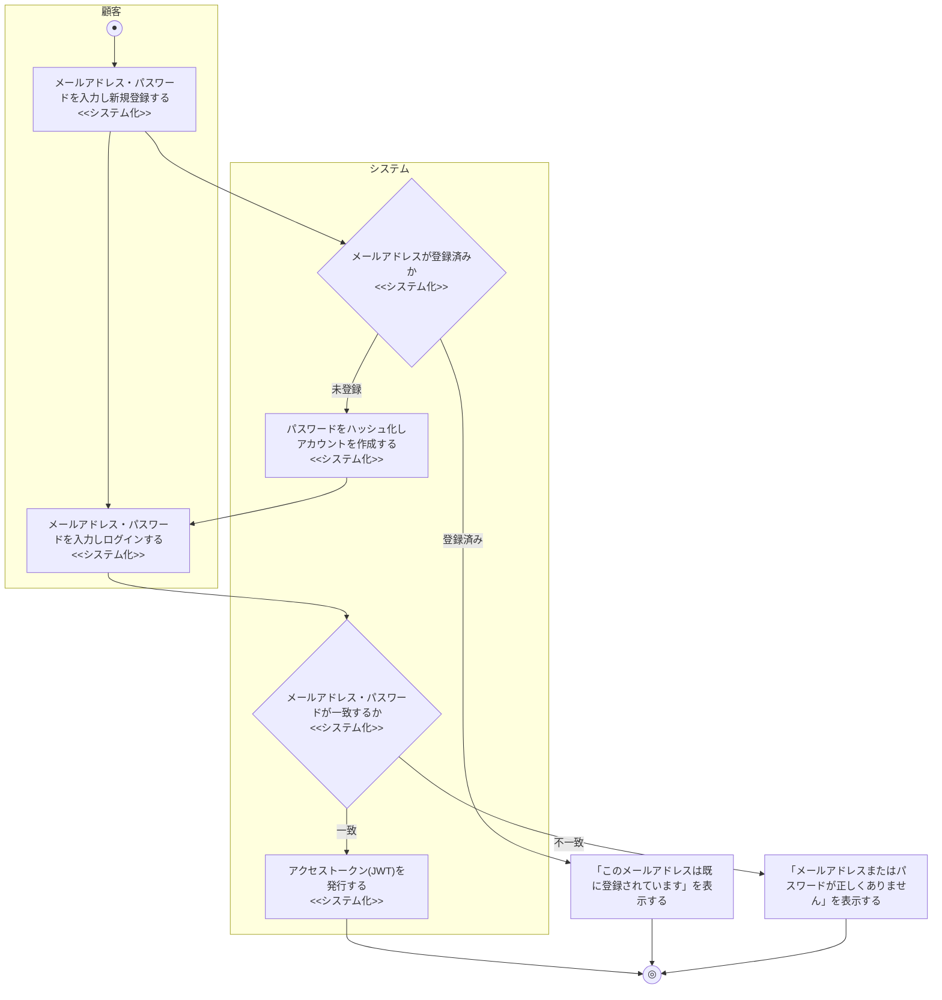
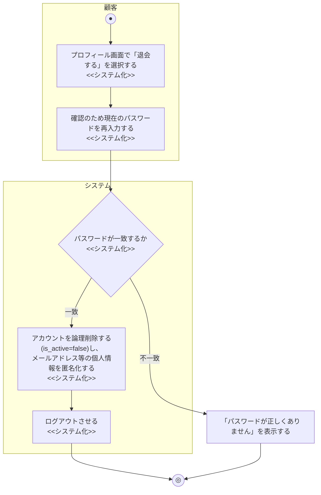
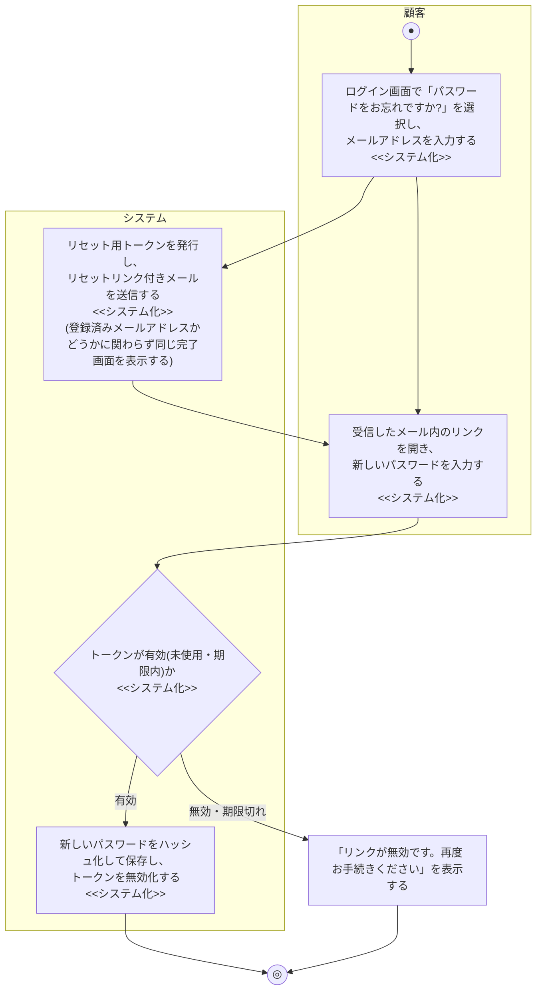

# 業務フロー図: 会員管理業務

[← 業務フロー図一覧に戻る](../01_business_flow.md) / 全体ルール: [[../../../README|docs/README.md]]

### 概要

顧客がアカウントを登録し、ログインしてシステムを利用できるようにする業務。

### 登場アクター

- 顧客
- システム(EC_SITE)

### 業務フロー図(As-Is)

該当なし。本機能(会員登録・ログイン)は、本ECサイトの導入によって新たに生まれた業務であり、対応する紙・電話ベースのAs-Is業務フローは存在しない(既存の商品購入業務のAs-Isは、顧客を識別せず都度電話・FAXで注文を受け付ける方式だったため、「会員」という概念自体が存在しなかった)。

### 課題・問題点

該当なし(As-Is業務が存在しないため)。

### 業務フロー図(To-Be)

### 業務フロー図(To-Be): 退会(2026-07-11追加)

以前は`06_nonfunctional_requirements.md`のNFR-016で「退会機能は現時点で実装されていない」ことが今後の課題として明記されているのみだったが、新機能として追加する。

- 注文履歴(`orders`/`order_items`)は業務記録として匿名化・削除せず残す。個人情報の扱いの詳細は[[../../requirements/06_nonfunctional_requirements|06_nonfunctional_requirements.md]] NFR-013・NFR-016を参照

### 業務フロー図(To-Be): パスワードリセット(2026-07-13追加)

パスワードを忘れた顧客が、メール経由で本人確認のうえパスワードを再設定できるようにする。従来はパスワードを忘れた場合の救済手段がなく、運営への問い合わせに頼るしかなかった。

- 登録済みメールアドレスでなくても常に同じ完了画面(「メールを送信しました」)を表示する。存在するメールアドレスの列挙(ユーザー列挙攻撃)を防ぐための意図的な設計であり、実装上のバグではない
- リセットトークンは24時間で失効し、1回使用すると再利用できなくなる(パスワード変更成功時に無効化)
- 既存のログインセッション(発行済みJWTアクセストークン)は、パスワードリセット後も個別には失効しない(本システムのJWTはステートレスで、トークン単位の失効の仕組みを持たないため)。この制約は将来的な課題として扱う

