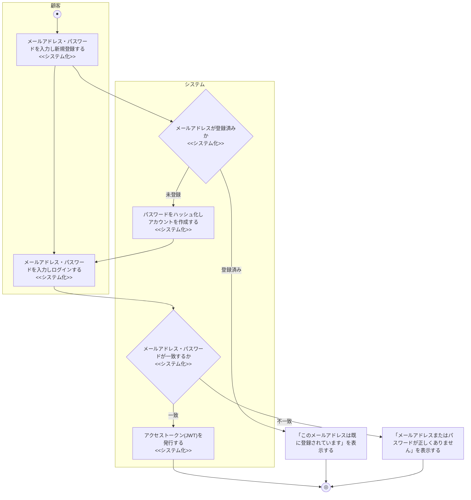

# 業務フロー図: 会員管理業務

[← 業務フロー図一覧に戻る](../01_business_flow.md) / 全体ルール: [[../../../README|docs/README.md]]

### 概要

顧客がアカウントを登録し、ログインしてシステムを利用できるようにする業務。

### 登場アクター

- 顧客
- システム(EC_SITE)

### 業務フロー図(As-Is)

該当なし。本機能(会員登録・ログイン)は、本ECサイトの導入によって新たに生まれた業務であり、対応する紙・電話ベースのAs-Is業務フローは存在しない(既存の商品購入業務のAs-Isは、顧客を識別せず都度電話・FAXで注文を受け付ける方式だったため、「会員」という概念自体が存在しなかった)。

### 課題・問題点

該当なし(As-Is業務が存在しないため)。

### 業務フロー図(To-Be)

