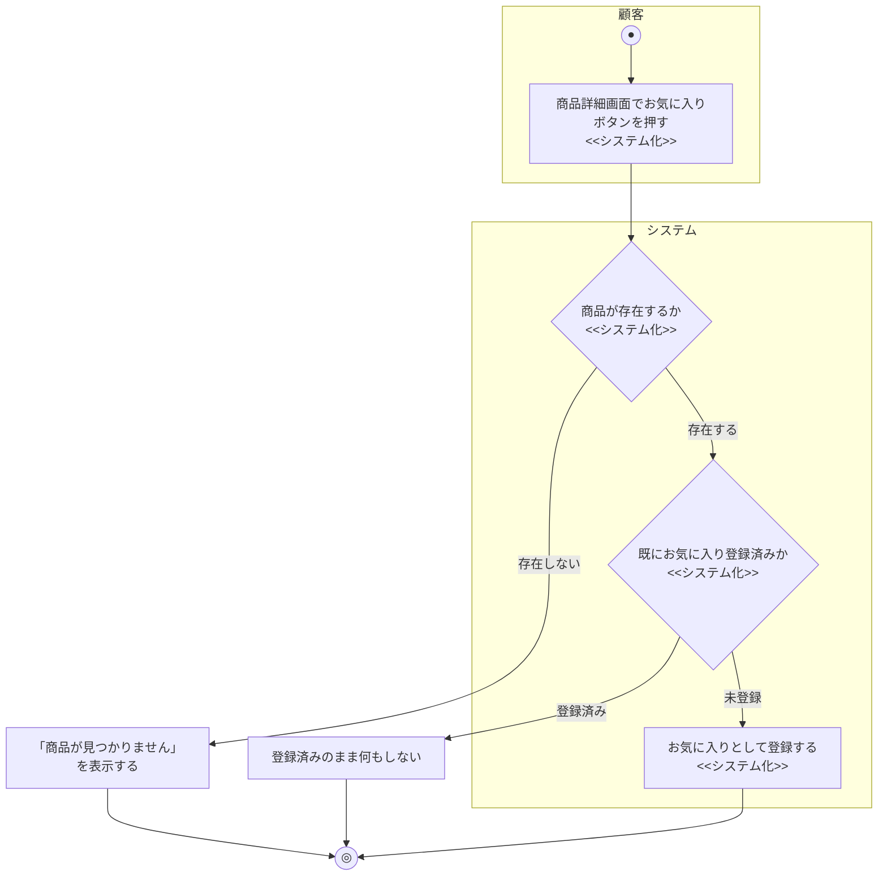

# 業務フロー図: お気に入り管理業務

[← 業務フロー図一覧に戻る](../01_business_flow.md) / 全体ルール: [[../../../README|docs/README.md]]

### 概要

顧客が気になる商品をお気に入り登録し、後で見返せるようにする業務。

### 登場アクター

- 顧客
- システム(EC_SITE)

### 業務フロー図(As-Is)

該当なし。本機能はECサイト固有の機能であり、対応する紙・電話ベースのAs-Is業務フローは存在しない。

### 課題・問題点

該当なし(As-Is業務が存在しないため)。

### 業務フロー図(To-Be)

- 解除(`DELETE /favorites/{product_id}`)・一覧表示(`GET /favorites`)は、いずれも分岐のない単純な処理(該当行の削除・ログイン中ユーザーのお気に入り一覧取得)のため、上図には含めていない。
