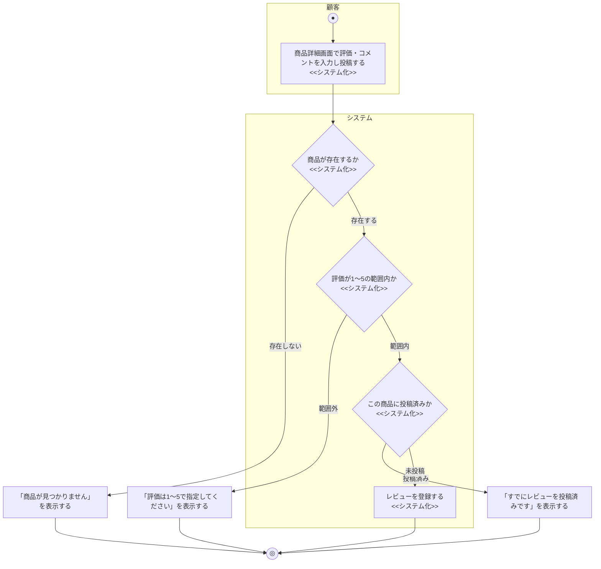

# 業務フロー図: レビュー投稿業務

[← 業務フロー図一覧に戻る](../01_business_flow.md) / 全体ルール: [[../../../README|docs/README.md]]

### 概要

顧客が購入検討中・購入済みの商品にレビュー(評価・コメント)を投稿し、他の顧客の購入判断材料にする業務。

### 登場アクター

- 顧客
- システム(EC_SITE)

### 業務フロー図(As-Is)

該当なし。本機能はECサイト固有の機能であり、対応する紙・電話ベースのAs-Is業務フローは存在しない。

### 課題・問題点

該当なし(As-Is業務が存在しないため)。

### 業務フロー図(To-Be)

- 実装上、1商品につき1顧客1件までしか投稿できない(重複投稿はエラー)。レビューの閲覧(`GET /products/{id}/reviews`)は認証不要かつ分岐がないため、上図には含めていない。
