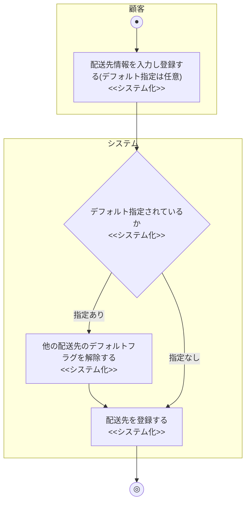

# 業務フロー図: 配送先管理業務(顧客向け)

[← 業務フロー図一覧に戻る](../01_business_flow.md) / 全体ルール: [[../../../README|docs/README.md]]

### 概要

顧客が配送先住所を登録・編集し、デフォルトの配送先を設定する業務。カート画面(S-002)での配送先選択の元になる。

### 登場アクター

- 顧客
- システム(EC_SITE)

### 業務フロー図(As-Is)

該当なし。As-Isの商品購入業務では、注文の都度、電話・FAXで配送先を口頭伝達していたと推測されるが、業務エキスパートへのヒアリングは行っておらず、独立した「配送先管理」という業務としては確認できていない。そのため、憶測でAs-Isを記述することは避け、該当なしとする。

### 課題・問題点

該当なし(As-Is業務を確認できていないため)。

### 業務フロー図(To-Be)

- 編集(`PATCH /addresses/{id}`)・削除(`DELETE /addresses/{id}`)・デフォルト設定(`POST /addresses/{id}/default`)も、他の配送先のデフォルトフラグ解除という同様のロジックを含むが、基本構造は登録時と同様のため、上図には代表として登録フローのみを示す。存在しない配送先IDを指定した場合は404「住所が見つかりません」となる。
