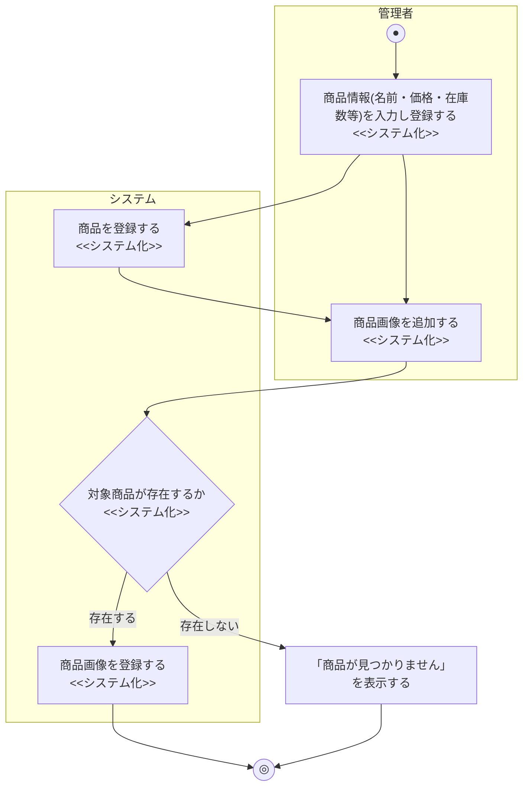
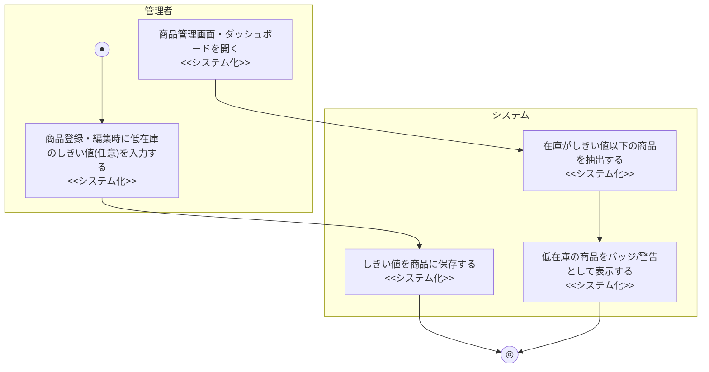

# 業務フロー図: 商品管理業務(管理者向け)

[← 業務フロー図一覧に戻る](../01_business_flow.md) / 全体ルール: [[../../../README|docs/README.md]]

### 概要

管理者が商品情報(商品本体・商品画像)を登録・編集・削除する業務。

### 登場アクター

- 管理者
- システム(EC_SITE)

### 業務フロー図(As-Is)

該当なし。業務エキスパートへのヒアリングを行っておらず、既存の商品台帳管理の方法(紙・Excel等)を確認できていないため、憶測でAs-Isを記述することは避け、該当なしとする。

### 課題・問題点

該当なし(As-Is業務を確認できていないため)。

### 業務フロー図(To-Be)

- 商品情報の編集(`PATCH /admin/products/{id}`)・削除(`DELETE /admin/products/{id}`)、画像の編集(`PATCH /admin/product-images/{id}`)・削除(`DELETE /admin/product-images/{id}`)も存在するが、いずれも「対象が存在するか」の確認後に更新/削除するだけの単純な処理のため、上図には代表として新規登録フローのみを示す。

### 業務フロー図(To-Be): 低在庫アラート確認(2026-07-12追加)

- しきい値は商品ごとに管理者が任意で設定する値であり、未設定(NULL)の商品は低在庫判定の対象外とする(既存商品への遡及的な警告を避けるため)。
- 通知はUI表示(バッジ・アラートセクション)のみとし、メール等の能動的な通知は行わない([[../../external_design/04_notification_design|04_notification_design.md]]参照)。
