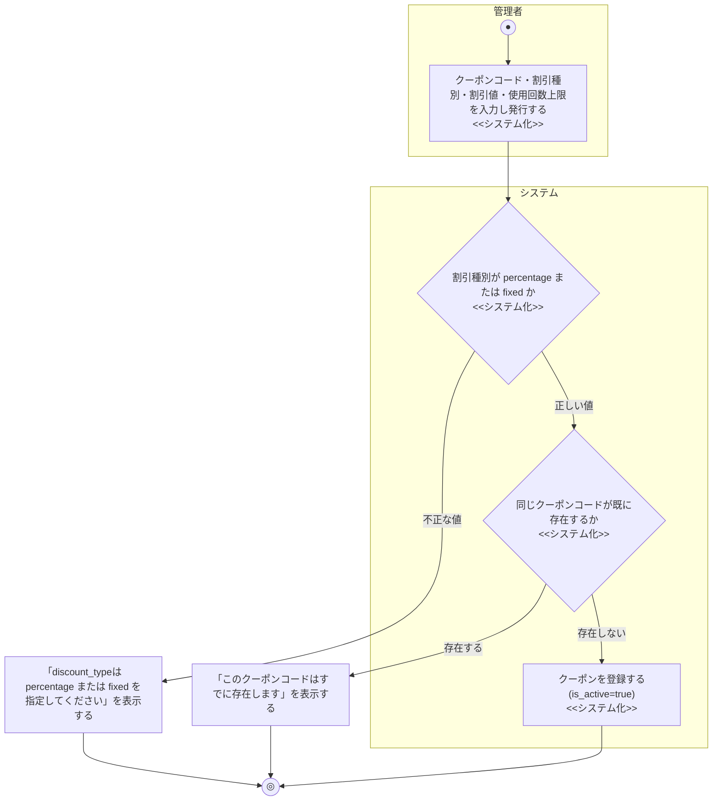
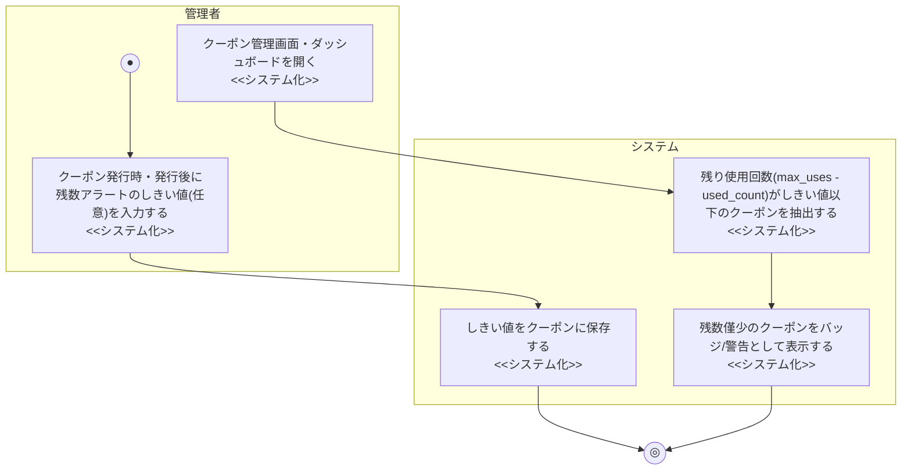

# 業務フロー図: クーポン管理業務(管理者向け)

[← 業務フロー図一覧に戻る](../01_business_flow.md) / 全体ルール: [[../../../README|docs/README.md]]

### 概要

管理者がクーポン(割引コード)を発行・有効化/無効化・削除する業務。

### 登場アクター

- 管理者
- システム(EC_SITE)

### 業務フロー図(As-Is)

該当なし。業務エキスパートへのヒアリングを行っておらず、既存のクーポン発行方法(紙のクーポン券等)を確認できていないため、憶測でAs-Isを記述することは避け、該当なしとする。

### 課題・問題点

該当なし(As-Is業務を確認できていないため)。

### 業務フロー図(To-Be)

- 有効/無効の切り替え(`PATCH /admin/coupons/{id}`、`is_active`を反転)・削除(`DELETE /admin/coupons/{id}`)は、対象クーポンの存在確認後に更新/削除するだけの単純な処理のため、上図には含めていない。

### 業務フロー図(To-Be): クーポン残数アラート確認(2026-07-13追加)

- しきい値はクーポンごとに管理者が任意で設定する値であり、未設定(NULL)のクーポンは対象外とする。使用回数上限(`max_uses`)が無制限(NULL)のクーポンも、残り回数の概念がないため対象外とする(既存の低在庫アラート機能と同じ設計思想)。
- 通知はUI表示(バッジ・アラートセクション)のみとし、メール等の能動的な通知は行わない([[../../external_design/04_notification_design|04_notification_design.md]]参照)。
