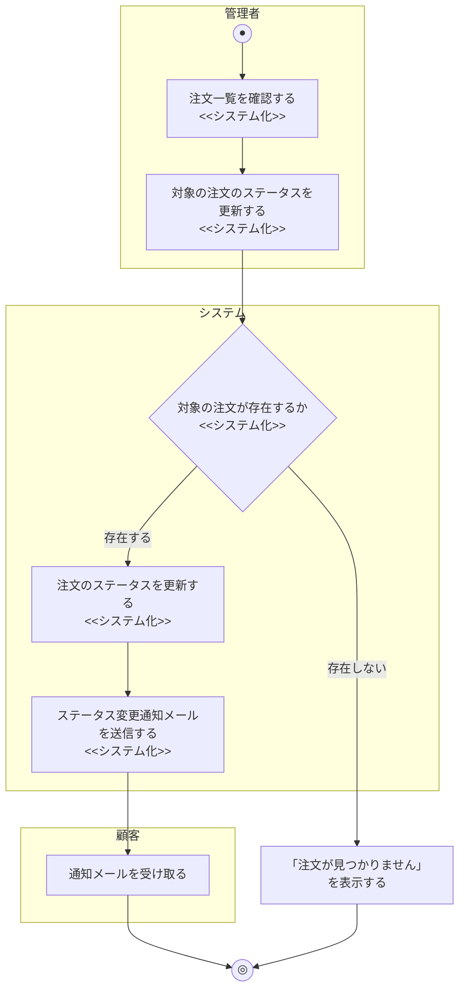

# 業務フロー図: 注文管理業務(管理者向け)

[← 業務フロー図一覧に戻る](../01_business_flow.md) / 全体ルール: [[../../../README|docs/README.md]]

### 概要

管理者が全顧客の注文一覧を確認し、注文状況(ステータス)を更新する業務。

### 登場アクター

- 管理者
- システム(EC_SITE)
- 顧客(通知の受信者)

### 業務フロー図(As-Is)

該当なし。As-Isの商品購入業務では受注担当者が電話・FAXで注文を受け付け、代金引換・銀行振込を案内するところまでは確認できているが(`01_business_flow.md`「商品購入業務」As-Is参照)、その後の出荷・発送状況の管理方法については業務エキスパートへのヒアリングを行っておらず確認できていないため、憶測での記述は避け、該当なしとする。

### 課題・問題点

該当なし(As-Is業務を確認できていないため)。

### 業務フロー図(To-Be)

- 注文一覧取得(`GET /admin/orders`)は作成日時降順で全顧客分を返す単純な参照処理のため、分岐は発生しない。
