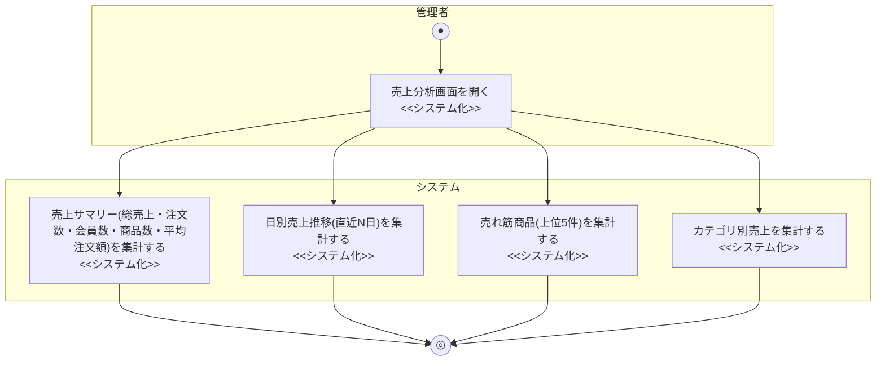

# 業務フロー図: 売上分析業務(管理者向け)

[← 業務フロー図一覧に戻る](../01_business_flow.md) / 全体ルール: [[../../../README|docs/README.md]]

### 概要

管理者が売上サマリー・日別売上推移・売れ筋商品・カテゴリ別売上を確認する業務。

### 登場アクター

- 管理者
- システム(EC_SITE)

### 業務フロー図(As-Is)

該当なし。本機能はECサイト固有の集計機能であり、対応する紙・電話ベースのAs-Is業務フローは存在しない(As-Isの商品購入業務は受注担当者が個別に受注処理するのみで、横断的な売上集計の仕組みは想定されていない)。

### 課題・問題点

該当なし(As-Is業務が存在しないため)。

### 業務フロー図(To-Be)

- 4種類の集計(サマリー/日別推移/売れ筋商品/カテゴリ別売上)はそれぞれ独立したエンドポイント(`/admin/analytics/summary`, `sales-by-date`, `top-products`, `category-sales`)であり、フォーク(並行処理)として表現している。分岐条件は存在しない(参照系のみ)。
