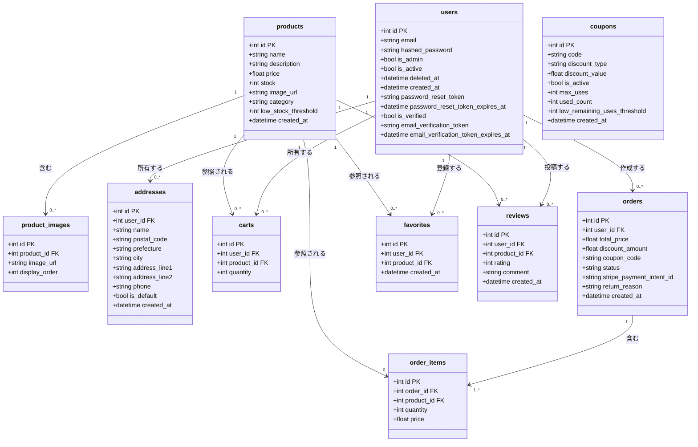

# テーブル定義書

テンプレート: [[../../templates/internal_design/table_definition_template|docs/templates/internal_design/table_definition_template.md]]
全体ルール: [[../../README|docs/README.md]](UML記法統一ルール(必須)を含む)

対象: `backend/app/models.py` に実装された全テーブル(SQLAlchemyモデル)。`04_conceptual_er.md`(概念クラス図)で扱ったエンティティに加え、実装上存在する補助テーブル(`product_images`)も含む。

## 1. 物理ER図(クラス図)

UMLクラス図(Class Diagram)で表現する([[../../README|docs/README.md]] 全体ルールに基づく)。

### 訂正メモ: `orders.coupon_code` と `coupons` の関係について

`04_conceptual_er.md`(概念ER図)では `ORDER "0..1" --> "0..1" COUPON : 適用する` という外部キー相当の関係として記載していたが、実装(`backend/app/models.py`)を確認した結果、`orders.coupon_code` は単なる `String` 型のカラムであり、`coupons.code` への `ForeignKey` 制約は貼られていない(アプリケーションロジック側で `coupons.code` と文字列一致させているのみ)。
本ドキュメントでは実装を優先し、上図では `orders` と `coupons` の間に物理的な関連線を引いていない。整合性チェック(クーポンコードの有効性・使用回数)は `POST /orders` / `POST /payment/checkout` のアプリケーションロジックで担保されている(`03_sequence_diagram.md`参照)。

## 2. テーブル定義表

### products テーブル

**元になったエンティティ**: PRODUCT(`04_conceptual_er.md`)

| カラム名 | 型 | PK/FK | NULL許可 | デフォルト | 説明 |
|---|---|---|---|---|---|
| id | INTEGER | PK(index) | NOT NULL | 自動採番 | 商品ID |
| name | STRING | | NOT NULL | なし | 商品名 |
| description | STRING | | NULL可 | なし | 商品説明 |
| price | FLOAT | | NOT NULL | なし | 価格(税抜) |
| stock | INTEGER | | NOT NULL | 0 | 在庫数 |
| image_url | STRING | | NULL可 | なし | メイン画像URL |
| category | STRING | | NULL可 | なし | カテゴリ |
| low_stock_threshold | INTEGER | | NULL可 | なし | 低在庫アラートのしきい値。NULLの場合はしきい値未設定として低在庫判定の対象外(2026-07-12追加、F-034) |
| created_at | DATETIME | | - | `datetime.utcnow()` | 作成日時 |

### product_images テーブル

**元になったエンティティ**: `04_conceptual_er.md` には未記載(実装のみに存在する補助テーブル。商品ごとの複数画像を表現する)。管理者向け商品画像管理機能(F-022)で使用される。

| カラム名 | 型 | PK/FK | NULL許可 | デフォルト | 説明 |
|---|---|---|---|---|---|
| id | INTEGER | PK(index) | NOT NULL | 自動採番 | 画像ID |
| product_id | INTEGER | FK → products.id | NOT NULL | なし | 対象商品 |
| image_url | STRING | | NOT NULL | なし | 画像URL |
| display_order | INTEGER | | NOT NULL | 0 | 表示順 |

### users テーブル

**元になったエンティティ**: CUSTOMER(`04_conceptual_er.md`)

| カラム名 | 型 | PK/FK | NULL許可 | デフォルト | 説明 |
|---|---|---|---|---|---|
| id | INTEGER | PK(index) | NOT NULL | 自動採番 | ユーザーID |
| email | STRING | index, UNIQUE | NOT NULL | なし | メールアドレス(ログインID) |
| hashed_password | STRING | | NOT NULL | なし | ハッシュ化済みパスワード |
| is_admin | BOOLEAN | | NOT NULL | false | 管理者フラグ |
| is_active | BOOLEAN | | NOT NULL | true | 有効フラグ。退会(F-030)により`false`になる論理削除フラグ(2026-07-11追加) |
| deleted_at | DATETIME | | NULL可 | なし | 退会日時(退会済みでない場合`NULL`)(2026-07-11追加) |
| created_at | DATETIME | | - | `datetime.utcnow()` | 作成日時 |
| password_reset_token | STRING | index | NULL可 | なし | パスワードリセット用トークン。未発行・使用済みの場合`NULL`(2026-07-13追加、F-036) |
| password_reset_token_expires_at | DATETIME | | NULL可 | なし | リセットトークンの有効期限(発行から24時間後)。`password_reset_token`が`NULL`の場合は無意味(2026-07-13追加、F-036) |
| is_verified | BOOLEAN | | NOT NULL | false | メールアドレス確認済みフラグ。未確認であってもログイン等の既存機能は制限しない(2026-07-13追加、F-037) |
| email_verification_token | STRING | index | NULL可 | なし | メールアドレス確認用トークン。未発行・使用済みの場合`NULL`(2026-07-13追加、F-037) |
| email_verification_token_expires_at | DATETIME | | NULL可 | なし | 確認用トークンの有効期限(発行から7日後)。`email_verification_token`が`NULL`の場合は無意味(2026-07-13追加、F-037) |

- インデックス: `email` に一意インデックス(`unique=True, index=True`)を実装で明示的に付与している。退会後は匿名化されたメールアドレス(`deleted-user-{id}@deleted.invalid`)に書き換わるため、一意制約に抵触せず同一メールアドレスでの再登録が可能になる
- インデックス: `password_reset_token` にインデックス(`index=True`)を付与し、トークン検証時の検索を高速化する(2026-07-13追加)
- インデックス: `email_verification_token` にインデックス(`index=True`)を付与し、トークン検証時の検索を高速化する(2026-07-13追加)
- 本テーブルへのカラム追加は`Base.metadata.create_all`ベースで行っており、正式なマイグレーション(既存テーブルへの`ALTER TABLE`)は対象外(`06_nonfunctional_requirements.md`の移行性に関する既存の記載を参照)。新規に作成されるDBには反映されるが、既存の永続化されたDBファイルには自動反映されない点に留意

### addresses テーブル

**元になったエンティティ**: ADDRESS(`04_conceptual_er.md`。配送先管理業務追加(2026-07-06)により、`04_conceptual_er.md`に正式なエンティティとして追加された。追加前は「商品購入業務の実ドキュメントでは、外部設計フェーズ(`02_api_spec.md`)にて参照専用(GET)としてのみスコープに含める」としていたが、配送先管理業務の追加に伴い、本テーブルの登録・編集・削除(F-015〜F-019)もスコープに含まれるようになった)。

| カラム名 | 型 | PK/FK | NULL許可 | デフォルト | 説明 |
|---|---|---|---|---|---|
| id | INTEGER | PK(index) | NOT NULL | 自動採番 | 住所ID |
| user_id | INTEGER | FK → users.id | NOT NULL | なし | 所有ユーザー |
| name | STRING | | NOT NULL | なし | 宛名 |
| postal_code | STRING | | NOT NULL | なし | 郵便番号 |
| prefecture | STRING | | NOT NULL | なし | 都道府県 |
| city | STRING | | NOT NULL | なし | 市区町村 |
| address_line1 | STRING | | NOT NULL | なし | 番地・建物名 |
| address_line2 | STRING | | NULL可 | なし | 番地・建物名(続き) |
| phone | STRING | | NULL可 | なし | 電話番号 |
| is_default | BOOLEAN | | NOT NULL | false | デフォルト住所フラグ |
| created_at | DATETIME | | - | `datetime.utcnow()` | 作成日時 |

### carts テーブル

**元になったエンティティ**: CART_ITEM(`04_conceptual_er.md`。概念ER図では CART という中間エンティティを想定していたが、実装では `carts` テーブル自体が1ユーザー・1商品ごとの行を持つ設計であり、`CART`(カート全体)に相当するテーブルは存在しない。実装を優先し、本表では `carts` = 概念上の CART_ITEM に相当するものとして扱う)

| カラム名 | 型 | PK/FK | NULL許可 | デフォルト | 説明 |
|---|---|---|---|---|---|
| id | INTEGER | PK(index) | NOT NULL | 自動採番 | カート行ID |
| user_id | INTEGER | FK → users.id | NOT NULL | なし | 所有ユーザー |
| product_id | INTEGER | FK → products.id | NOT NULL | なし | 商品 |
| quantity | INTEGER | | NOT NULL | 1 | 数量 |

### coupons テーブル

**元になったエンティティ**: COUPON(`04_conceptual_er.md`)

| カラム名 | 型 | PK/FK | NULL許可 | デフォルト | 説明 |
|---|---|---|---|---|---|
| id | INTEGER | PK(index) | NOT NULL | 自動採番 | クーポンID |
| code | STRING | index, UNIQUE | NOT NULL | なし | クーポンコード(`orders.coupon_code`と文字列一致、FK制約なし) |
| discount_type | STRING | | NOT NULL | なし | 割引種別("percentage" または "fixed") |
| discount_value | FLOAT | | NOT NULL | なし | 割引値 |
| is_active | BOOLEAN | | NOT NULL | true | 有効フラグ |
| max_uses | INTEGER | | NULL可 | なし | 使用回数上限(無制限の場合NULL) |
| used_count | INTEGER | | NOT NULL | 0 | 使用回数 |
| low_remaining_uses_threshold | INTEGER | | NULL可 | なし | 残数アラートしきい値。NULLの場合はしきい値未設定として残数僅少判定の対象外(2026-07-13追加、F-035) |
| created_at | DATETIME | | - | `datetime.utcnow()` | 作成日時 |

- インデックス: `code` に一意インデックス(`unique=True, index=True`)を実装で明示的に付与している。

### orders テーブル

**元になったエンティティ**: ORDER(`04_conceptual_er.md`)

| カラム名 | 型 | PK/FK | NULL許可 | デフォルト | 説明 |
|---|---|---|---|---|---|
| id | INTEGER | PK(index) | NOT NULL | 自動採番 | 注文ID |
| user_id | INTEGER | FK → users.id | NOT NULL | なし | 注文したユーザー |
| total_price | FLOAT | | NOT NULL | なし | 合計金額(税込・割引後) |
| discount_amount | FLOAT | | NOT NULL | 0 | 割引額 |
| coupon_code | STRING | | NULL可 | なし | 適用されたクーポンコード(FK制約なし。上記訂正メモ参照) |
| status | STRING | | NOT NULL | "pending" | 注文状態("pending" / "processing" / "shipped" / "cancelled" / "return_requested" / "returned" 等) |
| stripe_payment_intent_id | STRING | | NULL可 | なし | Stripe決済完了時のPaymentIntent ID(`POST /payment/complete`で設定。キャンセル・返品承認時の返金先として使用。カード決済を使わず確定した注文は`NULL`のまま)(2026-07-11追加) |
| return_reason | STRING | | NULL可 | なし | 返品申請時に顧客が入力した理由(任意入力)(2026-07-11追加) |
| created_at | DATETIME | | - | `datetime.utcnow()` | 作成日時 |

### order_items テーブル

**元になったエンティティ**: ORDER_ITEM(`04_conceptual_er.md`)

| カラム名 | 型 | PK/FK | NULL許可 | デフォルト | 説明 |
|---|---|---|---|---|---|
| id | INTEGER | PK(index) | NOT NULL | 自動採番 | 注文明細ID |
| order_id | INTEGER | FK → orders.id | NOT NULL | なし | 注文 |
| product_id | INTEGER | FK → products.id | NOT NULL | なし | 商品 |
| quantity | INTEGER | | NOT NULL | なし | 数量 |
| price | FLOAT | | NOT NULL | なし | 注文時点の単価(スナップショット) |

### favorites テーブル

**元になったエンティティ**: FAVORITE(`04_conceptual_er.md`。お気に入り管理業務追加(2026-07-06)により正式なエンティティとして追加された。F-011, F-012参照)

| カラム名 | 型 | PK/FK | NULL許可 | デフォルト | 説明 |
|---|---|---|---|---|---|
| id | INTEGER | PK(index) | NOT NULL | 自動採番 | お気に入りID |
| user_id | INTEGER | FK → users.id | NOT NULL | なし | ユーザー |
| product_id | INTEGER | FK → products.id | NOT NULL | なし | 商品 |
| created_at | DATETIME | | - | `datetime.utcnow()` | 登録日時 |

### reviews テーブル

**元になったエンティティ**: REVIEW(`04_conceptual_er.md`。レビュー投稿業務追加(2026-07-06)により正式なエンティティとして追加された。UC-004, F-013, F-014参照)

| カラム名 | 型 | PK/FK | NULL許可 | デフォルト | 説明 |
|---|---|---|---|---|---|
| id | INTEGER | PK(index) | NOT NULL | 自動採番 | レビューID |
| user_id | INTEGER | FK → users.id | NOT NULL | なし | 投稿ユーザー |
| product_id | INTEGER | FK → products.id | NOT NULL | なし | 対象商品 |
| rating | INTEGER | | NOT NULL | なし | 評価(点数) |
| comment | STRING | | NULL可 | なし | コメント |
| created_at | DATETIME | | - | `datetime.utcnow()` | 投稿日時 |

## 3. 改善提案(実装にないインデックス等)

- `carts.user_id` / `orders.user_id` / `order_items.order_id` など、頻繁に絞り込み条件として使われる外部キー列には、現状インデックスが明示的に貼られていない。パフォーマンス改善の余地があるが、これは確定事項ではなく改善提案として本節に留める(テーブル定義表本体には含めない)。
