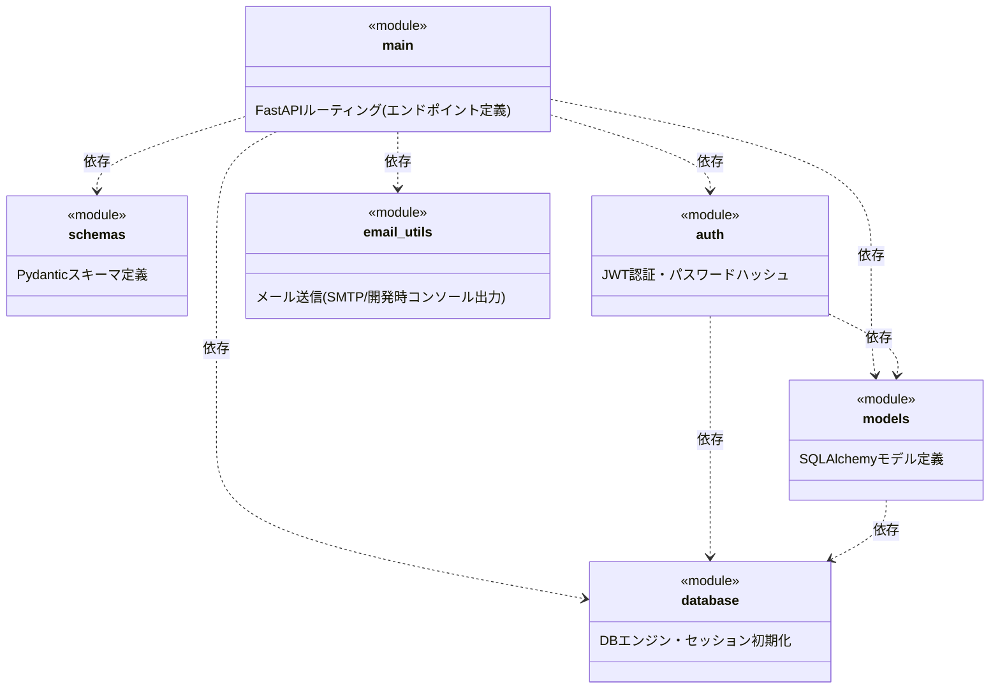

# モジュール構成図

テンプレート: [[../../templates/internal_design/module_design_template|docs/templates/internal_design/module_design_template.md]]
全体ルール: [[../../README|docs/README.md]](UML記法統一ルール(必須)を含む)

対象: `backend/app/` 配下の全Pythonモジュール(`main.py`, `models.py`, `schemas.py`, `auth.py`, `email_utils.py`, `database.py`)。実際の`import`文(2026-07-06時点のソース)に基づいて作成する。

## 1. モジュール構成図

UMLパッケージ図(Package Diagram)相当として、Mermaid `classDiagram` の `<<module>>`ステレオタイプ+依存矢印(`..>`)で近似表現する([[../../README|docs/README.md]] 全体ルールに基づく)。

- `schemas` と `email_utils` は他の自作モジュールに依存していない(外部ライブラリ・標準ライブラリのみに依存)。
- 循環依存は存在しない(`main`を頂点とする単方向の依存関係)。

## 2. 主要モジュールの役割

- **`main.py`**: FastAPIアプリケーション本体。全APIエンドポイント(`/products`, `/cart`, `/orders`, `/payment/*`, `/coupons/validate`, `/addresses`, `/config` 等)を定義する。`02_api_spec.md`(外部設計)の各エンドポイントは、すべて本モジュールに実装されている。
- **`models.py`**: SQLAlchemyモデル定義(`Product`, `ProductImage`, `User`, `Address`, `Cart`, `Coupon`, `Order`, `OrderItem`, `Favorite`, `Review`)。`01_table_definition.md`の物理テーブル定義の実体。
- **`schemas.py`**: Pydanticスキーマ定義。APIリクエスト/レスポンスの型を定義する(`ProductOut`, `OrderCreate`, `OrderOut` 等)。他の自作モジュールに依存しない。
- **`auth.py`**: JWT認証(トークン発行・検証)、パスワードハッシュ化(`passlib`)、`get_current_user`等の依存性注入関数を提供する。`models`・`database`に依存する。
- **`email_utils.py`**: 注文確認メール(`send_order_confirmation`)・状態通知メール(`send_status_notification`)・退会完了通知メール(`send_account_deletion_email`、2026-07-11追加)の送信。`SMTP_HOST`未設定時はコンソール出力にフォールバックする(開発時モード)。他の自作モジュールに依存しない。
- **`database.py`**: SQLAlchemyエンジン・セッション(`get_db`)・`Base`(モデルの基底クラス)を初期化する。他の自作モジュールに依存しない。

## 3. `02_api_spec.md` のエンドポイントとモジュールの対応

商品購入業務および他8業務(会員管理・お気に入り・レビュー投稿・配送先管理・商品管理・クーポン管理・注文管理・売上分析)のエンドポイントは、すべて `main.py` に実装されている。処理の中でモジュールをどう呼び出すかの詳細は `03_sequence_diagram.md` を参照。

| エンドポイント | 実装モジュール | 主な依存モジュール |
|---|---|---|
| `GET /products`, `GET /products/{id}` | `main.py` | `models`, `schemas` |
| `GET /cart`, `POST /cart`, `PATCH /cart/{id}`, `DELETE /cart/{id}` | `main.py` | `models`, `schemas`, `auth`(`get_current_user`) |
| `GET /coupons/validate` | `main.py` | `models`, `schemas` |
| `POST /orders`, `GET /orders`, `GET /orders/{id}` | `main.py` | `models`, `schemas`, `auth`, `email_utils` |
| `GET /config`, `POST /payment/checkout`, `POST /payment/complete` | `main.py` | `models`, `schemas`, `auth`, `email_utils`, `stripe`(外部ライブラリ) |
| `GET /addresses` | `main.py` | `models`, `schemas`, `auth` |
| `POST /auth/register`, `POST /auth/login`, `GET /auth/me` | `main.py` | `models`, `schemas`, `auth` |
| `DELETE /users/me` | `main.py` | `models`, `schemas`, `auth`, `email_utils`(退会完了通知) |
| `GET /favorites`, `POST /favorites/{id}`, `DELETE /favorites/{id}` | `main.py` | `models`, `schemas`, `auth` |
| `GET /products/{id}/reviews`, `POST /products/{id}/reviews` | `main.py` | `models`, `schemas`, `auth` |
| `POST /addresses`, `PATCH /addresses/{id}`, `DELETE /addresses/{id}`, `POST /addresses/{id}/default` | `main.py` | `models`, `schemas`, `auth` |
| `POST /admin/products`, `PATCH /admin/products/{id}`, `DELETE /admin/products/{id}` | `main.py` | `models`, `schemas`, `auth` |
| `POST /admin/products/{id}/images`, `PATCH /admin/product-images/{id}`, `DELETE /admin/product-images/{id}` | `main.py` | `models`, `schemas`, `auth` |
| `GET /admin/coupons`, `POST /admin/coupons`, `PATCH /admin/coupons/{id}`, `DELETE /admin/coupons/{id}` | `main.py` | `models`, `schemas`, `auth` |
| `GET /admin/orders`, `PATCH /admin/orders/{id}/status` | `main.py` | `models`, `schemas`, `auth`, `email_utils`(ステータス変更通知) |
| `GET /admin/analytics/summary`, `sales-by-date`, `top-products`, `category-sales` | `main.py` | `models`, `schemas`, `auth` |
