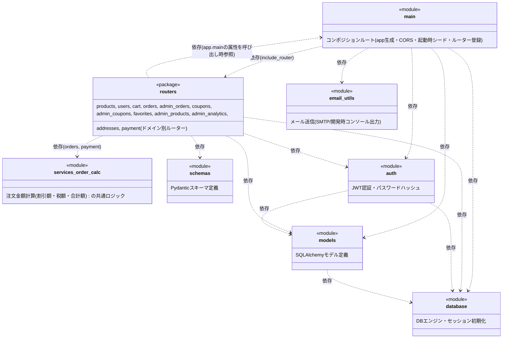

# モジュール構成図

テンプレート: [[../../templates/internal_design/module_design_template|docs/templates/internal_design/module_design_template.md]]
全体ルール: [[../../README|docs/README.md]](UML記法統一ルール(必須)を含む)

対象: `backend/app/` 配下の全Pythonモジュール(`main.py`, `routers/*.py`, `services/order_calc.py`, `models.py`, `schemas.py`, `auth.py`, `email_utils.py`, `database.py`)。実際の`import`文(2026-07-12時点のソース)に基づいて作成する。

`main.py`は2026-07-12にルーター分割リファクタを実施し、全APIエンドポイントを`routers/`配下のドメイン別モジュールへ移設した。`main.py`自体はFastAPIアプリのコンポジションルート(アプリ生成・CORS設定・起動時シード処理・各ルーターの`include_router`登録)のみを担う薄いモジュールになっている。

## 1. モジュール構成図

UMLパッケージ図(Package Diagram)相当として、Mermaid `classDiagram` の `<<module>>`ステレオタイプ+依存矢印(`..>`)で近似表現する([[../../README|docs/README.md]] 全体ルールに基づく)。

- `schemas`・`email_utils`・`services/order_calc.py` は他の自作モジュールに依存していない(外部ライブラリ・標準ライブラリのみに依存)。
- `routers ..> main` の依存は循環に見えるが、各ルーターは`from .. import main`を**関数内で遅延import**し、`main.stripe_lib`・`main.STRIPE_SECRET_KEY`・`main.send_status_notification`等の属性を**呼び出し時に**参照する設計(後述)であり、モジュール読み込み時の循環importにはならない。

## 2. 主要モジュールの役割

- **`main.py`**: FastAPIアプリのコンポジションルート。`app = FastAPI()`の生成、CORSミドルウェア設定、起動時シード処理(`seed_products`/`seed_coupons`/`seed_admin`)、`routers/`配下の各ルーターの`include_router`登録のみを行う。加えて、`STRIPE_SECRET_KEY`・`stripe_lib`(`import stripe as stripe_lib`)・`send_account_deletion_email`等のメール関数を**モジュール属性として保持**し続けている。これはテスト(`backend/tests/conftest.py`等)が`monkeypatch.setattr("app.main.X", ...)`の形で`app.main`の属性を直接パッチしているためで、ルーター側がこれらの値をimport時にコピーせず`main.X`の形で呼び出し時参照することで、パッチが正しく効く設計になっている。
- **`routers/`パッケージ**: ドメインごとに分割されたAPIエンドポイント定義。各モジュールは`APIRouter()`を1つ持ち、`main.py`から`include_router`される。
  - `products.py`: 商品一覧/詳細(公開)、レコメンド、レビュー、商品画像一覧(公開)
  - `users.py`: 会員登録・ログイン・自分の情報取得・退会
  - `cart.py`: カートCRUD
  - `orders.py`: 顧客側の注文作成・一覧・取得・キャンセル・返品申請
  - `admin_orders.py`: 管理者による返品承認/却下・注文ステータス変更・注文一覧
  - `coupons.py`: クーポンコード検証(公開)
  - `admin_coupons.py`: クーポン管理(CRUD)
  - `favorites.py`: お気に入りCRUD
  - `admin_products.py`: 商品管理CRUD・商品画像管理CRUD・低在庫商品一覧取得(2026-07-12追加、F-034)
  - `admin_analytics.py`: 売上サマリー・日別売上・売れ筋商品・カテゴリ別売上
  - `addresses.py`: 配送先住所CRUD・デフォルト設定
  - `payment.py`: Stripe決済設定確認(`/config`)・チェックアウトセッション作成・決済完了処理
- **`services/order_calc.py`**: 注文の割引額計算(`calculate_discount`)・税込合計額計算(`calculate_total`)の共通ロジック。`routers/orders.py`(注文確定時)と`routers/payment.py`(Stripeチェックアウト・決済完了時)の重複していた計算式を集約したもの。
- **`models.py`**: SQLAlchemyモデル定義(`Product`, `ProductImage`, `User`, `Address`, `Cart`, `Coupon`, `Order`, `OrderItem`, `Favorite`, `Review`)。`01_table_definition.md`の物理テーブル定義の実体。
- **`schemas.py`**: Pydanticスキーマ定義。APIリクエスト/レスポンスの型を定義する(`ProductOut`, `OrderCreate`, `OrderOut` 等)。他の自作モジュールに依存しない。
- **`auth.py`**: JWT認証(トークン発行・検証)、パスワードハッシュ化(`passlib`)、`get_current_user`等の依存性注入関数を提供する。`models`・`database`に依存する。
- **`email_utils.py`**: 注文確認メール(`send_order_confirmation`)・状態通知メール(`send_status_notification`)・退会完了通知メール(`send_account_deletion_email`)・返品却下通知メール(`send_return_rejected_email`)の送信。`SMTP_HOST`未設定時はコンソール出力にフォールバックする(開発時モード)。他の自作モジュールに依存しない。
- **`database.py`**: SQLAlchemyエンジン・セッション(`get_db`)・`Base`(モデルの基底クラス)を初期化する。他の自作モジュールに依存しない。

## 3. `02_api_spec.md` のエンドポイントとモジュールの対応

商品購入業務および他8業務(会員管理・お気に入り・レビュー投稿・配送先管理・商品管理・クーポン管理・注文管理・売上分析)のエンドポイントは、ドメインごとに`routers/`配下の各モジュールに実装されている。処理の中でモジュールをどう呼び出すかの詳細は `03_sequence_diagram.md` を参照。

| エンドポイント | 実装モジュール | 主な依存モジュール |
|---|---|---|
| `GET /products`, `GET /products/{id}`, `GET /products/{id}/recommendations` | `routers/products.py` | `models`, `schemas` |
| `GET /products/{id}/reviews`, `POST /products/{id}/reviews` | `routers/products.py` | `models`, `schemas`, `auth` |
| `GET /products/{id}/images` | `routers/products.py` | `models`, `schemas` |
| `POST /auth/register`, `POST /auth/login`, `GET /auth/me` | `routers/users.py` | `models`, `schemas`, `auth` |
| `DELETE /users/me` | `routers/users.py` | `models`, `schemas`, `auth`, `main`(退会完了通知メール呼び出し) |
| `GET /cart`, `POST /cart`, `PATCH /cart/{id}`, `DELETE /cart/{id}` | `routers/cart.py` | `models`, `schemas`, `auth`(`get_current_user`) |
| `POST /orders`, `GET /orders`, `GET /orders/{id}` | `routers/orders.py` | `models`, `schemas`, `auth`, `services/order_calc`, `main`(注文確認メール) |
| `POST /orders/{id}/cancel`, `POST /orders/{id}/return-request` | `routers/orders.py` | `models`, `schemas`, `auth`, `main`(ステータス変更通知メール、`stripe_lib`経由の返金) |
| `PATCH /admin/orders/{id}/return` | `routers/admin_orders.py` | `models`, `schemas`, `auth`, `main`(承認時は状態通知メール・却下時は返品却下通知メール、`stripe_lib`経由の返金) |
| `GET /admin/orders`, `PATCH /admin/orders/{id}/status` | `routers/admin_orders.py` | `models`, `schemas`, `auth`, `main`(ステータス変更通知メール) |
| `GET /coupons/validate` | `routers/coupons.py` | `models`, `schemas` |
| `GET /admin/coupons`, `POST /admin/coupons`, `PATCH /admin/coupons/{id}`, `DELETE /admin/coupons/{id}` | `routers/admin_coupons.py` | `models`, `schemas`, `auth` |
| `GET /favorites`, `POST /favorites/{id}`, `DELETE /favorites/{id}` | `routers/favorites.py` | `models`, `schemas`, `auth` |
| `POST /admin/products`, `PATCH /admin/products/{id}`, `DELETE /admin/products/{id}` | `routers/admin_products.py` | `models`, `schemas`, `auth` |
| `POST /admin/products/{id}/images`, `PATCH /admin/product-images/{id}`, `DELETE /admin/product-images/{id}` | `routers/admin_products.py` | `models`, `schemas`, `auth` |
| `GET /admin/products/low-stock` | `routers/admin_products.py` | `models`, `schemas`, `auth` |
| `GET /admin/analytics/summary`, `sales-by-date`, `top-products`, `category-sales` | `routers/admin_analytics.py` | `models`, `auth` |
| `GET /addresses`, `POST /addresses`, `PATCH /addresses/{id}`, `DELETE /addresses/{id}`, `POST /addresses/{id}/default` | `routers/addresses.py` | `models`, `schemas`, `auth` |
| `GET /config`, `POST /payment/checkout`, `POST /payment/complete` | `routers/payment.py` | `models`, `schemas`, `auth`, `services/order_calc`, `main`(`stripe_lib`・`STRIPE_SECRET_KEY`・注文確認メール) |
