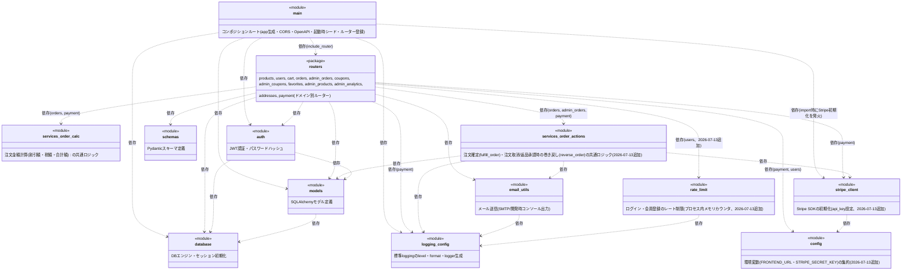

# モジュール構成図

テンプレート: [[../../templates/internal_design/module_design_template|docs/templates/internal_design/module_design_template.md]]
全体ルール: [[../../README|docs/README.md]](図の記法選定ルールを含む)

対象: `backend/app/` 配下の全Pythonモジュール(`main.py`, `config.py`, `stripe_client.py`, `logging_config.py`, `rate_limit.py`, `routers/*.py`, `services/*.py`, `models.py`, `schemas.py`, `auth.py`, `email_utils.py`, `database.py`)。パッケージ初期化ファイルは依存図から省略する。実際の`import`文に基づいて作成する。

`main.py`は全APIエンドポイントを`routers/`配下のドメイン別モジュールへ委譲する。FastAPIアプリ生成、CORS、起動時シード、ルーター登録に加え、共通401/403/429を補うOpenAPI生成を担うコンポジションルートである。

さらに2026-07-13、各ルーターが`from .. import main`で`main.py`のモジュール属性(`STRIPE_SECRET_KEY`・`stripe_lib`・`FRONTEND_URL`)を関数内で遅延参照していたDIP違反を解消し、`config.py`(環境変数の集約)と`stripe_client.py`(Stripe SDK初期化)を新設して各ルーターが直接importする形に変更した。あわせて、注文確定(カート→注文)と注文取消/返品承認時の巻き戻し(在庫復元・クーポン残数調整・Stripe返金)の重複ロジックを`services/order_actions.py`に集約した。

## 1. モジュール構成図

UMLパッケージ図(Package Diagram)相当として、Mermaid `classDiagram` の `<<module>>`ステレオタイプ+依存矢印(`..>`)で近似表現する([[../../README|docs/README.md]] 全体ルールに基づく)。

- `schemas`・`logging_config`・`config`・`services/order_calc.py`は他の自作モジュールに依存していない(外部ライブラリ・標準ライブラリのみに依存)。`email_utils`は`logging_config`に依存する。
- 2026-07-13以前は`routers ..> main`という循環依存があり、各ルーターが`from .. import main`を関数内で遅延importして`main.stripe_lib`・`main.STRIPE_SECRET_KEY`・`main.send_status_notification`等の属性を呼び出し時に参照する設計だったが、これはDIP違反(ルーターが上位のコンポジションルートに依存する逆転した依存関係)だったため解消した。現在は`routers`から`main`への依存はなく、`config`/`stripe_client`/`email_utils`/`services/order_actions`を直接importする。

## 2. 主要モジュールの役割

- **`main.py`**: FastAPIアプリのコンポジションルート。アプリ生成、CORS、起動時シード、ルーター登録、共通認証/認可/レート制限レスポンスをOpenAPIへ追加する`custom_openapi`を担う。`stripe_client`のimportでStripe APIキー初期化を発火させる。業務エンドポイントは持たない。
- **`config.py`**(2026-07-13追加): 環境変数から読み取る`FRONTEND_URL`・`STRIPE_SECRET_KEY`を定数として公開する。他の自作モジュールに依存しない。
- **`stripe_client.py`**(2026-07-13追加): `stripe`ライブラリを`stripe_lib`としてimportし、`config.STRIPE_SECRET_KEY`が設定されていれば`stripe_lib.api_key`をセットする。`config`にのみ依存する。
- **`routers/`パッケージ**: ドメインごとに分割されたAPIエンドポイント定義。各モジュールは`APIRouter()`を1つ持ち、`main.py`から`include_router`される。テスト(`backend/tests/conftest.py`等)は`monkeypatch.setattr("app.email_utils.X", ...)`・`monkeypatch.setattr("app.stripe_client.stripe_lib", ...)`・`monkeypatch.setattr("app.config.STRIPE_SECRET_KEY", ...)`のように各モジュールを直接パッチする。ルーター側は`import config`/`import stripe_client`/`import email_utils`の形でモジュールごとimportし、`config.STRIPE_SECRET_KEY`のように属性を呼び出し時参照することで、このパッチが正しく効く。
  - `products.py`: 商品一覧/詳細(公開)、レコメンド、レビュー、商品画像一覧(公開)
  - `users.py`: 会員登録・ログイン・自分の情報取得・退会・パスワードリセット要求/再設定(2026-07-13追加、F-036)・メールアドレス確認/再送(2026-07-13追加、F-037)
  - `cart.py`: カートCRUD
  - `orders.py`: 顧客側の注文作成・一覧・取得・キャンセル・返品申請
  - `admin_orders.py`: 管理者による返品承認/却下・注文ステータス変更・注文一覧
  - `coupons.py`: クーポンコード検証(公開)
  - `admin_coupons.py`: クーポン管理(CRUD)・残数僅少クーポン一覧取得(2026-07-13追加、F-035)
  - `favorites.py`: お気に入りCRUD
  - `admin_products.py`: 商品管理CRUD・商品画像管理CRUD・低在庫商品一覧取得(2026-07-12追加、F-034)
  - `admin_analytics.py`: 売上サマリー・日別売上・売れ筋商品・カテゴリ別売上
  - `addresses.py`: 配送先住所CRUD・デフォルト設定
  - `payment.py`: Stripe決済設定確認(`/config`)・チェックアウトセッション作成・決済完了処理
- **`services/order_calc.py`**: 注文の割引額計算(`calculate_discount`)・税込合計額計算(`calculate_total`)の共通ロジック。`routers/orders.py`(注文確定時)と`routers/payment.py`(Stripeチェックアウト・決済完了時)の重複していた計算式を集約したもの。
- **`services/order_actions.py`**(2026-07-13追加): `calculate_subtotal`(カート小計計算)・`fulfill_order`(カートから注文を確定し、在庫減算・クーポン使用数加算・注文確認メール送信までを行う)・`reverse_order`(注文取消/返品承認時に、Stripe返金・在庫復元・クーポン使用数減算を行う)を提供する。`routers/orders.py`(注文作成・キャンセル)・`routers/payment.py`(Stripe決済完了時の注文確定)・`routers/admin_orders.py`(返品承認時の巻き戻し)で重複していたロジックを集約したもの。`models`・`email_utils`・`stripe_client`に依存する。
- **`models.py`**: SQLAlchemyモデル定義(`Product`, `ProductImage`, `User`, `Address`, `Cart`, `Coupon`, `Order`, `OrderItem`, `Favorite`, `Review`)。`01_table_definition.md`の物理テーブル定義の実体。
- **`schemas.py`**: Pydanticスキーマ定義。APIリクエスト/レスポンスの型を定義する(`ProductOut`, `OrderCreate`, `OrderOut` 等)。他の自作モジュールに依存しない。
- **`auth.py`**: JWT認証(トークン発行・検証)、Argon2idによる新規パスワードハッシュ、既存bcryptハッシュの互換検証と再ハッシュ判定、`get_current_user`等の依存性注入関数を提供する。`models`・`database`に依存する。
- **`email_utils.py`**: 各種トランザクションメールを送信する。`SMTP_HOST`未設定時は宛先・本文・リンクをコンソール出力する開発モードのため、本番では禁止する。`logging_config`に依存する。
- **`database.py`**: SQLAlchemyエンジン・セッション(`get_db`)・`Base`(モデルの基底クラス)を初期化する。他の自作モジュールに依存しない。
- **`rate_limit.py`**(2026-07-13追加): ログイン・会員登録エンドポイントへのレート制限(NFR-022)。プロセス内メモリの固定ウィンドウカウンタ(キー: IPアドレス+エンドポイント種別)で実装し、外部ストア(Redis等)には依存しない。他の自作モジュールに依存しない。
- **`logging_config.py`**: `LOG_LEVEL`と共通formatをPython標準loggingへ設定し、named loggerを返す。構造化ログ、相関ID、機密マスキングは未実装。

## 3. `02_api_spec.md` のエンドポイントとモジュールの対応

商品購入業務および他8業務(会員管理・お気に入り・レビュー投稿・配送先管理・商品管理・クーポン管理・注文管理・売上分析)のエンドポイントは、ドメインごとに`routers/`配下の各モジュールに実装されている。処理の中でモジュールをどう呼び出すかの詳細は `03_sequence_diagram.md` を参照。

| エンドポイント | 実装モジュール | 主な依存モジュール |
|---|---|---|
| `GET /products`, `GET /products/{id}`, `GET /products/{id}/recommendations` | `routers/products.py` | `models`, `schemas` |
| `GET /products/{id}/reviews`, `POST /products/{id}/reviews` | `routers/products.py` | `models`, `schemas`, `auth` |
| `GET /products/{id}/images` | `routers/products.py` | `models`, `schemas` |
| `POST /auth/register`, `POST /auth/login`, `GET /auth/me` | `routers/users.py` | `models`, `schemas`, `auth` |
| `DELETE /users/me` | `routers/users.py` | `models`, `schemas`, `auth`, `config`, `email_utils`(退会完了通知メール) |
| `POST /auth/password-reset/request`, `POST /auth/password-reset/confirm` | `routers/users.py` | `models`, `schemas`, `auth`, `config`, `email_utils`(パスワードリセットメール) |
| `POST /auth/verify-email/resend`, `POST /auth/verify-email/confirm` | `routers/users.py` | `models`, `schemas`, `auth`, `config`, `email_utils`(メールアドレス確認メール) |
| `GET /cart`, `POST /cart`, `PATCH /cart/{id}`, `DELETE /cart/{id}` | `routers/cart.py` | `models`, `schemas`, `auth`(`get_current_user`) |
| `POST /orders`, `GET /orders`, `GET /orders/{id}` | `routers/orders.py` | `models`, `schemas`, `auth`, `services/order_calc`, `services/order_actions`(`fulfill_order`が注文確認メールまで送信) |
| `POST /orders/{id}/cancel`, `POST /orders/{id}/return-request` | `routers/orders.py` | `models`, `schemas`, `auth`, `email_utils`(ステータス変更通知メール), `services/order_actions`(`reverse_order`が`stripe_client`経由の返金・在庫復元) |
| `PATCH /admin/orders/{id}/return` | `routers/admin_orders.py` | `models`, `schemas`, `auth`, `email_utils`(承認時は状態通知メール・却下時は返品却下通知メール), `services/order_actions`(`reverse_order`が`stripe_client`経由の返金) |
| `GET /admin/orders`, `PATCH /admin/orders/{id}/status` | `routers/admin_orders.py` | `models`, `schemas`, `auth`, `email_utils`(ステータス変更通知メール) |
| `GET /coupons/validate` | `routers/coupons.py` | `models`, `schemas` |
| `GET /admin/coupons`, `POST /admin/coupons`, `PATCH /admin/coupons/{id}`, `DELETE /admin/coupons/{id}` | `routers/admin_coupons.py` | `models`, `schemas`, `auth` |
| `GET /admin/coupons/low-remaining-uses` | `routers/admin_coupons.py` | `models`, `schemas`, `auth` |
| `GET /favorites`, `POST /favorites/{id}`, `DELETE /favorites/{id}` | `routers/favorites.py` | `models`, `schemas`, `auth` |
| `POST /admin/products`, `PATCH /admin/products/{id}`, `DELETE /admin/products/{id}` | `routers/admin_products.py` | `models`, `schemas`, `auth` |
| `POST /admin/products/{id}/images`, `PATCH /admin/product-images/{id}`, `DELETE /admin/product-images/{id}` | `routers/admin_products.py` | `models`, `schemas`, `auth` |
| `GET /admin/products/low-stock` | `routers/admin_products.py` | `models`, `schemas`, `auth` |
| `GET /admin/analytics/summary`, `sales-by-date`, `top-products`, `category-sales` | `routers/admin_analytics.py` | `models`, `auth` |
| `GET /addresses`, `POST /addresses`, `PATCH /addresses/{id}`, `DELETE /addresses/{id}`, `POST /addresses/{id}/default` | `routers/addresses.py` | `models`, `schemas`, `auth` |
| `GET /config`, `POST /payment/checkout`, `POST /payment/complete` | `routers/payment.py` | `models`, `schemas`, `auth`, `config`(`STRIPE_SECRET_KEY`), `stripe_client`, `services/order_calc`, `services/order_actions`(`fulfill_order`が注文確認メールまで送信) |
