# シーケンス図

テンプレート: [[../../templates/internal_design/sequence_diagram_template|docs/templates/internal_design/sequence_diagram_template.md]]
全体ルール: [[../../README|docs/README.md]](UML記法統一ルール(必須)を含む)

対象: `01_use_cases.md`のユースケースのうち、複数コンポーネント(フロントエンド・API・DB・外部サービス)が絡む処理。本ドキュメントでは UC-002(カード決済)を中心に、UC-003(カード決済なし)も含めて作成する。UC-001(商品を探す/購入検討)は単純な参照系(`GET /products`)のみのため、シーケンス図の作成は省略する([[sequence_diagram_template|テンプレート]]3節「内部処理が複雑なものに限定する」の方針による)。UC-004(レビュー投稿)も、顧客→API→DBの単純な単一コンポーネント処理であり、Stripe連携のような多段の分岐・外部サービス連携を含まないため、同様の理由でシーケンス図の作成を省略する。お気に入り・配送先管理・商品管理・クーポン管理・売上分析の各業務についても、いずれも単一APIコールで完結する処理であり、シーケンス図を要するほどの複雑さはないと判断した。注文管理業務(ステータス更新+通知メール送信)と会員管理業務のUC-005(退会。パスワード検証+DB複数テーブル更新+メール送信+ログアウトの多段処理)は例外的に複雑度が高いため、シーケンス図を作成する。同様に、UC-006(注文キャンセル)・UC-007(返品申請)・UC-008(返品承認・却下)もStripe返金・在庫戻し等の多段処理を伴うため作成する(2026-07-11追加)。

## UC-003: カード決済を使わずに注文を確定する

`POST /orders`(`backend/app/main.py:218`)に対応する。

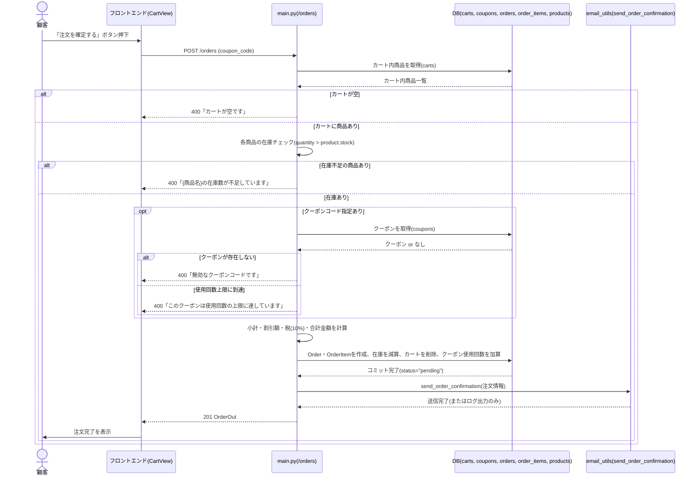

## UC-002: クレジットカードで支払う

2つのエンドポイント(`POST /payment/checkout`→`POST /payment/complete`)にまたがる。`backend/app/main.py:840`, `main.py:895`。

### 2-1. Checkout Session作成(`POST /payment/checkout`)

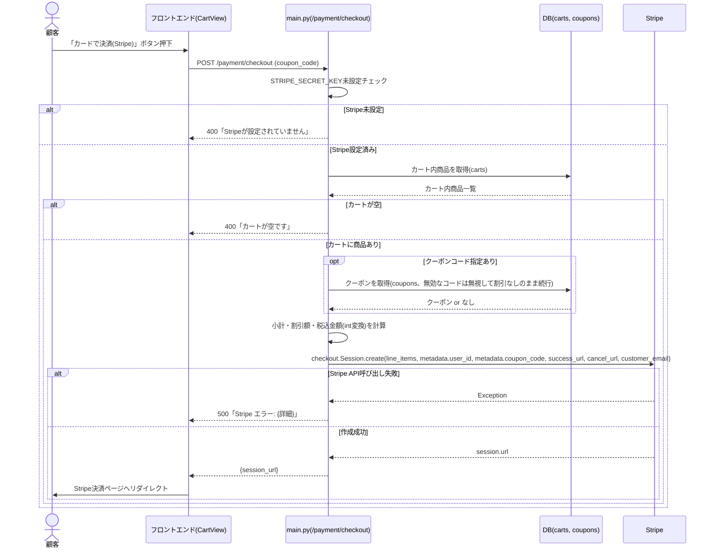

### 2-2. 決済完了処理(`POST /payment/complete`)

フロントエンドは、Stripe決済ページからのリダイレクト後、URLパラメータ `?payment=success&session_id=...` を検知して本APIを呼び出す(`frontend/src/pages/MainView.jsx`)。

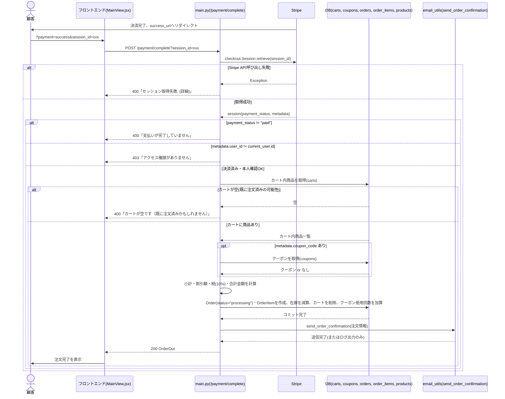

## 注文管理業務: 注文ステータスを更新する(管理者)

`PATCH /admin/orders/{order_id}/status`(`backend/app/main.py:557`)に対応する。DB更新後にメール送信を行う多段処理のため、UC-002/UC-003と同様にシーケンス図を作成する。

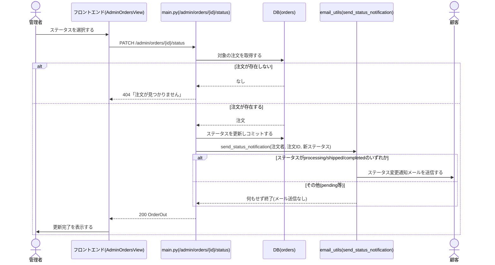

## UC-005: 退会する(2026-07-11追加)

`DELETE /users/me`(`backend/app/main.py`)に対応する。パスワード検証・DB複数テーブル更新・匿名化前アドレスへのメール送信・フロントエンド側ログアウトという多段処理のため、他のUCと同様にシーケンス図を作成する。

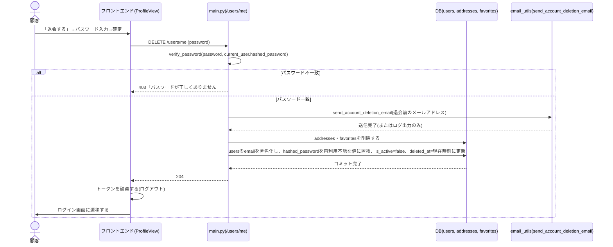

- メール送信(`send_account_deletion_email`)は、メールアドレスを匿名化する**前**に呼び出す(匿名化後では本人に届かないため)。この呼び出し順序は`main.py`の実装上の制約であり、他のUC(注文確認メール等)とは異なりDB更新より先に実行する
- 注文履歴(`orders`/`order_items`)・レビュー(`reviews`)は本処理では更新・削除しない(UC-005備考、NFR-013参照)

## UC-006: 注文をキャンセルする(2026-07-11追加)

`POST /orders/{order_id}/cancel`(`backend/app/routers/orders.py`)に対応する。Stripe返金・在庫戻し・クーポン使用回数戻し・DB更新・メール送信という多段処理のため、他のUCと同様にシーケンス図を作成する。

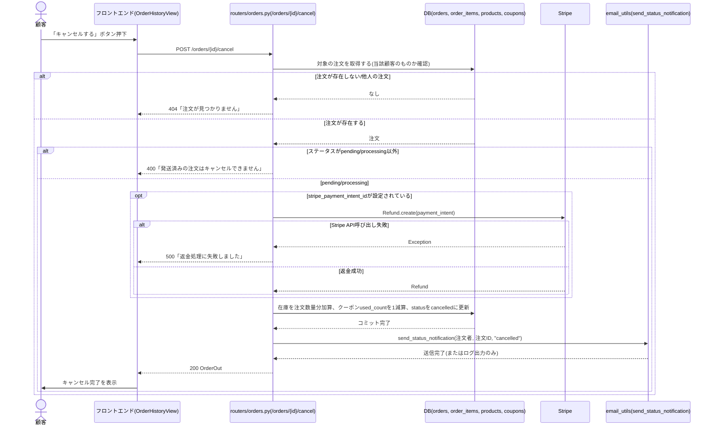

## UC-007: 返品を申請する(2026-07-11追加)

`POST /orders/{order_id}/return-request`(`backend/app/routers/orders.py`)に対応する。単純なステータス更新+通知メール送信のみだが、UC-006・UC-008との一連の流れを示すため図示する。

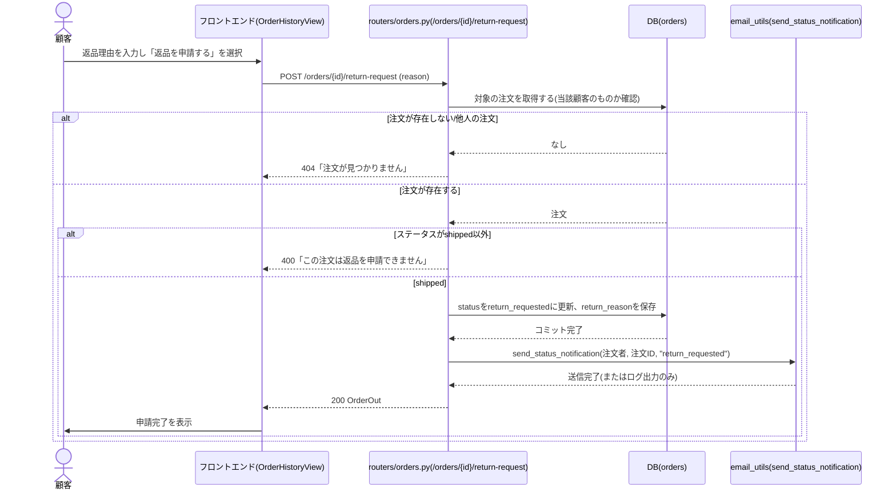

## UC-008: 返品を承認・却下する(管理者)(2026-07-11追加、2026-07-12 N-004反映)

`PATCH /admin/orders/{order_id}/return`(`backend/app/routers/admin_orders.py`)に対応する。承認/却下で処理が分岐し、承認時はUC-006と同様のStripe返金・在庫戻しを伴う多段処理のため図示する。却下時と承認時で送信するメール関数が異なる(N-004、`04_notification_design.md`参照)。

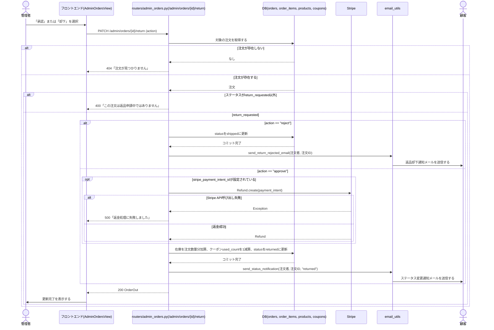

- 却下時は在庫・クーポン使用回数・返金処理を行わない(UC-008備考参照)
- 却下時に送信するメールは`send_status_notification`ではなく`send_return_rejected_email`(N-004): ステータスが`return_requested`→`shipped`に戻るため、汎用のステータス変更通知では顧客に「発送済み」という誤解を招く文面になってしまうことへの対応(`04_notification_design.md`参照)

## 商品管理業務: 低在庫アラートを確認する(管理者)(2026-07-12追加)

`GET /admin/products/low-stock`(`backend/app/routers/admin_products.py`、F-034)に対応する。DB検索のみで完結する単純な処理だが、S-101(商品管理画面)・S-104(ダッシュボード画面)の両方から呼び出される共通処理のため図示する。

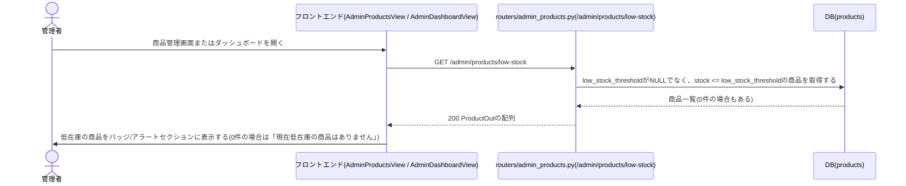

- しきい値(`low_stock_threshold`)自体の設定・変更は既存の`POST /admin/products` / `PATCH /admin/products/{id}`(F-020/F-021)のリクエストボディに項目が1つ増えるのみで、別シーケンスは起こさない

## クーポン管理業務: クーポン残数アラートを確認する(管理者)(2026-07-13追加)

`GET /admin/coupons/low-remaining-uses`(`backend/app/routers/admin_coupons.py`、F-035)に対応する。低在庫アラートと同型のDB検索のみで完結する単純な処理だが、S-102(クーポン管理画面)・S-104(ダッシュボード画面)の両方から呼び出される共通処理のため図示する。

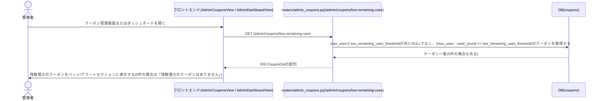

- しきい値(`low_remaining_uses_threshold`)自体の設定・変更は、クーポン発行時(`POST /admin/coupons`、F-023)、または既存の`PATCH /admin/coupons/{id}`(F-024)のリクエストボディに項目が加わる形で行い、別シーケンスは起こさない

## UC-009: パスワードをリセットする(2026-07-13追加)

`POST /auth/password-reset/request`・`POST /auth/password-reset/confirm`(`backend/app/routers/users.py`、F-036)に対応する。要求・確定の2段階に分かれ、メールアドレスの存在有無を開示しないための分岐があるため、シーケンス図を作成する。

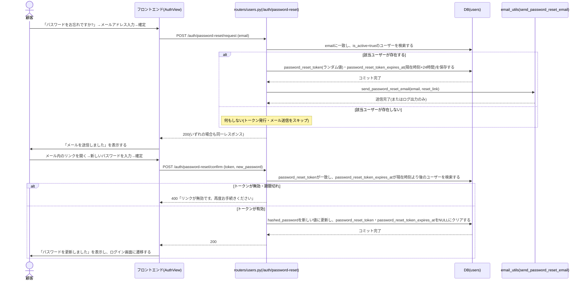

- 要求(`request`)ステップは、該当ユーザーの有無に関わらず必ず200を返し、処理時間・レスポンス内容にも意図的な差異を設けない(ユーザー列挙攻撃対策、UC-009参照)
- 確定(`confirm`)ステップの成功時、`password_reset_token`をNULLにクリアすることでトークンを1回限りの使用に制限する
- パスワードリセット成功後も、それ以前に発行済みのJWTアクセストークンは個別には失効しない(本システムのJWTの制約。UC-009備考参照)

## 補足: UC-002とUC-003の内部処理の違い

- UC-003(`POST /orders`)はクーポンコードが無効な場合に**400エラーで処理を中断する**が、UC-002(`POST /payment/checkout` / `POST /payment/complete`)はクーポンコードが無効な場合に**エラーにせず割引なしで処理を続行する**(`if coupon:` のみで判定し、`else`のエラー処理がない)。この差異は実装上の挙動であり、意図的な仕様か実装漏れかは要件定義フェーズ・業務エキスパートへの確認が必要な点として、`04_error_handling_design.md`に改善提案として記載する。
- 注文の`status`は、UC-003では`"pending"`、UC-002では`"processing"`となる(コードの実装差異をそのまま記載)。
