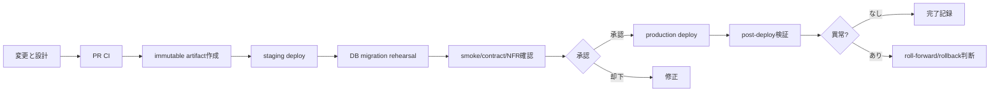

# リリース・DBマイグレーション設計

## 1. 現状

CIはテスト・lint・buildを行うが、versioned artifactの発行、staging/productionへのdeploy、承認、DB migrationは未定義である。DBはSQLAlchemy `Base.metadata.create_all()`で作成され、既存schemaを安全に変更する仕組みがない。`create_all`は本番マイグレーション手段として扱わない。

## 2. 目標リリースフロー

同一commitから作成したimmutable artifactをstagingからproductionへ昇格し、環境ごとに再buildしない。秘密と環境構成だけを外部注入する。

## 3. DB migration原則

- Alembic等のversioned migrationを導入し、schema versionをDBへ記録する
- expand/contractを基本とし、アプリ旧版と新版が移行中に共存できる変更順序にする
- column/table削除、型縮小、NOT NULL追加、大量データ書換えは複数releaseに分ける
- migrationは再実行時の挙動、lock時間、所要時間、disk容量をstagingで測定する
- 金額をfloatからDecimal/整数最小通貨単位へ移す場合、変換規則・丸め・照合・戻し方を別migration計画で承認する
- migration失敗後は、破壊的down migrationより修正migrationによるroll-forwardを優先する

## 4. リリース前チェック

- 変更対象の要求、ADR、API、テーブル、Runbook、追跡表が更新済み
- CI成功、依存脆弱性例外が期限内、OpenAPI差分承認済み
- backup取得と直近復元演習が成功
- migrationの前方適用と失敗時手順をproduction相当データ量で確認
- Stripe Webhook/SMTP/secret/CORS/TLSをstagingで確認
- Sev-1/Sev-2未解決0件、監視と担当者が有効

## 5. 実施・検証・中止

1. release ID、commit、artifact digest、担当者、開始時刻を記録
2. 必要ならmaintenance/traffic制御を開始
3. backup/PITR位置を確認
4. migrationを1回だけ実行し結果と所要時間を保存
5. applicationを段階deploy
6. readiness、主要API、登録/ログイン/商品閲覧/非破壊注文確認を実施
7. 5xx、latency、DB、Stripe/SMTP、業務不整合を監視
8. 異常がなければ完了し、監視強化期間を設ける

中止条件はmigration失敗、想定外のデータ欠損、5xx急増、認証/認可異常、決済/注文不整合である。DB変更後のapplication rollbackはschema互換性を確認せず行わない。

## 6. 緊急変更

緊急時も最低限、変更記録、別人または所有者承認、バックアップ、対象テスト、post-deploy検証を省略しない。通常手順を省略した項目は、理由と期限を付けて事後24時間以内に補完する。

## 7. 未決事項

- ホスティング、container registry、artifact署名方式
- staging/productionのDB製品とmigration tool
- deploy方式(rolling/blue-green等)とrollback判断者
- release cadence、maintenance window、通知先
- migration証拠とrelease記録の保存先
