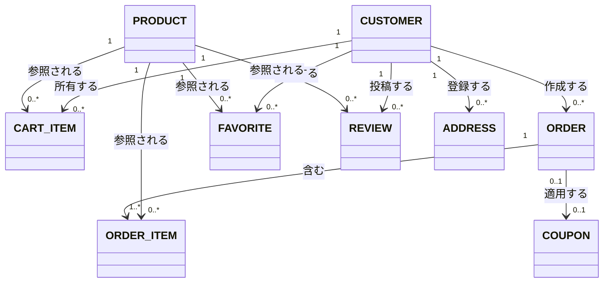

## 概念ER図(全体)

商品購入業務に加え、会員管理・お気に入り・レビュー・配送先管理業務のスコープに登場するエンティティを対象とする(管理者向け業務(商品管理・クーポン管理・注文管理・売上分析)は、既存のPRODUCT/COUPON/ORDERを操作する業務であり、新たなエンティティは発生しないため、本図には別途追加していない)。

## エンティティ一覧

| エンティティ名 | 概要 | 元になったドキュメント |
|---|---|---|
| CUSTOMER | 商品を購入する顧客(ログインユーザー)。管理者もこのエンティティの一種で、`is_admin`フラグにより区別される(`01_table_definition.md`参照) | US-001, UC-002, US-006, US-007 |
| PRODUCT | 販売対象の商品。在庫数を持つ | US-001 |
| CART_ITEM | 顧客がカートに入れた商品と数量 | US-001 |
| COUPON | 割引を適用するためのクーポン(コード・割引タイプ・使用回数上限) | UC-001 |
| ORDER | 決済完了後に確定する注文(小計・割引額・消費税を反映した合計金額を持つ) | UC-002 |
| ORDER_ITEM | 注文に含まれる商品明細(注文時点の数量・価格) | UC-002 |
| FAVORITE | 顧客が登録したお気に入り商品 | US-008 |
| REVIEW | 顧客が商品に投稿した評価・コメント | UC-004 |
| ADDRESS | 顧客が登録した配送先住所 | US-010 |

## 補足

- 決済(Stripe Checkout Session)はシステム外部のサービスであるため、概念エンティティとしては扱わない
- CART_ITEMは決済完了時にORDER_ITEMへ変換され、削除される(UC-002 基本フロー10〜12)。この「カートから注文への変換」は業務上重要な流れのため、テーブル設計時(内部設計フェーズ)にも引き継ぐ
- 管理者(admin)は独立したエンティティとしては設けていない。実装(`backend/app/models.py`)上、`users`テーブルの`is_admin`フラグで一般顧客と管理者を区別しているため、概念モデルでもCUSTOMERエンティティを共用する
