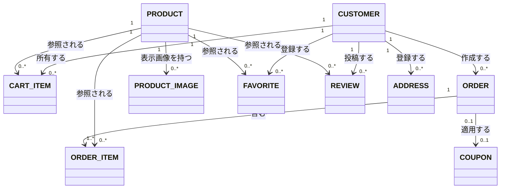

# 概念データモデル

## 概念ER図(全体)

商品購入業務に加え、会員管理・お気に入り・レビュー・配送先管理業務のスコープに登場するエンティティを対象とする(管理者向け業務(商品管理・クーポン管理・注文管理・売上分析)は、既存のPRODUCT/COUPON/ORDERを操作する業務であり、新たなエンティティは発生しないため、本図には別途追加していない)。

## エンティティ一覧

| エンティティ名 | 概要 | 元になったドキュメント |
|---|---|---|
| CUSTOMER | 商品を閲覧・購入する顧客(ログインユーザー)。管理者もこのエンティティの一種で、`is_admin`フラグにより区別される。パスワードリセット用トークン、メール確認状態・トークンも持つ | US-001, US-006, US-007, US-028〜032, UC-002, UC-009, UC-010 |
| PRODUCT | 販売対象の商品。在庫数と、任意の低在庫しきい値を持つ | US-001, US-024, US-028, US-030 |
| PRODUCT_IMAGE | 商品に追加され、表示順を持つ画像 | US-015, US-029 |
| CART_ITEM | 顧客がカートに入れた商品と数量 | US-001 |
| COUPON | 割引を適用するためのクーポン(コード・割引タイプ・使用回数上限)。残数アラート用のしきい値(任意、未設定可)も持つ(2026-07-13追加) | UC-001, US-025 |
| ORDER | 決済完了後に確定する注文(小計・割引額・消費税を反映した合計金額を持つ)。キャンセル・返品申請・返品完了の状態も持つ | US-031, UC-002, UC-006, UC-007, UC-008 |
| ORDER_ITEM | 注文に含まれる商品明細(注文時点の数量・価格) | UC-002 |
| FAVORITE | 顧客が登録したお気に入り商品 | US-008 |
| REVIEW | 顧客が商品に投稿した評価・コメント | UC-004 |
| ADDRESS | 顧客が登録・参照・編集する配送先住所 | US-010〜012, US-032 |

## 補足

- 決済(Stripe Checkout Session)はシステム外部のサービスであるため、概念エンティティとしては扱わない
- CART_ITEMは決済完了時にORDER_ITEMへ変換され、削除される(UC-002 基本フロー10〜12)。この「カートから注文への変換」は業務上重要な流れのため、テーブル設計時(内部設計フェーズ)にも引き継ぐ
- 管理者(admin)は独立したエンティティとしては設けていない。実装(`backend/app/models.py`)上、`users`テーブルの`is_admin`フラグで一般顧客と管理者を区別しているため、概念モデルでもCUSTOMERエンティティを共用する
- 退会機能(UC-005、2026-07-11追加)により、CUSTOMERは「有効/無効(論理削除済み)」の状態を持つようになった。概念モデル上は既存のCUSTOMERエンティティの状態(属性)として表現し、独立したエンティティは追加しない。物理設計(`is_active`, `deleted_at`カラム)は[[../internal_design/01_table_definition|01_table_definition.md]]を参照
- 注文キャンセル・返品機能(UC-006〜UC-008、2026-07-11追加)により、ORDERは`pending`/`processing`/`shipped`に加えて`cancelled`/`return_requested`/`returned`の状態を持つようになった。既存のORDERエンティティの状態(属性)拡張として表現し、独立したエンティティは追加しない。物理設計(`stripe_payment_intent_id`, `return_reason`カラム)は[[../internal_design/01_table_definition|01_table_definition.md]]を参照
- パスワードリセット機能(UC-009、2026-07-13追加)により、CUSTOMERはリセットトークン・その有効期限(任意、未設定可)を持つようになった。独立したエンティティ(例: PASSWORD_RESETテーブル)は設けず、既存のCUSTOMERエンティティの属性拡張として表現する(1顧客につき有効なリセットトークンは常に高々1つのため)。物理設計(`password_reset_token`, `password_reset_token_expires_at`カラム)は[[../internal_design/01_table_definition|01_table_definition.md]]を参照
- メールアドレスの本人確認機能(UC-010、2026-07-13追加)により、CUSTOMERはメールアドレス確認状態(`is_verified`)・確認用トークン・その有効期限(任意、未設定可)を持つようになった。パスワードリセットと同様の理由で、独立したエンティティは設けず既存のCUSTOMERエンティティの属性拡張として表現する。物理設計(`is_verified`, `email_verification_token`, `email_verification_token_expires_at`カラム)は[[../internal_design/01_table_definition|01_table_definition.md]]を参照
