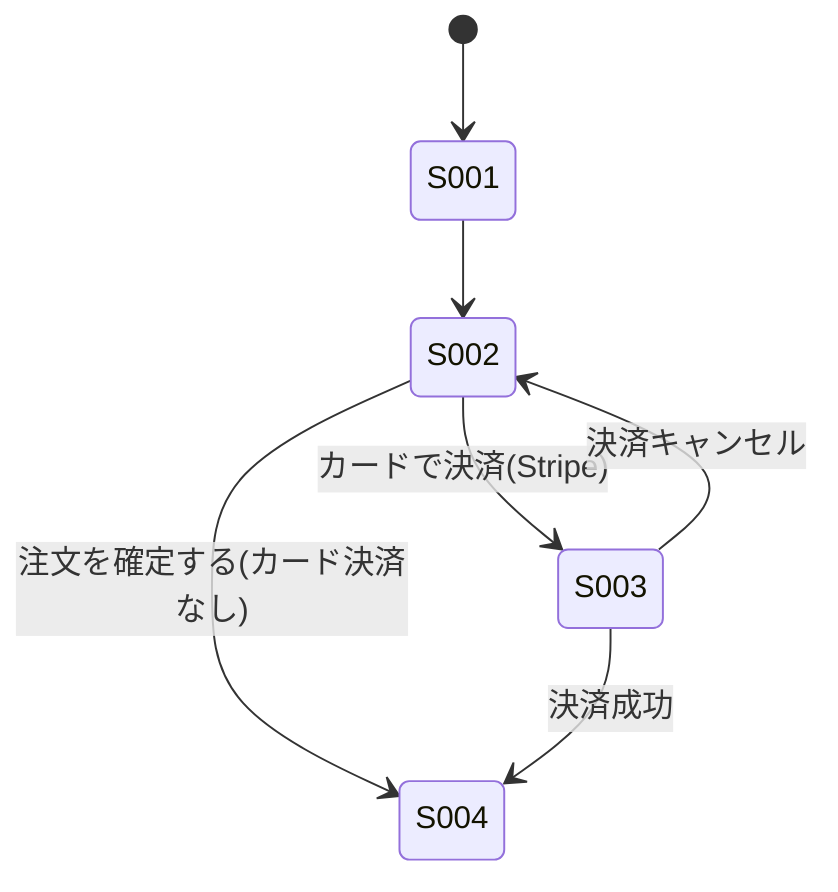
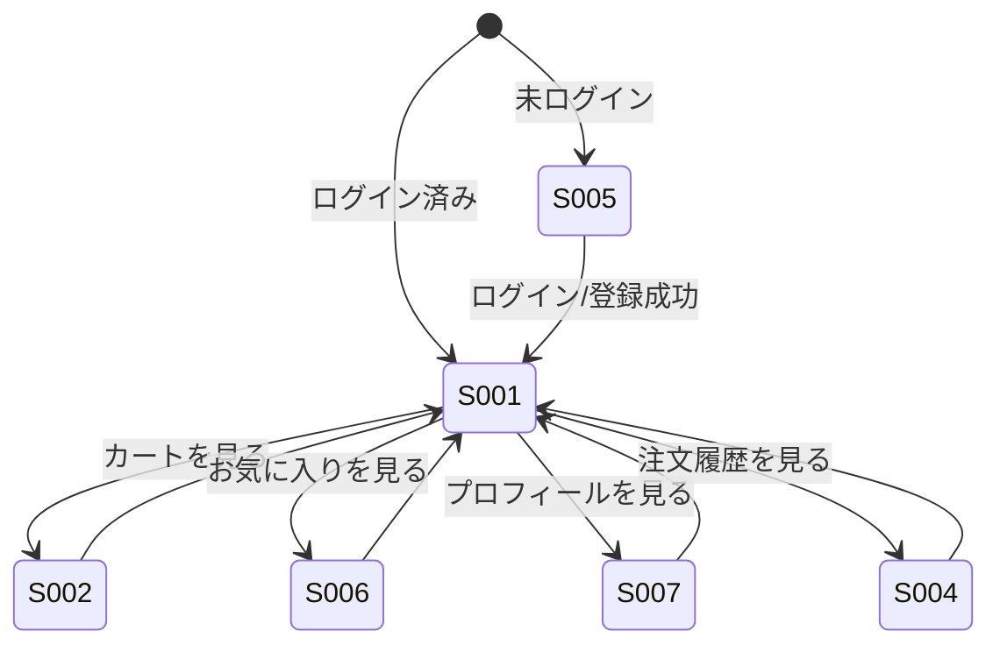
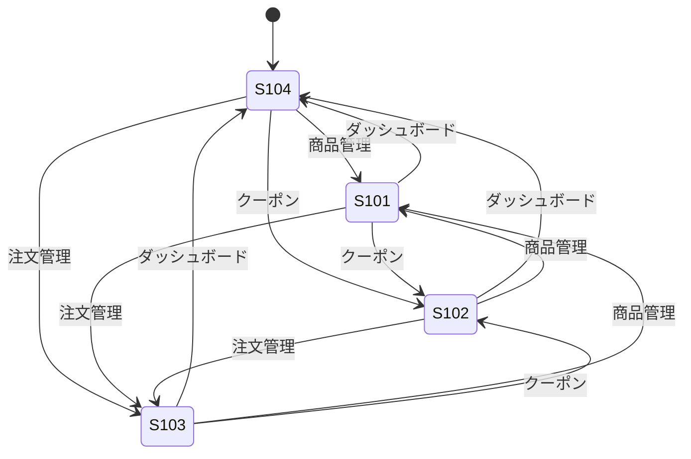

## 商品購入業務

### 画面一覧

| 画面ID | 画面名 | 概要 | 主なアクター | 元になったドキュメント |
|---|---|---|---|---|
| S-001 | 商品一覧画面 | 商品を閲覧し、カートに追加する。商品詳細では、お気に入り登録・レビュー閲覧・レビュー投稿も行う(`view === "products"`) | 顧客 | US-001, US-008, UC-004 |
| S-002 | カート画面 | カート内商品の確認・数量変更・クーポン適用・注文確定(カード決済/カード決済なしの2経路)を行う(`view === "cart"`、`CartView`) | 顧客 | US-001, UC-001, US-003, UC-002, UC-003 |
| S-003 | Stripe決済ページ | クレジットカード情報を入力し決済する(Stripeが提供する外部画面) | 顧客 | UC-002 |
| S-004 | 注文履歴画面 | 決済完了後の注文結果を確認する。発送前の注文はキャンセル、発送済みの注文は返品申請を行う(`view === "orders"`、`OrderHistoryView`) | 顧客 | US-005, US-021, UC-006, US-022, UC-007 |

- 注文キャンセル・返品申請機能(US-021, US-022, 2026-07-11追加)は、独立した画面としては起こさず、既存の注文履歴画面(S-004)内の各注文カードにボタン・入力欄を追加する形で実装する
- 実装(`frontend/src/pages/CartView.jsx`)を確認したところ、クーポン入力欄と決済ボタンは独立画面ではなく、カート画面(S-002)内のコンポーネントとして実装されている。そのため、当初想定していた「クーポン入力画面」「決済画面」は独立画面として起こさず、S-002にまとめた
- S-002には「注文を確定する」ボタン(常時表示、UC-003へ)と「カードで決済(Stripe)」ボタン(Stripe設定時のみ表示、UC-002へ)の2つの注文確定手段がある。外部設計フェーズでの調査により判明したため、UC-003を要件定義フェーズに追加した(F-008参照)
- S-001(商品詳細)には、お気に入りボタン(`ProductDetail`)・レビューセクション(`ReviewsSection`)が含まれる。当初想定していた「お気に入り画面」「レビュー投稿画面」は独立画面としては存在せず、商品一覧画面(S-001)内のコンポーネントとして実装されている。これは他業務の業務フロー図・User Story追加(2026-07-06)に伴う画面一覧の見直しにより判明した

### 画面遷移図

## 会員管理業務

### 画面一覧

| 画面ID | 画面名 | 概要 | 主なアクター | 元になったドキュメント |
|---|---|---|---|---|
| S-005 | ログイン・新規登録画面 | メールアドレス・パスワードでログイン、または新規登録する(`view === "login"` / `"register"`、`AuthView`) | 顧客(未ログイン) | US-006, US-007 |

## お気に入り管理業務

### 画面一覧

| 画面ID | 画面名 | 概要 | 主なアクター | 元になったドキュメント |
|---|---|---|---|---|
| S-006 | お気に入り画面 | お気に入り登録済みの商品一覧を確認し、解除する(`view === "favorites"`、`FavoritesView`) | 顧客 | US-008 |

## 配送先管理業務

### 画面一覧

| 画面ID | 画面名 | 概要 | 主なアクター | 元になったドキュメント |
|---|---|---|---|---|
| S-007 | プロフィール画面 | アカウント情報の確認、配送先の登録・削除・デフォルト設定、退会を行う(`view === "profile"`、`ProfileView`) | 顧客 | US-010, US-011, US-012, US-020, UC-005 |

- カート画面(S-002)にも配送先の選択欄があるが、これは登録済み配送先からの選択のみで、登録・編集・削除はS-007で行う
- 退会機能(US-020, UC-005)もS-007に追加する(2026-07-11)。独立した画面としては起こさず、既存のプロフィール画面内の「危険な操作」セクションとして実装する

### 顧客向け画面遷移図(全体)

商品購入業務・会員管理・お気に入り・配送先管理を横断する、顧客向けの画面遷移をまとめる。

## 商品管理業務(管理者向け)

### 画面一覧

| 画面ID | 画面名 | 概要 | 主なアクター | 元になったドキュメント |
|---|---|---|---|---|
| S-101 | 商品管理画面 | 商品の登録・編集・削除、商品画像の追加・削除を行う(`view === "admin-products"`、`AdminProductsView`) | 管理者 | US-013, US-014, US-015 |

## クーポン管理業務(管理者向け)

### 画面一覧

| 画面ID | 画面名 | 概要 | 主なアクター | 元になったドキュメント |
|---|---|---|---|---|
| S-102 | クーポン管理画面 | クーポンの発行・有効化・無効化・削除を行う(`view === "admin-coupons"`、`AdminCouponsView`) | 管理者 | US-016, US-017 |

## 注文管理業務(管理者向け)

### 画面一覧

| 画面ID | 画面名 | 概要 | 主なアクター | 元になったドキュメント |
|---|---|---|---|---|
| S-103 | 注文管理画面 | 全顧客の注文一覧を確認し、注文ステータスを更新する。返品申請中の注文は承認・却下を行う(`view === "admin-orders"`、`AdminOrdersView`) | 管理者 | US-018, US-023, UC-008 |

## 売上分析業務(管理者向け)

### 画面一覧

| 画面ID | 画面名 | 概要 | 主なアクター | 元になったドキュメント |
|---|---|---|---|---|
| S-104 | 売上ダッシュボード画面 | 売上サマリー・日別売上推移・売れ筋商品・カテゴリ別売上を確認する(`view === "admin-dashboard"`、`AdminDashboardView`) | 管理者 | US-019 |

#- 返品承認・却下機能(US-023, 2026-07-11追加)も、独立した画面としては起こさず、既存の注文管理画面(S-103)内に承認・却下ボタンを追加する形で実装する

## 管理者向け画面遷移図

管理者向けの4画面(S-101〜S-104)は、いずれもヘッダーのナビゲーションから直接遷移でき、相互の遷移順序に業務上の制約はない(すべて`is_admin=true`の場合のみヘッダーに表示される)。

