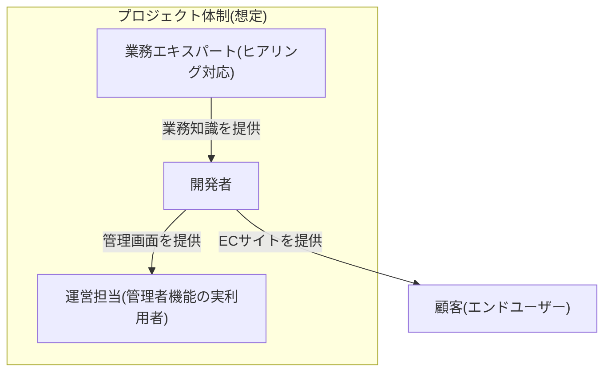

# ステークホルダー一覧

対象: 本プロジェクト(TechStore ECサイト)全体を通じて登場するステークホルダーの一覧。BABOK(Business Analysis Body of Knowledge)やIEEE 29148で要件定義フェーズの成果物として推奨されるステークホルダー登録簿(Stakeholder Register)に相当する

**元になったドキュメント**: 各ユースケース(`use_cases/UC-001.md`〜`UC-004.md`)内の「ステークホルダーと関心事」欄、および[[../demand_definition/01_business_flow|01_business_flow.md]]の記載

これまで各ユースケースに個別記載されていた「ステークホルダーと関心事」はUC単位の局所的な記載に留まり、プロジェクト全体を横断した一覧が存在しなかったため、本ドキュメントで集約する。個別UCの記載自体は削除せず、本ドキュメントは全体横断の要約として位置づける。

## 1. ステークホルダー一覧

| ステークホルダー | 役割 | 関心事(共通) | 主な登場ドキュメント |
|---|---|---|---|
| 顧客(CUSTOMER) | 商品を検索・購入する一般ユーザー | 正しい金額で確実に購入できること、個人情報・決済情報が安全に扱われること、注文状況が分かること | UC-001〜004, US-001〜012 |
| 運営(管理者、is_admin) | 商品・クーポン・注文を管理する社内担当者 | 在庫・クーポン使用回数・注文ステータスの整合性を保つこと、不正利用を防止すること、売上状況を把握できること | UC-001, US-013〜019 |
| 業務エキスパート | ヒアリング対象。本プロジェクトのドキュメント作成時に業務フロー・仕様の疑問点を確認する想定上の役割(実際のヒアリングが未実施の箇所は各ドキュメント内に「未確認」と明記されている) | ドキュメントが実際の業務・意図と乖離しないこと | [[../demand_definition/01_business_flow|01_business_flow.md]]、内部設計各種の「改善提案」欄 |
| Stripe(決済代行事業者) | カード決済処理を代行する外部サービス提供者 | 決済情報(カード番号等)を自システムが保持しないこと(PCI DSS範囲の縮小) | [[../external_design/03_external_interface|03_external_interface.md]] |
| SMTPサーバー運用者 | メール送信基盤を提供する主体(本番でどのサービスを使うかは未確定) | 送信元の正当性(SPF/DKIM等、現時点は未設定) | [[../external_design/03_external_interface|03_external_interface.md]] |

## 2. 体制図(簡易)

個人学習プロジェクトのため、開発・運営・レビューを1名(開発者)が兼務している。将来チーム開発に移行する場合は、以下のような役割分担を想定する。

- 上記は現時点で実在する体制図ではなく、本プロジェクトのドキュメント上に登場する役割を整理した想定図である。実際の体制(誰が開発者役・運営担当役を兼務しているか等)は本ドキュメントでは断定しない

## 参考文献

- IIBA, "A Guide to the Business Analysis Body of Knowledge (BABOK Guide)" — ステークホルダー分析の考え方
- IEEE 29148:2018 — 要件定義プロセスにおけるステークホルダー識別の要求事項
