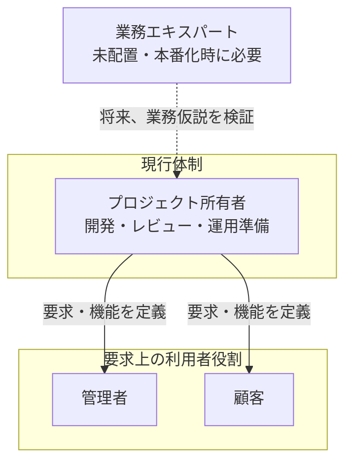

# ステークホルダー一覧

対象: 本プロジェクト(TechStore ECサイト)全体を通じて登場するステークホルダーの一覧。BABOK(Business Analysis Body of Knowledge)やIEEE 29148で要件定義フェーズの成果物として推奨されるステークホルダー登録簿(Stakeholder Register)に相当する

**元になったドキュメント**: 各ユースケース(`use_cases/UC-001.md`〜`UC-004.md`)内の「ステークホルダーと関心事」欄、および[[../demand_definition/01_business_flow|01_business_flow.md]]の記載

これまで各ユースケースに個別記載されていた「ステークホルダーと関心事」はUC単位の局所的な記載に留まり、プロジェクト全体を横断した一覧が存在しなかったため、本ドキュメントで集約する。個別UCの記載自体は削除せず、本ドキュメントは全体横断の要約として位置づける。

## 1. ステークホルダー一覧

| ステークホルダー | 役割 | 関心事(共通) | 主な登場ドキュメント |
|---|---|---|---|
| 顧客(CUSTOMER) | 商品を検索・購入する一般ユーザー | 正しい金額で確実に購入できること、個人情報・決済情報が安全に扱われること、注文状況が分かること | UC-001〜004, US-001〜012, US-028〜032 |
| 運営(管理者、is_admin) | 商品・クーポン・注文を管理する社内担当者 | 在庫・クーポン使用回数・注文ステータスの整合性を保つこと、不正利用を防止すること、売上状況を把握できること | UC-001, US-013〜019 |
| プロジェクト所有者 | 学習スコープ、要求、技術投資、本番化可否の意思決定者。現状は開発・レビュー・運用準備も兼務 | 要求の出所と未決事項が明確で、学習成果が再現可能であること | `00_system_requirements.md`、NFR、ADR、検証・運用文書 |
| 業務エキスパート(未配置) | 実事業化する場合に商品・受注・配送・返品・会計の業務規則を確認する将来役割。現時点では存在せず、ヒアリング実績もない | 学習用仮説を実業務要件として検証すること | As-Is、税、支払、配送、保持期間等の未決事項 |
| Stripe(決済代行事業者) | カード決済処理を代行する外部サービス提供者 | 決済情報(カード番号等)を自システムが保持しないこと(PCI DSS範囲の縮小) | [[../external_design/03_external_interface|03_external_interface.md]] |
| SMTPサーバー運用者 | メール送信基盤を提供する主体(本番でどのサービスを使うかは未確定) | 送信元の正当性(SPF/DKIM等、現時点は未設定) | [[../external_design/03_external_interface|03_external_interface.md]] |

## 2. 体制図(簡易)

個人学習プロジェクトのため、プロジェクト所有者が開発・レビュー・運用準備を兼務する。顧客・管理者は要求上の利用者役割であり、実在する運用組織ではない。

- Stripe、SMTP、GitHubは外部提供者であり、プロジェクト内の意思決定者ではない。本番化時にはセキュリティ、プライバシー、運用、リリース承認の責任分離を再設計する

## 参考文献

- IIBA, "A Guide to the Business Analysis Body of Knowledge (BABOK Guide)" — ステークホルダー分析の考え方
- IEEE 29148:2018 — 要件定義プロセスにおけるステークホルダー識別の要求事項
