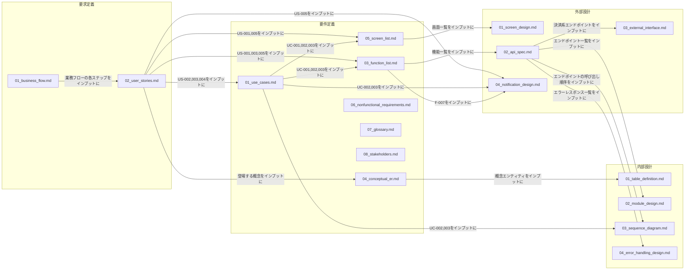

# ドキュメント体系図

全体ルール: [[README|docs/README.md]](UML記法統一ルール(必須)を含む)

各ドキュメントを「成果物(オブジェクト)」とみなし、あるドキュメントの記載内容(User Story, ユースケース, 機能, 画面等のID)をインプットにして次のドキュメントが作られる、という流れを示す。例:「User Storyをインプットにユースケースができる」「ユースケースをインプットに機能一覧ができる」。

矢印の向きは「インプット → 作成されるドキュメント」。UMLアクティビティ図のオブジェクトフロー(各ドキュメント=UMLオブジェクトノード)として、Mermaid `flowchart`(フェーズは`subgraph`によるパーティション)で近似表現する([[README|docs/README.md]] 全体ルールに基づく)。

対象は、商品購入業務および2026-07-06に追加した8業務(会員管理・お気に入り・レビュー投稿・配送先管理・商品管理・クーポン管理・注文管理・売上分析)を含む、現時点で作成済みの全実ドキュメント。ドキュメントファイル自体は業務追加前と同じ16ファイルのまま(各ファイルに業務ごとの見出しを追加する形で拡張したため)、下図のノード構成は変わらない。矢印(インプット関係)のラベルは商品購入業務分のみを代表として記載しており、他8業務分の詳細なインプット関係は[2節](#2-派生関係の補足)の表を参照。テンプレートとの対応関係(1テンプレート:1実ドキュメント)は本図には含めず、[3節](#3-テンプレートとの対応関係)に別途記載する。

## 1. 全体構成

- `06_nonfunctional_requirements.md`(B5)は、他ドキュメントへの明示的なインプット関係が記載上追えないため、上図では他ノードへの矢印を引いていない([2節](#2-派生関係の補足)参照)。
- 上図の矢印は商品購入業務分を代表として示したものであり、2026-07-06に追加した8業務(会員管理・お気に入り・レビュー投稿・配送先管理・商品管理・クーポン管理・注文管理・売上分析)についても、A2(User Story)→B1/B2/B4(ユースケース/機能一覧/画面一覧)→C1/C2(画面設計/API仕様)→D1〜D4(内部設計)という同じ流れで作成されている。業務ごとの詳細なID対応は[2節](#2-派生関係の補足)を参照。
- `07_glossary.md`(B6)・`08_stakeholders.md`(B7)は、2026-07-11に追加した横断的なドキュメントであり、上図では特定の単一ドキュメントをインプットとする矢印を引いていない(既存の複数ドキュメントの記載を集約・要約したものであるため)。詳細は[2節](#2-派生関係の補足)を参照。

## 2. 派生関係の補足

| フェーズ | ドキュメント | 主な派生元 | 備考 |
|---|---|---|---|
| 要求定義 | `01_business_flow.md` | (起点。業務エキスパートへのヒアリングが入力) | ヒアリングにより確認した内容を基に作成 |
| 要求定義 | `02_user_stories.md` | `01_business_flow.md` | 業務フロー図の各ステップからUser Storyを起こす |
| 要件定義 | `01_use_cases.md` | `02_user_stories.md` | 複雑度が高いUser Story(分岐が多いもの等)をユースケース化 |
| 要件定義 | `03_function_list.md` | `01_use_cases.md`, `02_user_stories.md` | F-008はUC-003(外部設計フェーズで発見し要件定義に遡って追加)由来 |
| 要件定義 | `04_conceptual_er.md` | `02_user_stories.md` | User Story本文に登場する概念を抽出 |
| 要件定義 | `05_screen_list.md` | `02_user_stories.md`, `01_use_cases.md` | S-002はUC-003追加に伴い記載を更新済み |
| 要件定義 | `06_nonfunctional_requirements.md` | (行単位のトレーサビリティは未整備) | 現状、個別のUser Story/ユースケースとの1対1対応は記載していない。将来的に整備する場合は本図・本表を更新する。2026-07-11、個人情報保護方針(NFR-012〜016)を追加 |
| 要件定義 | `07_glossary.md`(2026-07-11追加) | `02_user_stories.md`, `04_conceptual_er.md`, `03_function_list.md`, `05_screen_list.md` | 各ドキュメントに散在するドメイン用語・ID接頭辞を集約した用語集。一般監査(業界標準の要件定義成果物との比較)で用語集の欠落が指摘されたことを受けて追加 |
| 要件定義 | `08_stakeholders.md`(2026-07-11追加) | `use_cases/UC-001.md`〜`UC-004.md`の「ステークホルダーと関心事」欄 | UC単位に閉じていたステークホルダー記載をプロジェクト全体で集約。同様に一般監査を受けて追加 |
| 外部設計 | `01_screen_design.md` | `05_screen_list.md` | 画面ごとに1:1対応 |
| 外部設計 | `02_api_spec.md` | `03_function_list.md` | 機能ごとにエンドポイントを対応付け |
| 外部設計 | `03_external_interface.md` | `02_api_spec.md` | Stripe連携部分のみを抜き出して詳細化 |
| 外部設計 | `04_notification_design.md` | `02_user_stories.md`, `01_use_cases.md`, `03_function_list.md` | 注文確認メール(N-001) |
| 内部設計 | `01_table_definition.md` | `04_conceptual_er.md` | 概念エンティティを物理テーブルに落とし込み。差異は同ドキュメント内で訂正済み |
| 内部設計 | `02_module_design.md` | `02_api_spec.md` | エンドポイント→実装モジュールの対応 |
| 内部設計 | `03_sequence_diagram.md` | `01_use_cases.md`, `02_api_spec.md` | 複数コンポーネントが絡む処理(UC-002, UC-003)のみ作成 |
| 内部設計 | `04_error_handling_design.md` | `02_api_spec.md` | エラーレスポンスの内部的な発生箇所を整理 |

- `06_nonfunctional_requirements.md`は他の実ドキュメントと異なり、行単位の「元になったドキュメント」列を持たない。本図では派生元を明示できないため、今後の課題として記載するに留める(実装を勝手に補って断定しない)。

### 2-1. 追加8業務のID対応表(2026-07-06追加)

上記16ファイルはそのままに、各ファイル内に業務ごとの見出しを追加する形で対応した。業務ごとのID対応は以下の通り。

| 業務領域 | User Story | ユースケース | 機能 | 画面 | 内部設計での参照箇所 |
|---|---|---|---|---|---|
| 会員管理業務 | US-006, US-007, US-020(2026-07-11追加) | (なし。分岐が少ないためUC化していない)、US-020のみUC-005化 | F-009, F-010, F-030 | S-005, S-007(退会) | `02_module_design.md`「/auth」行、退会は「/users/me」行 |
| お気に入り管理業務 | US-008 | (なし) | F-011, F-012 | S-006(S-001にもボタンあり) | 同上「/favorites」行 |
| レビュー投稿業務 | US-009 | UC-004 | F-013, F-014 | S-001(商品詳細内) | `03_sequence_diagram.md`で検討の上、単純処理のため図は作成せず |
| 配送先管理業務 | US-010, US-011, US-012 | (なし) | F-015〜F-019 | S-007(S-002は選択のみ) | `01_table_definition.md`ADDRESSテーブル、`04_error_handling_design.md`「/addresses」各行 |
| 商品管理業務(管理者) | US-013, US-014, US-015, US-024(2026-07-12追加) | (なし) | F-020〜F-022, F-034 | S-101(低在庫バッジ), S-104(低在庫アラート) | `02_module_design.md`「/admin/products」行、`03_sequence_diagram.md`「低在庫アラートを確認する(管理者)」 |
| クーポン管理業務(管理者) | US-016, US-017, US-025(2026-07-13追加) | (なし) | F-023〜F-026, F-035 | S-102(残数僅少バッジ), S-104(クーポン残数アラート) | 同上「/admin/coupons」行、`03_sequence_diagram.md`「クーポン残数アラートを確認する(管理者)」 |
| 注文管理業務(管理者) | US-018, US-023(2026-07-11追加) | (なし)、US-023のみUC-008化 | F-027, F-028, F-033 | S-103(返品承認・却下) | `03_sequence_diagram.md`「注文ステータスを更新する(管理者)」「UC-008」 |
| 売上分析業務(管理者) | US-019 | (なし) | F-029 | S-104 | `02_module_design.md`「/admin/analytics」行 |

- レビュー投稿業務(UC-004)のみ、分岐が3つ以上あるためユースケース化した。他の7業務は分岐が少なく(0〜2)、User Storyの段階で留めている(`02_user_stories.md`の各「複雑度判定」参照)

## 3. テンプレートとの対応関係

各実ドキュメントは、同名の(または対応する)テンプレートファイルに基づいて作成されている(1テンプレート:1実ドキュメントの対応)。

| フェーズ | テンプレート(`docs/templates/<phase>/`) | 実ドキュメント(`docs/deliverables/<phase>/`) |
|---|---|---|
| demand_definition | `business_flow_template.md` | `01_business_flow.md` |
| demand_definition | `user_story_template.md` | `02_user_stories.md` |
| requirements | `use_case_template.md` | `01_use_cases.md` |
| requirements | `acceptance_criteria_template.md` | (対象ドキュメントなし。意図的に単独ファイル化していない — 下記補足参照) |
| requirements | `function_list_template.md` | `03_function_list.md` |
| requirements | `conceptual_er_template.md` | `04_conceptual_er.md` |
| requirements | `screen_list_template.md` | `05_screen_list.md` |
| requirements | `nonfunctional_requirements_template.md` | `06_nonfunctional_requirements.md` |
| external_design | `screen_design_template.md` | `01_screen_design.md` |
| external_design | `api_spec_template.md` | `02_api_spec.md` |
| external_design | `external_interface_template.md` | `03_external_interface.md` |
| external_design | `notification_design_template.md` | `04_notification_design.md` |
| internal_design | `table_definition_template.md` | `01_table_definition.md` |
| internal_design | `module_design_template.md` | `02_module_design.md` |
| internal_design | `sequence_diagram_template.md` | `03_sequence_diagram.md` |
| internal_design | `error_handling_design_template.md` | `04_error_handling_design.md` |

- `acceptance_criteria_template.md`の1行目に「対象ドキュメント: なし(単独の実ドキュメントは作らない。`02_user_stories.md`内の各User Storyの`Confirmation`欄に直接記述する)」と明記されている(2026-07-11、一般的な業界標準との比較監査の過程で再確認)。したがって`02_acceptance_criteria.md`が存在しないのは欠落ではなく、テンプレート自体が定める意図的な設計である。全19件のUser Story(`user_stories/US-001.md`〜`US-019.md`)にConfirmation欄が存在することを確認済み。
- `07_glossary.md`・`08_stakeholders.md`(2026-07-11追加)には対応する専用テンプレートが存在しない。既存16ファイルの記載を集約する横断ドキュメントという性質のため、他ドキュメントのように単一テンプレートに1対1対応させる形はとっていない。テンプレート化する場合は今後の課題とする。

## 4. 概要+詳細分離ドキュメントのリンク集(2026-07-06追加)

項目数が多く肥大化していた以下5ドキュメントは、「概要ファイル(一覧+リンク集)」と「詳細ファイル(1項目=1ファイル)」に分離した。概要ファイルのパスはこれまでと同じ(本図・本表中の参照も変更不要)であり、内容が全文記載から一覧+リンクに変わった点のみが変更点。詳細ファイルへのリンクは各概要ファイル内の一覧表に集約しているため、本図では概要ファイルへの入口のみを示す。

| フェーズ | 概要ファイル(入口) | 詳細ファイルの格納先 | 分離単位 |
|---|---|---|---|
| 要求定義 | [01_business_flow.md](deliverables/demand_definition/01_business_flow.md) | `deliverables/demand_definition/business_flow/` | 1業務=1ファイル(9業務) |
| 要求定義 | [02_user_stories.md](deliverables/demand_definition/02_user_stories.md) | `deliverables/demand_definition/user_stories/` | 1User Story=1ファイル(25件、2026-07-13 US-025追加) |
| 要件定義 | [01_use_cases.md](deliverables/requirements/01_use_cases.md) | `deliverables/requirements/use_cases/` | 1ユースケース=1ファイル(8件、2026-07-11 UC-005〜UC-008追加) |
| 要件定義 | [03_function_list.md](deliverables/requirements/03_function_list.md) | `deliverables/requirements/function_list/` | 1機能=1ファイル(35件、2026-07-13 F-035追加) |
| 外部設計 | [02_api_spec.md](deliverables/external_design/02_api_spec.md) | `deliverables/external_design/api_spec/` | 1エンドポイント=1ファイル(47件、2026-07-13 GET /admin/coupons/low-remaining-uses追加) |

- 上記以外のドキュメント(概念ER図・画面一覧・画面設計・通知設計・内部設計各種等)は、項目数がまだ少なく肥大化していないため、分離を行っていない。今後項目数が増え見づらくなった場合は、同様の方針で分離を検討する。
- 詳細ファイルはいずれも、概要ファイルへの「戻る」リンクと、元になったUser Story/機能等のIDを内部に保持しており、概要ファイル単体・詳細ファイル単体のどちらからでもトレーサビリティを追える。

## 5. 一般的な業界標準との比較監査を受けた追加(2026-07-11)

一般的なソフトウェア開発ドキュメントの標準(IPA「共通フレーム2013」、IEEE 29148等)と本ドキュメント群を比較監査した結果を受け、以下を追加・更新した。

| 種別 | 対象 | 内容 |
|---|---|---|
| 新規ドキュメント | `07_glossary.md` | 用語集を新規作成([2節](#2-派生関係の補足)参照) |
| 新規ドキュメント | `08_stakeholders.md` | ステークホルダー一覧を新規作成(同上) |
| 追記 | `06_nonfunctional_requirements.md` | 個人情報保護方針(NFR-012〜016)を追加。決済情報の非保持(既存NFR-008)に加え、保持する個人情報の範囲・パスワードの保管方式・利用目的・削除手続きの現状を明記 |
| 追記 | `external_design/03_external_interface.md` | SMTP(メール送信基盤)連携のセクションを追加。従来Stripeのみ記載されていたが、`email_utils.py`のメール送信連携が記載漏れであったため |
| 追記 | `internal_design/04_error_handling_design.md` | 「ログ設計」節を追加。従来「ログ出力」欄が全行「なし」だった箇所のうち、外部サービス(Stripe, SMTP)呼び出し失敗と決済完了時の不正アクセス試行(`user_id`不一致)の3箇所について、実装(`backend/app/logging_config.py`)を追加しログ出力するよう修正した上でドキュメントを更新 |

- 上記のうち監査で指摘された「テスト仕様書」「運用/監視設計書」「移行計画書」「セキュリティ設計書の独立文書化」等は、本プロジェクトの規模(個人学習用ECサイト、決済はStripeへ委任)を踏まえ、現時点では過剰投資と判断し対応を見送った。将来的にプロジェクトの性質が変わった場合(チーム開発化・本番運用開始等)に再検討する。

## 6. 新機能追加の例: 退会機能(F-030, 2026-07-11)

上記の監査で「NFR-016: 退会機能は今後の課題」として識別されていたギャップを、新機能開発フローの実例として解消した。全フェーズにドキュメントを追加・更新した一連の流れを示す。

| フェーズ | 追加・更新したドキュメント |
|---|---|
| 要求定義 | `business_flow/02_membership.md`(退会フローを追加)、`user_stories/US-020.md`(新規) |
| 要件定義 | `use_cases/UC-005.md`(新規)、`function_list/F-030.md`(新規)、`04_conceptual_er.md`(CUSTOMERの状態に関する補足)、`05_screen_list.md`(S-007の説明更新)、`06_nonfunctional_requirements.md`(NFR-016を「今後の課題」から「実装済み」に更新) |
| 外部設計 | `api_spec/users_me__delete.md`(新規)、`02_api_spec.md`(一覧に追加)、`01_screen_design.md`(S-007に退会UIを追記)、`04_notification_design.md`(N-003を新規追加) |
| 内部設計 | `01_table_definition.md`(usersテーブルに`is_active`/`deleted_at`を追加)、`02_module_design.md`(エンドポイント対応表・email_utilsの役割を更新)、`03_sequence_diagram.md`(UC-005のシーケンス図を新規追加)、`04_error_handling_design.md`(`DELETE /users/me`のエラーハンドリング・ログ設計を追加) |
| 実装 | `backend/app/models.py`, `schemas.py`, `auth.py`, `main.py`, `email_utils.py`、`frontend/src/api/auth.js`, `pages/ProfileView.jsx` |

- 退会時のデータ方針(論理削除+匿名化、注文履歴・レビューは業務記録として残す)は、要求定義段階でユーザーと協議した上で決定した(UC-005備考参照)。実行前の本人確認はパスワード再入力方式とした。

## 7. 新機能追加の例: 注文キャンセル・返品機能(F-031〜F-033, 2026-07-11)

`docs/README.md`§4「新機能開発フロー」の2件目の実例。既存の機能一覧に「注文確定後に顧客側から取り消す手段がない」というギャップがあったため、発送前後で扱いを分けた「キャンセル」(顧客即時実行)と「返品申請」(管理者承認制)の2つの機能として追加した。

| フェーズ | 追加・更新したドキュメント |
|---|---|
| 要求定義 | `business_flow/01_product_purchase.md`(注文キャンセル・返品申請フローを追加)、`business_flow/08_order_admin.md`(返品承認・却下フローを追加)、`user_stories/US-021.md`〜`US-023.md`(新規) |
| 要件定義 | `use_cases/UC-006.md`〜`UC-008.md`(新規)、`function_list/F-031.md`〜`F-033.md`(新規)、`04_conceptual_er.md`(ORDERの状態に関する補足)、`05_screen_list.md`(S-004・S-103の説明更新)、`06_nonfunctional_requirements.md`(NFR-017: 返金関連のログ出力を追加) |
| 外部設計 | `api_spec/orders_order_id_cancel__post.md`, `api_spec/orders_order_id_return_request__post.md`, `api_spec/admin_orders_order_id_return__patch.md`(新規)、`02_api_spec.md`(一覧に追加)、`01_screen_design.md`(S-004・S-103にUIを追記)、`04_notification_design.md`(N-002のステータス対応表にcancelled/return_requested/returnedを追加) |
| 内部設計 | `01_table_definition.md`(ordersテーブルに`stripe_payment_intent_id`/`return_reason`を追加)、`02_module_design.md`(エンドポイント対応表を更新)、`03_sequence_diagram.md`(UC-006〜UC-008のシーケンス図を新規追加)、`04_error_handling_design.md`(新規3エンドポイントのエラーハンドリング・ログ設計を追加) |
| 実装 | `backend/app/models.py`, `schemas.py`, `main.py`, `email_utils.py`、`frontend/src/api/orders.js`, `api/admin.js`, `pages/OrderHistoryView.jsx`, `pages/AdminOrdersView.jsx` |

## 8. 新機能追加の例: 低在庫アラート機能(F-034, 2026-07-12)

`docs/README.md`§4「新機能開発フロー」の3件目の実例。既存の機能一覧に「在庫が少なくなった商品を管理者が把握する手段がない」というギャップがあったため、商品ごとに設定できるしきい値と、管理画面へのバッジ/警告表示のみ(メール通知は対象外)という小規模なスコープで追加した。

| フェーズ | 追加・更新したドキュメント |
|---|---|
| 要求定義 | `business_flow/06_product_admin.md`(低在庫アラート確認フローを追加)、`user_stories/US-024.md`(新規) |
| 要件定義 | `use_cases/`(追加なし。分岐がなくUC化せず)、`function_list/F-034.md`(新規)、`function_list/F-021.md`(しきい値フィールドを含む旨を追記)、`04_conceptual_er.md`(PRODUCTの属性に関する補足)、`05_screen_list.md`(S-101・S-104の説明更新) |
| 外部設計 | `api_spec/admin_products_low_stock__get.md`(新規)、`02_api_spec.md`(一覧に追加)、`api_spec/admin_products__post.md`・`admin_products_product_id__patch.md`(リクエスト項目に`low_stock_threshold`を追記)、`01_screen_design.md`(S-101・S-104にUIを追記)、`04_notification_design.md`(メール通知は対象外である旨を明記) |
| 内部設計 | `01_table_definition.md`(productsテーブルに`low_stock_threshold`を追加)、`02_module_design.md`(エンドポイント対応表を更新)、`03_sequence_diagram.md`(低在庫アラート確認のシーケンス図を新規追加) |
| 実装 | `backend/app/models.py`, `schemas.py`, `routers/admin_products.py`、`frontend/src/api/admin.js`, `pages/AdminProductsView.jsx`, `pages/AdminDashboardView.jsx` |

- しきい値は商品ごとに管理者が任意設定する値とし、未設定(NULL)の商品は低在庫判定の対象外とした(既存商品への遡及的な警告を避けるため)。通知方式(UI表示のみ/メール送信も行う)は要求定義着手前にユーザーと協議して決定した(`04_notification_design.md`参照)。

- データ方針(発送前後での扱いの違い、返品は管理者承認制、Stripe返金APIを実際に呼び出す)は、要求定義段階でユーザーと協議した上で決定した(UC-006〜UC-008備考参照)。
- 却下時にステータスを`shipped`に戻す設計上、既存の通知メール(`send_status_notification`)がそのまま「発送済み」の案内文を再送してしまい、「却下されたこと」自体が顧客に伝わりにくいという課題があった(当初は`04_notification_design.md`のN-002に今後の課題として明記していた)。2026-07-12、専用の通知(N-004: `send_return_rejected_email`)を追加して解消した。

## 9. 新機能追加の例: クーポン残数アラート機能(F-035, 2026-07-13)

`docs/README.md`§4「新機能開発フロー」の4件目の実例。低在庫アラート機能(F-034)と同じギャップ(「クーポンの残り使用回数が少なくなったことを管理者が把握する手段がない」、NFR-006)を埋めるため、クーポンごとに設定できるしきい値と、管理画面へのバッジ/警告表示のみ(メール通知は対象外)という同型のスコープで追加した。

| フェーズ | 追加・更新したドキュメント |
|---|---|
| 要求定義 | `business_flow/07_coupon_admin.md`(クーポン残数アラート確認フローを追加)、`user_stories/US-025.md`(新規) |
| 要件定義 | `use_cases/`(追加なし。分岐がなくUC化せず)、`function_list/F-035.md`(新規)、`function_list/F-023.md`(しきい値フィールドを含む旨を追記)、`04_conceptual_er.md`(COUPONの属性に関する補足)、`05_screen_list.md`(S-102・S-104の説明更新) |
| 外部設計 | `api_spec/admin_coupons_low_remaining_uses__get.md`(新規)、`02_api_spec.md`(一覧に追加)、`api_spec/admin_coupons__post.md`・`admin_coupons_coupon_id__patch.md`(リクエスト項目に`low_remaining_uses_threshold`を追記)、`01_screen_design.md`(S-102・S-104にUIを追記)、`04_notification_design.md`(メール通知は対象外である旨を明記) |
| 内部設計 | `01_table_definition.md`(couponsテーブルに`low_remaining_uses_threshold`を追加)、`02_module_design.md`(エンドポイント対応表を更新)、`03_sequence_diagram.md`(クーポン残数アラート確認のシーケンス図を新規追加) |
| 実装 | `backend/app/models.py`, `schemas.py`, `routers/admin_coupons.py`、`frontend/src/api/coupons.js`, `pages/AdminCouponsView.jsx`, `pages/AdminDashboardView.jsx` |

- しきい値はクーポンごとに管理者が任意設定する値とし、未設定(NULL)のクーポン、および使用回数上限(`max_uses`)が無制限(NULL)のクーポンは残数僅少判定の対象外とした(低在庫アラートと同じ設計思想)。この設計判断は要求定義着手前にユーザーと協議して決定した。
- 既存の`PATCH /admin/coupons/{id}`(元は`is_active`の反転専用)にしきい値設定機能を統合する際、`is_active`を明示指定した場合はその値を設定し、省略時のみ反転する挙動に変更した。既存フロントエンド(`toggleAdminCoupon`、ボディなしで呼び出す)・既存テストの双方と後方互換になるよう設計した。
