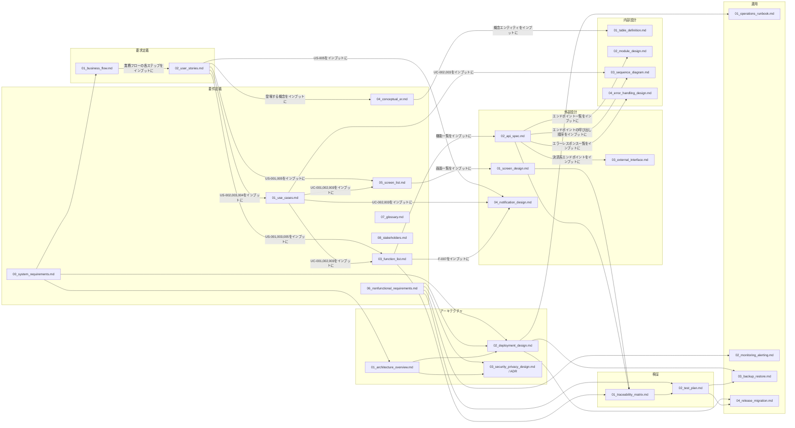

# ドキュメント体系図

全体ルール: [[README|docs/README.md]](図の記法選定ルールを含む)

各ドキュメントを「成果物(オブジェクト)」とみなし、あるドキュメントの記載内容(User Story, ユースケース, 機能, 画面等のID)をインプットにして次のドキュメントが作られる、という流れを示す。例:「User Storyをインプットにユースケースができる」「ユースケースをインプットに機能一覧ができる」。

矢印の向きは「インプット → 作成されるドキュメント」。UMLアクティビティ図のオブジェクトフロー(各ドキュメント=UMLオブジェクトノード)として、Mermaid `flowchart`(フェーズは`subgraph`によるパーティション)で近似表現する([[README|docs/README.md]] 全体ルールに基づく)。

対象は、商品閲覧・購入を含む全業務と、横断的なシステム要求、アーキテクチャ、検証、運用の成果物である。矢印は主な派生・入力関係を示し、詳細なID単位の追跡は`verification/01_traceability_matrix.md`を正本とする。テンプレートとの対応は[3節](#3-テンプレートとの対応関係)に記載する。

## 1. 全体構成

- 業務ごとのA2(User Story)→B1/B2/B4(ユースケース/機能一覧/画面一覧)→C1/C2(画面設計/API仕様)→D1〜D4(内部設計)の詳細は[2節](#2-派生関係の補足)と追跡表を参照する。
- `07_glossary.md`(B6)・`08_stakeholders.md`(B7)は、2026-07-11に追加した横断的なドキュメントであり、上図では特定の単一ドキュメントをインプットとする矢印を引いていない(既存の複数ドキュメントの記載を集約・要約したものであるため)。詳細は[2節](#2-派生関係の補足)を参照。

## 2. 派生関係の補足

| フェーズ | ドキュメント | 主な派生元 | 備考 |
|---|---|---|---|
| 要件定義 | `00_system_requirements.md` | プロジェクト目的、所有者判断、実装監査 | システム境界、スコープ、制約、未決事項の上位正本 |
| 要求定義 | `01_business_flow.md` | システム目的、プロジェクト所有者の判断、既存実装の監査 | 実在する業務エキスパートは不在。As-Isと業務規則は学習用仮説または未確認として扱う |
| 要求定義 | `02_user_stories.md` | `01_business_flow.md` | 業務フロー図の各ステップからUser Storyを起こす |
| 要件定義 | `01_use_cases.md` | `02_user_stories.md` | 複雑度が高いUser Story(分岐が多いもの等)をユースケース化 |
| 要件定義 | `03_function_list.md` | `01_use_cases.md`, `02_user_stories.md` | F-008はUC-003(外部設計フェーズで発見し要件定義に遡って追加)由来 |
| 要件定義 | `04_conceptual_er.md` | `02_user_stories.md` | User Story本文に登場する概念を抽出 |
| 要件定義 | `05_screen_list.md` | `02_user_stories.md`, `01_use_cases.md` | S-002はUC-003追加に伴い記載を更新済み |
| 要件定義 | `06_nonfunctional_requirements.md` | システム要求、ステークホルダー関心事、リスク | 各NFRに検証方法・状態・責任を持たせ、検証計画へ接続する |
| 要件定義 | `07_glossary.md`(2026-07-11追加) | `02_user_stories.md`, `04_conceptual_er.md`, `03_function_list.md`, `05_screen_list.md` | 各ドキュメントに散在するドメイン用語・ID接頭辞を集約した用語集。一般監査(業界標準の要件定義成果物との比較)で用語集の欠落が指摘されたことを受けて追加 |
| 要件定義 | `08_stakeholders.md`(2026-07-11追加) | `use_cases/UC-001.md`〜`UC-004.md`の「ステークホルダーと関心事」欄 | UC単位に閉じていたステークホルダー記載をプロジェクト全体で集約。同様に一般監査を受けて追加 |
| 外部設計 | `01_screen_design.md` | `05_screen_list.md` | 画面ごとに1:1対応 |
| 外部設計 | `02_api_spec.md` | `03_function_list.md` | 機能ごとにエンドポイントを対応付け |
| 外部設計 | `03_external_interface.md` | `02_api_spec.md` | Stripe連携部分のみを抜き出して詳細化 |
| 外部設計 | `04_notification_design.md` | `02_user_stories.md`, `01_use_cases.md`, `03_function_list.md` | 注文確認メール(N-001) |
| 内部設計 | `01_table_definition.md` | `04_conceptual_er.md` | 概念エンティティを物理テーブルに落とし込み。差異は同ドキュメント内で訂正済み |
| 内部設計 | `02_module_design.md` | `02_api_spec.md` | エンドポイント→実装モジュールの対応 |
| 内部設計 | `03_sequence_diagram.md` | `01_use_cases.md`, `02_api_spec.md` | 複数コンポーネントが絡む処理(UC-002, UC-003)のみ作成 |
| 内部設計 | `04_error_handling_design.md` | `02_api_spec.md` | エラーレスポンスの内部的な発生箇所を整理 |
| 検証 | `verification/01_traceability_matrix.md` | User Story、ユースケース、機能一覧、画面/API仕様、自動テスト | 要求→設計→検証を42機能単位で対応付け、部分検証を明示する |
| 検証 | `verification/02_test_plan.md` | トレーサビリティ、NFR、リスク | レベル、環境、開始/終了基準、欠陥管理を定義する |
| アーキテクチャ | `architecture/01_architecture_overview.md` | システム要求、ステークホルダー、実装構成 | Context/Container、関心事、決定・リスクを整理する |
| アーキテクチャ | `architecture/02_deployment_design.md` | システム要求、アーキテクチャ、NFR、実装構成 | 環境、構成値、本番化ゲートを定義する |
| アーキテクチャ | `architecture/03_security_privacy_design.md` | システム要求、NFR、データ/外部IF、実装 | DFD、脅威、制御、個人データを整理する |
| 運用 | `operations/01_operations_runbook.md` | デプロイ、エラー設計、監視 | 起動・診断・インシデント初動を定義する |
| 運用 | `operations/02_monitoring_alerting.md` | NFR、エラー/ログ、デプロイ | SLI、アラート、通知・演習を定義する |
| 運用 | `operations/03_backup_restore.md` | NFR、DB/デプロイ、テスト計画 | RPO/RTO、対象、復元演習を定義する |
| 運用 | `operations/04_release_migration.md` | デプロイ、DB、CI、テスト計画 | artifact昇格、migration、release判定を定義する |

- 機能要求の詳細な双方向対応と検証状態は`verification/01_traceability_matrix.md`を正本とする。本書のID対応表は概要であり、テスト網羅性の判定には使用しない。

### 2-1. 業務別ID対応表

業務ごとの主要なID対応は以下の通り。全42機能のテスト対応は追跡表を参照する。

| 業務領域 | User Story | ユースケース | 機能 | 画面 | 内部設計での参照箇所 |
|---|---|---|---|---|---|
| 会員管理業務 | US-006, US-007, US-020(2026-07-11追加) | (なし。分岐が少ないためUC化していない)、US-020のみUC-005化 | F-009, F-010, F-030 | S-005, S-007(退会) | `02_module_design.md`「/auth」行、退会は「/users/me」行 |
| お気に入り管理業務 | US-008 | (なし) | F-011, F-012 | S-006(S-001にもボタンあり) | 同上「/favorites」行 |
| レビュー投稿業務 | US-009 | UC-004 | F-013, F-014 | S-001(商品詳細内) | `03_sequence_diagram.md`で検討の上、単純処理のため図は作成せず |
| 配送先管理業務 | US-010, US-011, US-012, US-032 | (なし) | F-015〜F-019 | S-007(S-002は選択のみ) | `01_table_definition.md`ADDRESSテーブル、`04_error_handling_design.md`「/addresses」各行 |
| 商品管理業務(管理者) | US-013, US-014, US-015, US-024(2026-07-12追加) | (なし) | F-020〜F-022, F-034 | S-101(低在庫バッジ), S-104(低在庫アラート) | `02_module_design.md`「/admin/products」行、`03_sequence_diagram.md`「低在庫アラートを確認する(管理者)」 |
| クーポン管理業務(管理者) | US-016, US-017, US-025, US-033 | (なし) | F-023〜F-026, F-035 | S-102(残数僅少バッジ), S-104(クーポン残数アラート) | 同上「/admin/coupons」行、`03_sequence_diagram.md`「クーポン残数アラートを確認する(管理者)」 |
| 会員管理業務(パスワードリセット、2026-07-13追加) | US-026 | UC-009 | F-036 | S-008, S-009(ログイン画面(S-005)からリンク) | `02_module_design.md`「/auth/password-reset」行、`03_sequence_diagram.md`「UC-009」 |
| 会員管理業務(メールアドレスの本人確認、2026-07-13追加) | US-027 | UC-010 | F-037 | S-007(バッジ・再送ボタン。専用の確認画面は起こさず) | `02_module_design.md`「/auth/verify-email」行、`03_sequence_diagram.md`「UC-010」 |
| 注文管理業務(管理者) | US-018, US-023, US-034 | (なし)、US-023のみUC-008化 | F-027, F-028, F-033 | S-103(返品承認・却下) | `03_sequence_diagram.md`「注文ステータスを更新する(管理者)」「UC-008」 |
| 売上分析業務(管理者) | US-019 | (なし) | F-029 | S-104 | `02_module_design.md`「/admin/analytics」行 |
| 商品閲覧・注文参照 | US-028〜031 | (なし) | F-038〜F-042 | S-001, S-004 | `02_module_design.md`「/products」「/orders」行、API補足文書 |

- 分岐・例外が多いUser Storyだけをユースケース化し、単純な参照・更新はUser Storyの受け入れ条件で定義する。

## 3. テンプレートとの対応関係

各実ドキュメントは、同名または対応するテンプレートに基づく。ADRのように1テンプレートから複数成果物を作る場合もある。

| フェーズ | テンプレート(`docs/templates/<phase>/`) | 実ドキュメント(`docs/deliverables/<phase>/`) |
|---|---|---|
| demand_definition | `business_flow_template.md` | `01_business_flow.md` |
| demand_definition | `user_story_template.md` | `02_user_stories.md` |
| requirements | `system_requirements_template.md` | `00_system_requirements.md` |
| requirements | `use_case_template.md` | `01_use_cases.md` |
| requirements | `acceptance_criteria_template.md` | (対象ドキュメントなし。意図的に単独ファイル化していない — 下記補足参照) |
| requirements | `function_list_template.md` | `03_function_list.md` |
| verification | `traceability_matrix_template.md` | `01_traceability_matrix.md` |
| verification | `test_plan_template.md` | `02_test_plan.md` |
| requirements | `conceptual_er_template.md` | `04_conceptual_er.md` |
| requirements | `screen_list_template.md` | `05_screen_list.md` |
| requirements | `nonfunctional_requirements_template.md` | `06_nonfunctional_requirements.md` |
| requirements | `glossary_template.md` | `07_glossary.md` |
| requirements | `stakeholders_template.md` | `08_stakeholders.md` |
| architecture | `architecture_overview_template.md` | `01_architecture_overview.md` |
| architecture | `deployment_design_template.md` | `02_deployment_design.md` |
| architecture | `security_privacy_design_template.md` | `03_security_privacy_design.md` |
| architecture | `adr_template.md` | `adr/ADR-*.md` |
| external_design | `screen_design_template.md` | `01_screen_design.md` |
| external_design | `api_spec_template.md` | `openapi.json`(機械可読な正本), `02_api_spec.md`/`api_spec/*.md`(業務上の補足) |
| external_design | `external_interface_template.md` | `03_external_interface.md` |
| external_design | `notification_design_template.md` | `04_notification_design.md` |
| internal_design | `table_definition_template.md` | `01_table_definition.md` |
| internal_design | `module_design_template.md` | `02_module_design.md` |
| internal_design | `sequence_diagram_template.md` | `03_sequence_diagram.md` |
| internal_design | `error_handling_design_template.md` | `04_error_handling_design.md` |
| operations | `operations_template.md` | `01_operations_runbook.md` |
| operations | `monitoring_alerting_template.md` | `02_monitoring_alerting.md` |
| operations | `backup_restore_template.md` | `03_backup_restore.md` |
| operations | `release_migration_template.md` | `04_release_migration.md` |

- `acceptance_criteria_template.md`の1行目に「対象ドキュメント: なし(単独の実ドキュメントは作らない。`02_user_stories.md`内の各User Storyの`Confirmation`欄に直接記述する)」と明記されている。したがって`02_acceptance_criteria.md`が存在しないのは欠落ではない。全34件のUser Story(`user_stories/US-001.md`〜`US-034.md`)にConfirmation欄が存在する。
- 横断文書も更新時の品質を一定にするため、用語集・ステークホルダー・アーキテクチャ・検証・運用に専用テンプレートを置く。

## 4. 概要+詳細分離ドキュメントのリンク集(2026-07-06追加)

項目数が多く肥大化していた以下5ドキュメントは、「概要ファイル(一覧+リンク集)」と「詳細ファイル(1項目=1ファイル)」に分離した。概要ファイルのパスはこれまでと同じ(本図・本表中の参照も変更不要)であり、内容が全文記載から一覧+リンクに変わった点のみが変更点。詳細ファイルへのリンクは各概要ファイル内の一覧表に集約しているため、本図では概要ファイルへの入口のみを示す。

| フェーズ | 概要ファイル(入口) | 詳細ファイルの格納先 | 分離単位 |
|---|---|---|---|
| 要求定義 | [01_business_flow.md](deliverables/demand_definition/01_business_flow.md) | `deliverables/demand_definition/business_flow/` | 1業務=1ファイル(9業務) |
| 要求定義 | [02_user_stories.md](deliverables/demand_definition/02_user_stories.md) | `deliverables/demand_definition/user_stories/` | 1User Story=1ファイル(34件) |
| 要件定義 | [01_use_cases.md](deliverables/requirements/01_use_cases.md) | `deliverables/requirements/use_cases/` | 1ユースケース=1ファイル(10件、2026-07-13 UC-010追加) |
| 要件定義 | [03_function_list.md](deliverables/requirements/03_function_list.md) | `deliverables/requirements/function_list/` | 1機能=1ファイル(42件) |
| 外部設計 | [02_api_spec.md](deliverables/external_design/02_api_spec.md) | `deliverables/external_design/api_spec/` | 1エンドポイント=1補足ファイル(54件)。機械可読な正本は同階層の`openapi.json` |

- 上記以外のドキュメント(概念ER図・画面一覧・画面設計・通知設計・内部設計各種等)は、項目数がまだ少なく肥大化していないため、分離を行っていない。今後項目数が増え見づらくなった場合は、同様の方針で分離を検討する。
- 詳細ファイルはいずれも、概要ファイルへの「戻る」リンクと、元になったUser Story/機能等のIDを内部に保持しており、概要ファイル単体・詳細ファイル単体のどちらからでもトレーサビリティを追える。

## 5. 一般的な業界標準との比較監査を受けた追加(2026-07-11)

一般的なソフトウェア開発ドキュメントの標準(IPA「共通フレーム2013」、IEEE 29148等)と本ドキュメント群を比較監査した結果を受け、以下を追加・更新した。

| 種別 | 対象 | 内容 |
|---|---|---|
| 新規ドキュメント | `07_glossary.md` | 用語集を新規作成([2節](#2-派生関係の補足)参照) |
| 新規ドキュメント | `08_stakeholders.md` | ステークホルダー一覧を新規作成(同上) |
| 追記 | `06_nonfunctional_requirements.md` | 個人情報保護方針(NFR-012〜016)を追加。決済情報の非保持(既存NFR-008)に加え、保持する個人情報の範囲・パスワードの保管方式・利用目的・削除手続きの現状を明記 |
| 追記 | `external_design/03_external_interface.md` | SMTP(メール送信基盤)連携のセクションを追加。従来Stripeのみ記載されていたが、`email_utils.py`のメール送信連携が記載漏れであったため |
| 追記 | `internal_design/04_error_handling_design.md` | 「ログ設計」節を追加。従来「ログ出力」欄が全行「なし」だった箇所のうち、外部サービス(Stripe, SMTP)呼び出し失敗と決済完了時の不正アクセス試行(`user_id`不一致)の3箇所について、実装(`backend/app/logging_config.py`)を追加しログ出力するよう修正した上でドキュメントを更新 |

- 2026-07-13の再監査では、規模を理由に文書種別そのものを省略せず、内容の深さを現状に合わせる方針へ変更した。システム要求、アーキテクチャ、セキュリティ、トレーサビリティ、テスト計画、運用/監視、バックアップ/復元、リリース/移行を追加し、未実装項目は本番化ゲートとして明示した。

## 6. 新機能追加の例: 退会機能(F-030, 2026-07-11)

上記の監査で「NFR-016: 退会機能は今後の課題」として識別されていたギャップを、新機能開発フローの実例として解消した。全フェーズにドキュメントを追加・更新した一連の流れを示す。

| フェーズ | 追加・更新したドキュメント |
|---|---|
| 要求定義 | `business_flow/02_membership.md`(退会フローを追加)、`user_stories/US-020.md`(新規) |
| 要件定義 | `use_cases/UC-005.md`(新規)、`function_list/F-030.md`(新規)、`04_conceptual_er.md`(CUSTOMERの状態に関する補足)、`05_screen_list.md`(S-007の説明更新)、`06_nonfunctional_requirements.md`(NFR-016を「今後の課題」から「実装済み」に更新) |
| 外部設計 | `api_spec/users_me__delete.md`(新規)、`02_api_spec.md`(一覧に追加)、`01_screen_design.md`(S-007に退会UIを追記)、`04_notification_design.md`(N-003を新規追加) |
| 内部設計 | `01_table_definition.md`(usersテーブルに`is_active`/`deleted_at`を追加)、`02_module_design.md`(エンドポイント対応表・email_utilsの役割を更新)、`03_sequence_diagram.md`(UC-005のシーケンス図を新規追加)、`04_error_handling_design.md`(`DELETE /users/me`のエラーハンドリング・ログ設計を追加) |
| 実装 | `backend/app/models.py`, `schemas.py`, `auth.py`, `main.py`, `email_utils.py`、`frontend/src/api/auth.js`, `pages/ProfileView.jsx` |

- 退会時のデータ方針(論理削除+匿名化、注文履歴・レビューは業務記録として残す)は、要求定義段階でユーザーと協議した上で決定した(UC-005備考参照)。実行前の本人確認はパスワード再入力方式とした。

## 7. 新機能追加の例: 注文キャンセル・返品機能(F-031〜F-033, 2026-07-11)

`docs/README.md`§4「新機能開発フロー」の2件目の実例。既存の機能一覧に「注文確定後に顧客側から取り消す手段がない」というギャップがあったため、発送前後で扱いを分けた「キャンセル」(顧客即時実行)と「返品申請」(管理者承認制)の2つの機能として追加した。

| フェーズ | 追加・更新したドキュメント |
|---|---|
| 要求定義 | `business_flow/01_product_purchase.md`(注文キャンセル・返品申請フローを追加)、`business_flow/08_order_admin.md`(返品承認・却下フローを追加)、`user_stories/US-021.md`〜`US-023.md`(新規) |
| 要件定義 | `use_cases/UC-006.md`〜`UC-008.md`(新規)、`function_list/F-031.md`〜`F-033.md`(新規)、`04_conceptual_er.md`(ORDERの状態に関する補足)、`05_screen_list.md`(S-004・S-103の説明更新)、`06_nonfunctional_requirements.md`(NFR-017: 返金関連のログ出力を追加) |
| 外部設計 | `api_spec/orders_order_id_cancel__post.md`, `api_spec/orders_order_id_return_request__post.md`, `api_spec/admin_orders_order_id_return__patch.md`(新規)、`02_api_spec.md`(一覧に追加)、`01_screen_design.md`(S-004・S-103にUIを追記)、`04_notification_design.md`(N-002のステータス対応表にcancelled/return_requested/returnedを追加) |
| 内部設計 | `01_table_definition.md`(ordersテーブルに`stripe_payment_intent_id`/`return_reason`を追加)、`02_module_design.md`(エンドポイント対応表を更新)、`03_sequence_diagram.md`(UC-006〜UC-008のシーケンス図を新規追加)、`04_error_handling_design.md`(新規3エンドポイントのエラーハンドリング・ログ設計を追加) |
| 実装 | `backend/app/models.py`, `schemas.py`, `main.py`, `email_utils.py`、`frontend/src/api/orders.js`, `api/admin.js`, `pages/OrderHistoryView.jsx`, `pages/AdminOrdersView.jsx` |

## 8. 新機能追加の例: 低在庫アラート機能(F-034, 2026-07-12)

`docs/README.md`§4「新機能開発フロー」の3件目の実例。既存の機能一覧に「在庫が少なくなった商品を管理者が把握する手段がない」というギャップがあったため、商品ごとに設定できるしきい値と、管理画面へのバッジ/警告表示のみ(メール通知は対象外)という小規模なスコープで追加した。

| フェーズ | 追加・更新したドキュメント |
|---|---|
| 要求定義 | `business_flow/06_product_admin.md`(低在庫アラート確認フローを追加)、`user_stories/US-024.md`(新規) |
| 要件定義 | `use_cases/`(追加なし。分岐がなくUC化せず)、`function_list/F-034.md`(新規)、`function_list/F-021.md`(しきい値フィールドを含む旨を追記)、`04_conceptual_er.md`(PRODUCTの属性に関する補足)、`05_screen_list.md`(S-101・S-104の説明更新) |
| 外部設計 | `api_spec/admin_products_low_stock__get.md`(新規)、`02_api_spec.md`(一覧に追加)、`api_spec/admin_products__post.md`・`admin_products_product_id__patch.md`(リクエスト項目に`low_stock_threshold`を追記)、`01_screen_design.md`(S-101・S-104にUIを追記)、`04_notification_design.md`(メール通知は対象外である旨を明記) |
| 内部設計 | `01_table_definition.md`(productsテーブルに`low_stock_threshold`を追加)、`02_module_design.md`(エンドポイント対応表を更新)、`03_sequence_diagram.md`(低在庫アラート確認のシーケンス図を新規追加) |
| 実装 | `backend/app/models.py`, `schemas.py`, `routers/admin_products.py`、`frontend/src/api/admin.js`, `pages/AdminProductsView.jsx`, `pages/AdminDashboardView.jsx` |

- しきい値は商品ごとに管理者が任意設定する値とし、未設定(NULL)の商品は低在庫判定の対象外とした(既存商品への遡及的な警告を避けるため)。通知方式(UI表示のみ/メール送信も行う)は要求定義着手前にユーザーと協議して決定した(`04_notification_design.md`参照)。

- データ方針(発送前後での扱いの違い、返品は管理者承認制、Stripe返金APIを実際に呼び出す)は、要求定義段階でユーザーと協議した上で決定した(UC-006〜UC-008備考参照)。
- 却下時にステータスを`shipped`に戻す設計上、既存の通知メール(`send_status_notification`)がそのまま「発送済み」の案内文を再送してしまい、「却下されたこと」自体が顧客に伝わりにくいという課題があった(当初は`04_notification_design.md`のN-002に今後の課題として明記していた)。2026-07-12、専用の通知(N-004: `send_return_rejected_email`)を追加して解消した。

## 9. 新機能追加の例: クーポン残数アラート機能(F-035, 2026-07-13)

`docs/README.md`§4「新機能開発フロー」の4件目の実例。低在庫アラート機能(F-034)と同じギャップ(「クーポンの残り使用回数が少なくなったことを管理者が把握する手段がない」、NFR-006)を埋めるため、クーポンごとに設定できるしきい値と、管理画面へのバッジ/警告表示のみ(メール通知は対象外)という同型のスコープで追加した。

| フェーズ | 追加・更新したドキュメント |
|---|---|
| 要求定義 | `business_flow/07_coupon_admin.md`(クーポン残数アラート確認フローを追加)、`user_stories/US-025.md`(新規) |
| 要件定義 | `use_cases/`(追加なし。分岐がなくUC化せず)、`function_list/F-035.md`(新規)、`function_list/F-023.md`(しきい値フィールドを含む旨を追記)、`04_conceptual_er.md`(COUPONの属性に関する補足)、`05_screen_list.md`(S-102・S-104の説明更新) |
| 外部設計 | `api_spec/admin_coupons_low_remaining_uses__get.md`(新規)、`02_api_spec.md`(一覧に追加)、`api_spec/admin_coupons__post.md`・`admin_coupons_coupon_id__patch.md`(リクエスト項目に`low_remaining_uses_threshold`を追記)、`01_screen_design.md`(S-102・S-104にUIを追記)、`04_notification_design.md`(メール通知は対象外である旨を明記) |
| 内部設計 | `01_table_definition.md`(couponsテーブルに`low_remaining_uses_threshold`を追加)、`02_module_design.md`(エンドポイント対応表を更新)、`03_sequence_diagram.md`(クーポン残数アラート確認のシーケンス図を新規追加) |
| 実装 | `backend/app/models.py`, `schemas.py`, `routers/admin_coupons.py`、`frontend/src/api/coupons.js`, `pages/AdminCouponsView.jsx`, `pages/AdminDashboardView.jsx` |

- しきい値はクーポンごとに管理者が任意設定する値とし、未設定(NULL)のクーポン、および使用回数上限(`max_uses`)が無制限(NULL)のクーポンは残数僅少判定の対象外とした(低在庫アラートと同じ設計思想)。この設計判断は要求定義着手前にユーザーと協議して決定した。
- 既存の`PATCH /admin/coupons/{id}`(元は`is_active`の反転専用)にしきい値設定機能を統合する際、`is_active`を明示指定した場合はその値を設定し、省略時のみ反転する挙動に変更した。既存フロントエンド(`toggleAdminCoupon`、ボディなしで呼び出す)・既存テストの双方と後方互換になるよう設計した。

## 10. 新機能追加の例: パスワードリセット機能(F-036, 2026-07-13)

`docs/README.md`§4「新機能開発フロー」の5件目の実例。これまでのUI表示系アラート機能(F-034, F-035)とは異なり、認証フローに関わる機能であり、分岐(トークンの有効/無効・期限切れ)とセキュリティ上の考慮(メールアドレス列挙攻撃対策)を伴うため、UC-009としてユースケース化した。

| フェーズ | 追加・更新したドキュメント |
|---|---|
| 要求定義 | `business_flow/02_membership.md`(パスワードリセットフローを追加)、`user_stories/US-026.md`(新規) |
| 要件定義 | `use_cases/UC-009.md`(新規)、`function_list/F-036.md`(新規)、`04_conceptual_er.md`(CUSTOMERの属性に関する補足)、`05_screen_list.md`(S-005の説明更新、S-008/S-009新設) |
| 外部設計 | `api_spec/auth_password_reset_request__post.md`・`auth_password_reset_confirm__post.md`(新規)、`02_api_spec.md`(一覧に追加)、`01_screen_design.md`(S-005にリンクを追記、S-008/S-009を新設)、`04_notification_design.md`(N-005を新規追加) |
| 内部設計 | `01_table_definition.md`(usersテーブルに`password_reset_token`/`password_reset_token_expires_at`を追加)、`02_module_design.md`(エンドポイント対応表・email_utilsの役割を更新)、`03_sequence_diagram.md`(UC-009のシーケンス図を新規追加) |
| 実装 | `backend/app/models.py`, `schemas.py`, `routers/users.py`, `main.py`, `email_utils.py`、`frontend/src/api/auth.js`, `pages/AuthView.jsx`, `pages/MainView.jsx` |

- リセットトークンは、JWTではなくDB保存のランダムな不透明トークン(`secrets.token_urlsafe`)とした。JWTはステートレスで個別失効の仕組みを持たず、1回限りの使い捨てトークンには不向きと判断したため(UC-009備考参照)。この設計判断は要求定義着手前にユーザーと協議して決定した
- パスワードリセット要求(`POST /auth/password-reset/request`)は、入力されたメールアドレスの存在有無に関わらず常に同一の200レスポンスを返す設計とした。ユーザー列挙攻撃を防ぐための意図的なセキュリティ対策であり、この判断も要求定義着手前にユーザーと協議して決定した
- フロントエンドはSPA内の`view`状態遷移(react-router不使用の既存方式)に合わせ、URLクエリパラメータ`?token=...`をアプリ起動時に読み取って`password-reset-confirm`ビューへ遷移させる方式とした(Stripe決済完了時の`?payment=success`処理と同じパターン)

## 11. 新機能追加の例: ログイン・会員登録へのレート制限(NFR-022, 2026-07-13)

`docs/README.md`§4「新機能開発フロー」の6件目の実例。一般的な業界標準との比較監査で、認証系エンドポイント(`/auth/login`, `/auth/register`)にブルートフォース攻撃・スパム登録対策のレート制限が存在しないギャップが識別された。ユーザー向けの画面・業務フローを持たない、純粋なセキュリティ強化(既存のNFR-009「決済完了時の権限チェック」・NFR-011「管理者権限チェック」と同種の非機能要件)であるため、US/UC/画面設計は起こさず、NFR追加+内部設計+実装の最小限のドキュメントフローとした。

| フェーズ | 追加・更新したドキュメント |
|---|---|
| 要件定義 | `06_nonfunctional_requirements.md`(NFR-022を新規追加) |
| 外部設計 | `api_spec/auth_register__post.md`・`auth_login__post.md`(429エラーレスポンスを追記) |
| 内部設計 | `02_module_design.md`(新規モジュール`rate_limit.py`を追加)、`04_error_handling_design.md`(429エラー・ログ設計を追記) |
| 実装 | `backend/app/rate_limit.py`(新規)、`routers/users.py`(登録・ログインエンドポイントに適用)、`tests/conftest.py`(テスト間でレート制限カウンタをリセットする処理を追加) |

- レート制限はプロセス内メモリの固定ウィンドウカウンタで実装し、外部ストア(Redis等)には依存しない設計とした。本プロジェクトの規模(個人学習用、単一プロセス運用を想定)では許容範囲と判断したが、複数プロセス/インスタンス構成では制限値が実質的に緩くなる制約がある(NFR-022参照)。この設計判断はユーザーへの事前確認を行わず、本機能を担当したエンジニアの判断で決定した
- しきい値(ログイン: 15分に10回、登録: 1時間に5回)は一般的なブルートフォース対策の目安を参考にした値であり、業務要件から導出したものではない。運用実績に応じて調整の余地がある
- 自動テスト(`test_rate_limit.py`)がログイン・登録のfixture(`auth_headers`等)を多用する既存テストと干渉しないよう、`conftest.py`の`_reset_db`(autouse)にレート制限カウンタのリセットを追加し、DBリセットと同じタイミングで初期化する設計とした

## 12. 新機能追加の例: メールアドレスの本人確認(メール認証)機能(F-037, 2026-07-13)

`docs/README.md`§4「新機能開発フロー」の7件目の実例。一般的な業界標準との比較監査で、会員登録時に入力されたメールアドレスの実在性を確認する手段がなく、他人のメールアドレスの誤登録・悪用を防げないギャップが識別された。パスワードリセット(UC-009)と同様の分岐(確認用トークンの有効/無効・期限切れ)を持つためユースケース化した。

| フェーズ | 追加・更新したドキュメント |
|---|---|
| 要求定義 | `business_flow/02_membership.md`(メールアドレスの本人確認フローを追加)、`user_stories/US-027.md`(新規) |
| 要件定義 | `use_cases/UC-010.md`(新規)、`function_list/F-037.md`(新規)、`04_conceptual_er.md`(CUSTOMERの属性に関する補足)、`05_screen_list.md`(S-007の説明更新) |
| 外部設計 | `api_spec/auth_verify_email_resend__post.md`・`auth_verify_email_confirm__post.md`(新規)、`02_api_spec.md`(一覧に追加)、`api_spec/auth_register__post.md`(確認メール送信の副作用・`is_verified`フィールドを追記)、`01_screen_design.md`(S-007に未確認バッジ・再送ボタンを追記)、`04_notification_design.md`(N-006を新規追加) |
| 内部設計 | `01_table_definition.md`(usersテーブルに`is_verified`/`email_verification_token`/`email_verification_token_expires_at`を追加)、`02_module_design.md`(エンドポイント対応表・email_utilsの役割を更新)、`03_sequence_diagram.md`(UC-010のシーケンス図を新規追加) |
| 実装 | `backend/app/models.py`, `schemas.py`, `routers/users.py`, `main.py`, `email_utils.py`、`frontend/src/api/auth.js`, `pages/ProfileView.jsx`, `pages/MainView.jsx` |

- メールアドレス未確認でも既存機能を制限しない挙動は、実装由来・業務未確認の暫定仕様(CON-006/TBD-004)として管理し、本番化前にプロジェクト所有者が許可操作を決定する
- 確認用トークンの有効期限は7日間とし、パスワードリセット(24時間)より長く設定した。パスワードリセットと異なりセキュリティ上の緊急性が低く、顧客がメールにすぐ気づかない可能性を考慮したため
- 確認リンクのクリックはフォーム入力を要さず、トークンのみで完結するため、パスワードリセットのような専用の確認画面(S-008/S-009に相当するもの)は起こさなかった。フロントエンドはStripe決済完了時の`?payment=success`処理と同じパターンで、アプリ起動時にクエリパラメータ`?verify_token=...`を検知して自動的に確認APIを呼び出し、結果を既存のトースト通知で表示する設計とした

## 13. CI/CDの静的解析・依存脆弱性対策の強化(NFR-024・NFR-025, 2026-07-13)

`docs/README.md`§4「新機能開発フロー」の8件目の実例。ユーザー向け機能ではなく開発基盤(CI)の改善のため、要求定義・外部設計(画面設計)フェーズは対象外とし、要件定義(NFR追加)+実装(ワークフロー・ツール設定)の最小限のドキュメントフローとした。

| フェーズ | 追加・更新したドキュメント |
|---|---|
| 要件定義 | `06_nonfunctional_requirements.md`(NFR-024: CIによる静的解析、NFR-025: 依存関係の脆弱性対策を新規追加) |
| 実装 | `.github/workflows/ci.yml`(uv移行・ruff・pip-audit・ESLint・`permissions`・`concurrency`・`paths-ignore`を追加)、`.github/dependabot.yml`(新規)、`backend/pyproject.toml`(新規、`requirements.txt`/`requirements-dev.txt`を置き換え)、`backend/Dockerfile`(uvベースに変更)、`frontend/eslint.config.js`(新規)、`README.md`(新規、CIバッジ追加)、`backend/README.md`・`frontend/README.md`(uv/lint手順を追記) |

- backendの依存管理を`pip`から[uv](https://docs.astral.sh/uv/)へ移行した。CIでのインストール高速化に加え、`uv.lock`によるロックファイル管理を学習する目的も兼ねる
- 依存脆弱性チェック(`pip-audit`)導入にあたり、既知の脆弱性のうち修正版が存在するもの(`fastapi`・`python-jose`・`python-multipart`・`pytest`)は互換性のある範囲でバージョンを上げて解消した。`ecdsa`(`python-jose`の依存先)のPYSEC-2026-1325は、pure-Pythonの ECDSA実装に起因するタイミング攻撃で、上流に修正版が存在しないため、CIでは個別に許可リスト化(`--ignore-vuln`)して対応した。他の脆弱性が新たに検知された場合はCIが失敗する
- `eslint-plugin-react-hooks`はv7でReact Compiler向けの新ルールセット(`static-components`・`set-state-in-effect`等)が「推奨」設定に含まれるようになったが、本プロジェクトはReact 18でCompiler未導入のため、これらのルールは既存の正当なデータフェッチパターン(`useEffect`内での`setState`等)を誤検知する。そのため、従来からある`rules-of-hooks`・`exhaustive-deps`のみを有効化する設定とした
- CodeQL(GitHub Code Scanningのデフォルトセットアップ)を有効化した。ワークフローファイルの追加ではなくリポジトリ設定側の機能のため、`.github/workflows/`には対応するファイルが存在しない
- CD(実際のホスティングへの自動デプロイ)は本改善のスコープ外とした。デプロイ先が未決定であり、Stripe Webhookに必要な公開HTTPSエンドポイントとDB永続化を伴うホスティング選定は別途の意思決定が必要なため、着手する場合は本項とは別に要求定義から立てる
- Docker build検証(CI上での`docker build`)・イメージスキャン(Trivy)・Playwright E2EのCI組み込みは、調査の結果「価値はあるが今回のスコープ外」と判断し見送った。将来着手する場合の参考情報は本セッションの検討記録(調査エージェントの報告)を参照

## 14. `passlib`廃止によるパスワードハッシュ化ロジックの根本修正(2026-07-13)

上記§13のCI/CD整備後、Dependabotが提案したpip依存関係の一括更新PR(bcrypt 4→5等)を検証した際、`passlib==1.7.4`(2020年以降メンテナンスが止まっているライブラリ)が`bcrypt>=4.1`で削除された`bcrypt.__about__.__version__`属性を参照しており、`bcrypt`を5系に上げると全てのパスワードハッシュ化・検証が例外を送出して機能しなくなることが判明した。当初は`bcrypt==4.0.1`への固定と、Dependabotの`ignore`ルールで回避する対症療法を取ったが、根本原因(`passlib`自体の非互換体質)は解消されていなかったため、認証ロジックを`passlib`非依存に書き換える追加対応を行った。

| フェーズ | 追加・更新したドキュメント |
|---|---|
| 内部設計 | `02_module_design.md`(`auth.py`の説明を「`passlib`」→「`bcrypt`を直接使用」に更新) |
| 実装 | `backend/app/auth.py`(`passlib.context.CryptContext`を廃止し、`bcrypt.hashpw`/`bcrypt.checkpw`を直接呼び出す実装に変更)、`backend/pyproject.toml`(`passlib[bcrypt]`を削除、`bcrypt`のピン留めを解除し`bcrypt>=4.1`に緩和)、`backend/uv.lock`(再生成、`bcrypt`は5.0.0へ)、`.github/dependabot.yml`(不要になった`bcrypt>=4.1`の`ignore`ルールを削除) |

- 影響範囲は`backend/app/auth.py`の`hash_password`/`verify_password`の2関数のみで、呼び出し側(`routers/users.py`等)はシグネチャ不変のため変更不要だった
- 当時はbcrypt以外への移行予定がないと判断していたが、その後のコーディング規約レビューでArgon2idへの移行を決定した。新しい段階移行機構は後述の§16で実装した
- 変更後、backendテストスイート(98件、既存の認証・パスワードハッシュ化系テストを含む)が全てgreenであることを確認し、`ruff`・`pip-audit`も合わせて再実行して問題がないことを確認した

## 15. コーディング規約の新設とSQLAlchemy 2.0スタイルへの全面移行(2026-07-13)

`docs/coding_conventions/`(共通・backend・frontend・testingの4ファイル)を新設した。要求定義〜内部設計の成果物とは性質が異なるプロジェクト運営ルールのため、本ドキュメント体系図の派生関係表には含めない(詳細は[[README|docs/README.md]] §5を参照)。作成にあたり、一般的なベストプラクティスをサブエージェント4体で並行調査した上で、実コードベース(`backend/app/`, `frontend/src/`, `backend/tests/`)の実態に基づいて執筆し、別のサブエージェント1体でレビューを行った。

その後の厳格レビューで、既存実装を規約の主な根拠にすると技術的負債まで標準化する問題があると判断した。規約の根拠を「公式仕様・公開標準・プロジェクト要件・既存実装」の順に改め、標準・例外・移行対象・要決定を区別する構成へ更新した。併せて、セキュリティ、DBトランザクションと同時実行、React Effect、アクセシビリティ、E2Eを含むテスト戦略を補強した。

レビューの過程で、backendの実装(`models.py`のモデル定義、全ルーターのDBクエリ)がSQLAlchemy 1.x系のレガシースタイル(`Column(...)`, `db.query(...)`)であり、一般的なベストプラクティスである2.0系スタイル(`Mapped`/`mapped_column`, `select()`)と乖離していることが判明した。この乖離をどう規約に反映するか(現状維持/将来移行の方針明記/今回移行する)をユーザーに確認したところ、「規模がまだ小さい今のうちに移行する」との判断で、規約作成のついでに実装移行も行うことになった。

| フェーズ | 追加・更新したドキュメント |
|---|---|
| プロジェクト運営ルール(新設) | `docs/coding_conventions/common.md`・`backend.md`・`frontend.md`・`testing.md`(新規)、`docs/README.md`(§5として参照セクションを追加) |
| 実装 | `backend/app/database.py`(`declarative_base()`→`DeclarativeBase`継承)、`backend/app/models.py`(全10モデルを`Mapped`/`mapped_column`に書き換え)、`backend/app/auth.py`・`main.py`・`routers/*.py`(全12ファイル)・`services/order_actions.py`(`db.query(...)`を`select(...)`+`db.execute(...)`または`db.get(...)`に置き換え、計69箇所) |

- モデル定義・クエリの書き方を全面的に書き換える一方、テーブル構造(カラム名・型・制約)・APIの入出力・ビジネスロジックは一切変更していない。既存のbackendテストスイート(98件)を無変更のまま実行し、全てgreenであることでこれを確認した
- 単一行取得は`db.get(Model, id)`(主キー指定時)または`db.execute(select(...)).scalar_one_or_none()`(主キー以外の条件時)、複数行取得は`db.execute(select(...)).scalars().all()`に統一した。一括削除・一括更新(`db.query(...).delete()`/`.update()`相当)は`db.execute(delete(...))`/`db.execute(update(...))`に置き換えた
- レビューエージェントが指摘した2点(規約書のスタイリング説明が実際の`className`+インライン`style`併用パターンを反映していなかった点、カスタムHookが`AuthContext.jsx`以外に`MainView.jsx`の`useQueryParamCallback`にも存在する点)は、実コードを再確認のうえ規約書に反映した。レート制限(`rate_limit.check_rate_limit`)への言及が抜けていた点も追加した
- service/repository層の追加はこの時点では見送った。その後の厳格レビューで、serviceへの分離を再利用回数や行数ではなく、トランザクション境界・ビジネスルール・外部サービス調整・テスト容易性から判断する規約へ改めた。repository層は引き続き必須としていない

## 16. Argon2idへのパスワードハッシュ段階移行(2026-07-13)

コーディング規約の厳格レビューで、OWASPが新規システムの第一候補としてArgon2idを推奨していること、bcryptには72バイト制限があることを確認した。新規登録・パスワードリセット・退会時の無効化用パスワードはArgon2idでハッシュし、既存DBに残るbcryptハッシュはログイン時のみ互換検証する。bcryptでの認証成功後、取得できた平文パスワードを使ってArgon2idへ再ハッシュし、DBへ保存する段階移行方式を採用した。認証失敗時はハッシュを書き換えない。

| フェーズ | 追加・更新したドキュメント/実装 |
|---|---|
| 内部設計 | `02_module_design.md`(`auth.py`の責務をArgon2id新規ハッシュ、bcrypt互換検証、再ハッシュ判定へ更新) |
| 規約 | `coding_conventions/backend.md`(Argon2idを標準化し、bcryptを既存ハッシュ検証専用に限定) |
| 実装 | `backend/app/auth.py`(`PasswordHasher`、ハッシュ種別判定、`check_needs_rehash`)・`backend/app/routers/users.py`(ログイン成功時の再ハッシュ)・`backend/pyproject.toml`/`uv.lock`(`argon2-cffi`追加、bcryptは移行互換用に維持) |
| テスト | `backend/tests/test_auth.py`(新規Argon2idハッシュ、bcryptログイン成功時の移行、認証失敗時に移行しないこと、古いArgon2パラメータの再ハッシュを検証) |

- backendテスト101件が全て成功し、カバレッジ95.65%で70%ゲートを通過した。ruff lint/formatおよび`pip-audit`も成功した

## 17. ドキュメント体系の業界標準ベース再監査(2026-07-13)

ISO/IEC/IEEE 29148、ISO/IEC/IEEE 42010、ISO/IEC 25010、ISO/IEC/IEEE 29119-3、OpenAPI、C4、OWASP ASVS/Threat Modeling、NIST SSDF、WCAG、IPA非機能要求グレードを観点として、成果物種別と内容を再監査した。

| 分類 | 主な変更 |
|---|---|
| 上位要求 | `00_system_requirements.md`を追加し、目的、境界、スコープ、制約、未決事項、要求出所を明確化 |
| アーキテクチャ | Context/Container、デプロイ、セキュリティ/プライバシー/脅威モデル、ADRを追加 |
| API | FastAPI生成OpenAPIを正本とし、54操作をCIで実装照合。欠落3 APIの補足仕様を追加 |
| トレーサビリティ | 実装由来だった7 User Story、5機能を上流へ遡及し、全42機能を要求→画面/API→テストへ対応付け |
| 非機能 | 測定条件、検証方法、適合状態、責任、本番化ゲートを追加。架空SLAを撤回 |
| 検証・運用 | テスト計画、Runbook、監視、バックアップ/復元、リリース/DB migration設計を追加 |
| 整合性 | 商品画像の概念エンティティ、モジュールのOpenAPI/logging責務、Stripe/SMTPの外部IFリスク、テーブル制約候補を修正 |
| 継続検査 | docs-only変更を含むCIで`check_docs.py`を実行し、リンク、H1、US/UC/F一覧、API/OpenAPI件数、API上流IDを検査 |

現段階で文書化は完了しているが、本番化ゲートの実装完了を意味しない。Stripe Webhook/冪等性、金額型、注文配送先snapshot、秘密管理、HTTPS、監視、復元、migration、性能、アクセシビリティ等は各文書で`未適合`または`未測定`として管理する。
