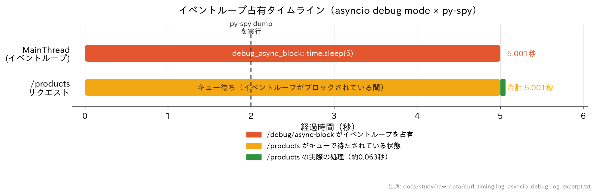
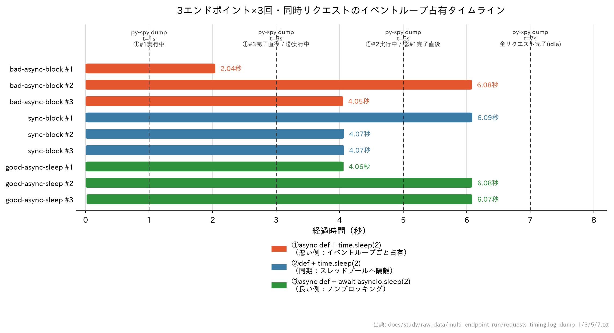
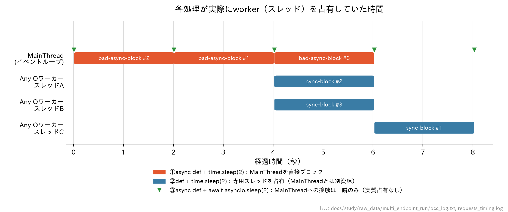

# asyncioデバッグモード × py-spy 組み合わせ検証レポート

## 目的
「どの処理が」「どのくらい」イベントループ（ワーカー）を占有していたかを、
asyncioデバッグモードとpy-spyを組み合わせて実際に特定できるかを検証する。

## 検証環境
- このリポジトリの `backend`（FastAPI + uvicorn、`--reload`モード）
- Docker Compose上で一時的に以下を追加して検証（**検証後すべて削除・復元済み**）
  - `docker-compose.yml`: `cap_add: [SYS_PTRACE]`、環境変数 `PYTHONASYNCIODEBUG=1`
  - `backend/app/main.py`: 検証用の一時エンドポイント `/debug/async-block` と、
    asyncioの警告をログに出すための `logging.basicConfig(...)`
  - コンテナ内に `pip install py-spy` で一時インストール（イメージ自体は変更していないため、
    コンテナ再作成で自然に消える）

### 仕込んだバグ
```python
@app.get("/debug/async-block")
async def debug_async_block():
    time.sleep(5)  # asyncのつもりで同期的にブロックする典型的なバグ
    return {"status": "done"}
```
`async def`の中で`time.sleep`という**同期的にブロックする呼び出し**を直接使うと、
イベントループ全体が完全に停止する、という典型的なアンチパターンを再現した。

## 検証手順と結果

### 1. asyncioデバッグモードで「いつ・何が・何秒」を検知
`PYTHONASYNCIODEBUG=1`を有効にした状態でリクエストを送ったところ、以下のログが出力された。

```
14:57:10.536 asyncio Executing <Task finished name='Task-3'
  coro=<RequestResponseCycle.run_asgi() ...> ...> took 5.002 seconds
```

→ **「どのタスクが」「何秒」イベントループを占有したか**が一目で分かる（実測5.002秒、
仕込んだ`time.sleep(5)`とほぼ一致）。ただしこの時点では「run_asgi()の中の具体的にどの処理が
重かったか」までは分からない。

### 2. 同時リクエストで「本当にワーカー全体が止まっていたか」を実証
ブロック中のエンドポイントと同時に、通常なら一瞬で返る`/products`を投げたところ:

```
async-block status=200 time=4.993112s
products(concurrent) status=200 time=5.001256s
```

→ 本来数十msで返るはずの`/products`が**5秒待たされた**。これは前回のpy-spy学習で確認した
「同期`def`エンドポイントはスレッドプールにオフロードされるので他のリクエストをブロックしない」
という挙動とは対照的で、**`async def`直下の同期ブロッキング呼び出しは、そのワーカープロセス全体
（イベントループ）を完全に道連れにする**ことが実測で裏付けられた。

### 3. py-spy dumpで「具体的に何が実行されていたか」を特定
ブロック中（リクエスト送信から2秒後）に`py-spy dump --pid <uvicornのPID>`を実行:

```
Thread 8 (idle): "MainThread"
    debug_async_block (app/main.py:93)
    run_endpoint_function (fastapi/routing.py:212)
    app (fastapi/routing.py:301)
    ...
    run_asgi (uvicorn/protocols/http/httptools_impl.py:401)
    run (asyncio/runners.py:118)
    ...
```

→ asyncioログだけでは分からなかった**「`run_asgi()`の中の、具体的に`debug_async_block`関数の
どこで止まっていたか」**がコールスタックとして特定できた。

**発見した注意点**：スレッドの状態は `(idle)` と表示される。これは`time.sleep()`が
内部的にGILを解放するCの処理を呼ぶため、py-spyから見ると「Pythonバイトコードを実行中
（GIL保持中）」ではなく「アイドル」に分類されるから。ただし`(idle)`表示でも
**Python側のコールスタックのフレーム自体はきちんと記録される**ため、
「今どの関数の中で止まっているか」の特定には支障がない。

### 4. py-spy recordでflamegraphも取得（副次的な発見）
同じブロック時間帯を`py-spy record --format flamegraph --duration 6`で記録したところ:

```
py-spy> Sampling process 100 times a second for 6 seconds.
py-spy> Wrote flamegraph data to 'combo_trace.svg'. Samples: 13 Errors: 0
```

100Hzで6秒 = 本来600サンプル取れるはずが、**わずか13サンプルしか記録されなかった**。
これは`record`のデフォルト設定が「アイドル状態のスレッドのサンプルを間引く／記録しない」
挙動になっているため。`time.sleep`中はほとんどの時間`(idle)`扱いになるので、
「重い処理に見えるほど、flamegraph上では逆に細く（薄く）記録される」という
直感に反する結果になる。この場合は`top -i`や`record`の`--idle`相当のオプションを使うか、
`dump`で直接コールスタックを取る方が実態を正しく把握できる。
（今回のsvgは`docs/study/py_spy_asyncio_combo.svg`として保存済みだが、サンプル数が少なく
参考程度）

## 結論：組み合わせで分かったこと

| 情報源 | 分かったこと |
|---|---|
| asyncioデバッグモードのログ | ブロックが発生した**時刻**・対象の**タスク名**・**継続時間（5.002秒）** |
| 同時リクエストの応答時間比較 | ワーカー（イベントループ）**全体**が実際に止まっていたことの実証（`/products`も5秒待たされた） |
| py-spy dump | ブロックの瞬間に**どの関数のどの行**で止まっていたかの具体的なコールスタック（`debug_async_block`） |
| py-spy record (flamegraph) | `time.sleep`のようにGILを手放す処理は、サンプル数が極端に少なくなり**過小評価されがち**という罠 |

asyncioデバッグモード単体では「何秒止まったか」までしか分からず、py-spy単体では
「いつ狙って観測すればいいか」が分からない。両者を組み合わせることで、
**「いつ・何が原因で・どのくらいの時間・ワーカーを占有したか」を一貫して特定できる**
ことを実際のプロジェクトコードで確認できた。

## タイムライン図（どの処理がどのくらいイベントループをホールドしていたか）



横軸が経過時間、縦軸が「イベントループ本体（MainThread）」と「巻き添えになった`/products`リクエスト」。
実測値（`raw_data/curl_timing.log`と`raw_data/asyncio_debug_log_excerpt.txt`）から作図しており、
以下が視覚的に一目で分かる。

- 赤：`debug_async_block`の`time.sleep(5)`が**イベントループそのものを5.001秒間占有**
- オレンジ：無関係のはずの`/products`リクエストが、その間**ずっとキューで待たされていた**
- 緑：`/products`が実際にキューを抜けてから処理された時間はごくわずか（約0.06秒）
- 点線：py-spy dumpを実行したタイミング（ブロック開始から2秒後、まだホールド中）

「オレンジの帯がほぼ全部＝待たされていただけで、実処理は一瞬（緑）」という対比が、
asyncioログの秒数だけを見るよりも直感的に伝わるはずです。

（生成スクリプトは一時ファイルとして作成したものでリポジトリには含めていません。必要であれば
`docs/study/raw_data/`に再現用スクリプトも保存できます。）

## 追加検証：3種類のエンドポイント×3回・同時リクエストでの比較

縦軸に「色々な処理」が並ぶタイムラインを見たいという要望から、以下の3種類の検証用エンドポイントを
それぞれ3回ずつ、合計9リクエストをほぼ同時（五月雨）に投げる追加実験を行った。
（このエンドポイント自体も検証専用の一時追加で、検証後は削除・復元済み）

```python
@app.get("/debug/bad-async-block")
async def debug_bad_async_block():
    time.sleep(2)  # ①悪い例: イベントループごと占有

@app.get("/debug/sync-block")
def debug_sync_block():
    time.sleep(2)  # ②同期def: スレッドプールにオフロードされる

@app.get("/debug/good-async-sleep")
async def debug_good_async_sleep():
    await asyncio.sleep(2)  # ③良い例: ノンブロッキング
```

9リクエストを`&`でバックグラウンド起動しほぼ同時に発火し、その最中に`py-spy dump`を
t=1, 3, 5, 7秒の4回実行した。

### 結果（タイムライン）


### 分かったこと
- **①（悪い例）は完全に直列化**：3本の`bad-async-block`は2.04秒→4.05秒→6.08秒と、
  ちょうど2秒ずつずれて完了している。これは1 workerのイベントループが1つしかなく、
  3リクエストが**同時に処理されず、順番に1本ずつイベントループを占有した**ことを示す。
- **②（同期def）と③（正しいasync）は本来ノンブロッキングなはずなのに、全部6秒前後かかっている**：
  これは①がイベントループを塞いでいる間、②・③のリクエスト自体が**受け付け（スケジュール）されるタイミングすら遅延した**ため。
  イベントループが空くまでは、新しいリクエストの処理を開始することさえできない。
- **py-spy dumpとの突合**：t=1sではMainThreadが`debug_bad_async_block`のフレームで止まっており、
  t=3sでは①#3が完了した直後で②（`debug_sync_block`）がAnyIO worker threadで実行中、
  t=7sでは全リクエストが完了し全スレッドが`(idle)`（`queue.get`で待機）に戻っている——
  という**スタックの推移**が、実際のリクエスト完了タイミング（`requests_timing.log`）とほぼ一致することを確認できた。

### 結論
この実験は「アプリの書き方一つが悪いだけで、無関係な他の全リクエスト（同期・非同期を問わず）が
巻き添えになる」ことを、より多くの処理を並べることで視覚的に裏付けるものになった。
1 workerのイベントループは「早い者勝ちで処理を進める1本の道」であり、
そこに`time.sleep()`のような同期ブロッキング処理を直接置いてしまうと、
道全体が塞がれて後続の車（他のリクエスト）が種類を問わず詰まってしまう、というイメージに近い。

## 追加検証2：実際にworker(スレッド)を占有していた時間だけを正確に取り出す

前節のグラフは「クライアントが送信してから応答を受け取るまでの合計時間（待ち時間＋実処理時間）」を
表しており、実際にworkerを占有していた時間そのものではなかった（②③のバーが重なって見えるのは
「一緒に待たされていただけ」で、実際に同時にworkerを使っていたわけではない）。

そこで、各エンドポイントの実処理コードの直前・直後に高精度タイムスタンプ＋実行スレッド名を
記録するログを一時的に仕込み、同じ9リクエスト（3種類×3回、同時発火）を再実行した。

```python
def _occ_log(kind, req_id, event):
    print(f"OCC kind={kind} req={req_id} thread={threading.current_thread().name} "
          f"tid={threading.get_ident()} event={event} t={time.time():.6f}", flush=True)
```

### 結果


- **MainThread（イベントループ）行**：①`bad-async-block`の3回だけが表示されており、**途切れなく1本ずつ順番に**
  並んでいる。これは「1 workerなので同時には1つの処理しかできない」という認識と完全に一致する。
- **AnyIOワーカースレッドA/B/C行**：②`sync-block`は専用のOSスレッドで実行されるため、MainThreadとは
  別リソースとして扱われる。そのため時間的にはMainThreadの赤いバーや互いに重なっているが、これは
  「並列に動いて良い別の資源」なので問題ない。
- **緑の▽マーク**：③`good-async-sleep`は`await`した瞬間にMainThreadを手放すため、実際に触れるのは
  「投げる瞬間」と「起きた瞬間」の2点だけで、2秒間の待ち時間中はMainThreadを一切占有していない
  （マーカーの位置がバーではなく点になっているのはそのため）。

### 結論
「1 worker（イベントループ）は同時に1つのことしかできない」という直感を、実際にworkerを
占有していた区間だけを抜き出すことで正確に裏付けられた。前節のグラフはリクエストの
体感速度（レイテンシ）の説明には有効だが、「workerの奪い合い」を厳密に見るには
今回のような**スレッド単位での実処理区間の可視化**が必要だった。

## 生データ
このレポート内の数値・スタックトレースは、以下の生データから抜粋・転記したものです。

- [`raw_data/pyspy_dump_mid_block.txt`](raw_data/pyspy_dump_mid_block.txt) — ブロック中に`py-spy dump --pid 8`を実行した生の出力
- [`raw_data/curl_timing.log`](raw_data/curl_timing.log) — `/debug/async-block`と`/products`を同時実行した際の`curl`タイミング測定の生ログ
- [`raw_data/async_block_first_response.txt`](raw_data/async_block_first_response.txt) — 1回目の単独リクエスト時の`curl`応答時間
- [`raw_data/asyncio_debug_log_excerpt.txt`](raw_data/asyncio_debug_log_excerpt.txt) — `docker compose logs backend`で得たasyncioデバッグモードの警告ログ（コンテナ復元により生ログ自体は消えたため、検証実施中に取得したコマンド出力をそのまま転記したもの）
- [`py_spy_asyncio_combo.svg`](py_spy_asyncio_combo.svg) — 同時間帯のflamegraph（サンプル数13、参考程度）
- [`raw_data/event_loop_timeline.png`](raw_data/event_loop_timeline.png) — 上記の生データから作図したタイムライン図
- [`raw_data/multi_endpoint_run/requests_timing.log`](raw_data/multi_endpoint_run/requests_timing.log) — 3エンドポイント×3回・同時実行時の各リクエストの開始/終了時刻
- [`raw_data/multi_endpoint_run/dump_1.txt`](raw_data/multi_endpoint_run/dump_1.txt), [`dump_3.txt`](raw_data/multi_endpoint_run/dump_3.txt), [`dump_5.txt`](raw_data/multi_endpoint_run/dump_5.txt), [`dump_7.txt`](raw_data/multi_endpoint_run/dump_7.txt) — 上記実行中にt=1,3,5,7秒で取得した`py-spy dump`
- [`raw_data/multi_endpoint_run/backend_log_both_runs.txt`](raw_data/multi_endpoint_run/backend_log_both_runs.txt) — この追加検証時のasyncioデバッグログ＋アクセスログ（生ログ、転記ではない）
- [`raw_data/multi_endpoint_run/multi_endpoint_timeline.png`](raw_data/multi_endpoint_run/multi_endpoint_timeline.png) — 上記から作図した9本のタイムライン図
- [`raw_data/multi_endpoint_run/occ_log.txt`](raw_data/multi_endpoint_run/occ_log.txt) — 各処理が実際にworkerを占有していた開始/終了時刻とスレッド名の生ログ
- [`raw_data/multi_endpoint_run/requests_timing_run2_occupancy.log`](raw_data/multi_endpoint_run/requests_timing_run2_occupancy.log) — 上記ログ取得時の各リクエストのクライアント側タイミング
- [`raw_data/multi_endpoint_run/worker_occupancy_timeline.png`](raw_data/multi_endpoint_run/worker_occupancy_timeline.png) — 実占有時間のみを描いたタイムライン図

## 実施した一時変更と復元の確認
- `backend/app/main.py`: `/debug/async-block`エンドポイントと`logging.basicConfig`を追加 → 削除済み
- `docker-compose.yml`: `cap_add: [SYS_PTRACE]`、`PYTHONASYNCIODEBUG=1`を追加 → 削除済み
- コンテナ内`pip install py-spy`はイメージ非永続のため、コンテナ再作成で自然に消滅
- （追加検証時）`backend/app/main.py`: `/debug/bad-async-block`・`/debug/sync-block`・`/debug/good-async-sleep`と`_occ_log`ヘルパーを追加 → 削除済み
- 復元後の確認結果:
  - `grep -n "SYS_PTRACE\|PYTHONASYNCIODEBUG\|async-block\|basicConfig\|debug/bad-async-block\|debug/sync-block\|debug/good-async-sleep\|_occ_log" docker-compose.yml backend/app/main.py` → 一致なし
  - `/debug/async-block`・`/debug/bad-async-block`・`/debug/sync-block`・`/debug/good-async-sleep` → いずれも`404`（存在しないことを確認）
  - `/products` → `200`（正常動作を確認）
  - `docker inspect ec_site-backend-1 --format '{{.HostConfig.CapAdd}}'` → `[]`（権限も削除確認）
