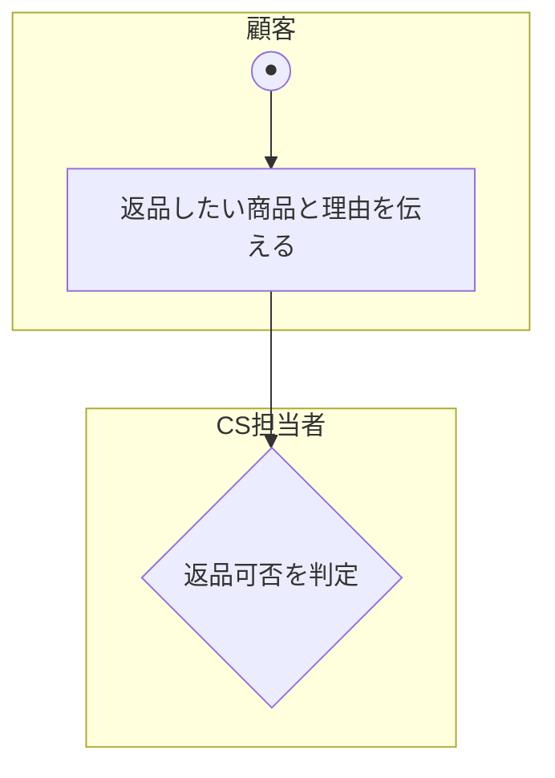
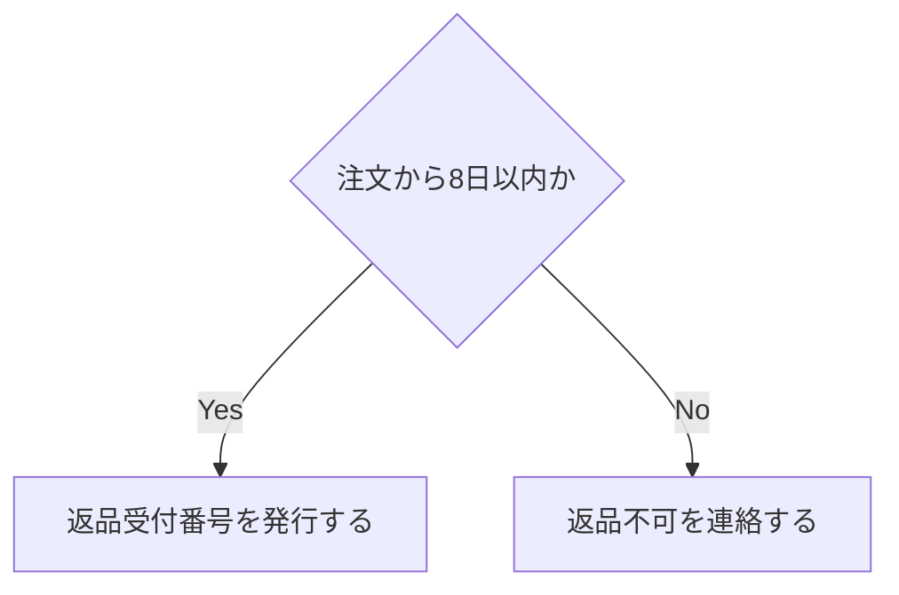

# 業務フロー図 記載ルール・テンプレート

対象ドキュメント: `docs/deliverables/demand_definition/01_business_flow.md`

このファイルは業務フロー図を作成する際の共通ルールをまとめたものです。個別機能の業務フロー図を作成する際は、このルールに従い、**UMLアクティビティ図(Activity Diagram)**の記法で記述してください([[../../README|docs/README.md]] 全体ルール参照)。

## 1. 記法のベース

- 図の種類は **UMLアクティビティ図** とする(OMG UML 2.5.1 Specification, 15章 Activities に準拠)
- パーティション(アクターごとの担当範囲)の考え方は、UMLアクティビティ図の **ActivityPartition** に準拠する
- 作図フォーマットは **Mermaid flowchart** を用いる(コードとして差分管理でき、レビューしやすいため)。MermaidにはUMLアクティビティ図専用の記法がないため、`flowchart`の図形をUMLアクティビティ図のシンボルに合わせて用いる近似表現とする

## 2. 使用する記号

| 記号 | Mermaid記法 | 意味 |
|---|---|---|
| 開始ノード(Initial Node) | `((●))` (円) | 業務フローの開始点。UMLでは塗りつぶした円だが、Mermaidの表現上「●」の文字で代替する |
| 終了ノード(Activity Final Node) | `((◎))` (円) | 業務フローの終了点。UMLでは円+内部塗りつぶし円(牛の目)だが、Mermaidの表現上「◎」の文字で代替する |
| アクション(Action) | `[テキスト]` (角丸に近い四角) | 人またはシステムが行う1つの作業単位 |
| 分岐/合流(Decision/Merge Node) | `{テキスト}` (ひし形) | 条件によって流れが分かれる、または合流する箇所 |
| フォーク/ジョイン(Fork/Join) | 必要になった場合のみ、`subgraph`内で並列に矢印を分ける形で近似する | 並行して行われる複数のアクション |

- 帳票・書類やデータストアを表現したい場合は、UMLアクティビティ図の **オブジェクトノード(Object Node)** として `[テキスト]` の四角(通常のアクションと区別するため `<<object>>` 等の注記を付ける)で表現する。BPMNの帳票・データストア記号は使わない

## 3. パーティション(スイムレーン)の表現

Mermaidに正式なパーティション記法はないため、`subgraph` をパーティション代わりに使う。

- 1パーティション = 1アクター(人または部門)
- パーティションの並び順は、業務フロー上で最初にアクションを起こすアクターを左(または上)に置く

## 4. ステップの記載ルール

- 各ステップは **「主語(誰が) + 動詞(何をする)」** で1行にまとめる
  - 良い例: `CS担当者が返品可否を判定する`
  - 悪い例: `返品可否判定`(誰がやるか不明)
- 分岐には必ず条件を明記する(例: `{注文から8日以内か}`)
- 分岐の各枝には、Yes/Noなど結果ラベルを付ける

## 5. As-Is / To-Be の書き分け

- **As-Is**: 現状の業務フロー。ヒアリングで聞いた「今どうやっているか」をそのまま記述する。システム化の是非は問わない
- **To-Be**: システム導入後のあるべき業務フロー。As-Isの各ステップに対して「システム化するか/人が担うか」を判断した結果を反映する
- To-Beの図では、システム化するステップに `<<システム化>>` という注記を付ける

## 6. ファイル内の構成順序

`01_business_flow.md` 内では、機能領域ごとに以下の順で記載する。

1. 対象業務の概要(1〜2文)
2. 登場アクター一覧
3. 業務フロー図(As-Is)
4. 課題・問題点(As-Isのどこに課題があるか、箇条書き)
5. 業務フロー図(To-Be)

## 7. 命名規則

- 業務フロー図の対象業務ごとに見出しを立てる(例: `## 商品返品受付業務`)
- 図中のステップ番号は振らない(Mermaid上の矢印の流れで順序が読み取れるため)。ただし本文中でステップに言及する場合は「①」「②」等の丸数字で参照してよい

## 8. 参考文献(ソース)

このテンプレートのルールは以下の公開資料をベースにしている。

- OMG, "Unified Modeling Language (UML) Specification", Version 2.5.1, 15章 Activities — https://www.omg.org/spec/UML/2.5.1/
  - アクティビティ図(開始/終了ノード、アクション、分岐/合流ノード、パーティション、フォーク/ジョイン)の概念・記号の出典
- 「機能要件の合意形成ガイド」独立行政法人情報処理推進機構(IPA)
  - IPA公式サイト(https://www.ipa.go.jp/)内の「超上流工程」関連の公開資料。業務フロー整理の考え方の参考(記号自体はUMLアクティビティ図に準拠するため、こちらは参考情報)
  - 具体的なPDFのURLは変更される場合があるため、IPA公式サイト内検索を推奨
  - 具体的なPDFのURLは変更される場合があるため、IPA公式サイト内検索を推奨
