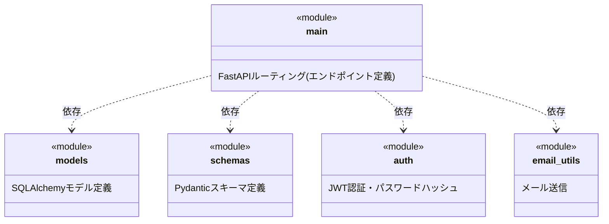

# モジュール構成図 記載ルール・テンプレート

対象ドキュメント: `docs/deliverables/internal_design/02_module_design.md`

このファイルはモジュール構成図を作成する際の共通ルールをまとめたものです。バックエンド(`backend/app/`)のPythonモジュール間の依存関係を整理し、`02_api_spec.md`のエンドポイントがどのモジュールに実装されているかを示します。

## 1. 記法のベース

- 図の種類は、[[../../README|docs/README.md]] 全体ルールに従い、モジュール(パッケージ)間の依存関係を表現する**UMLパッケージ図(Package Diagram)相当**とする(OMG UML 2.5.1 Specification, 7.4 Packages に準拠)
- 作図フォーマットは **Mermaid classDiagram** を用いる(Mermaidにパッケージ図専用の記法がないため、`<<module>>`ステレオタイプを付けたクラスボックスと依存矢印で近似する)

## 2. 基本フォーマット

- モジュール間の依存は `..>`(UMLの依存関係を表す破線矢印)で表現する
- 依存の向きは「import する側 → import される側」とする

## 3. 記載ルール

- モジュール名は実際のファイル名(拡張子なし)と一致させる(例: `main`, `models`, `schemas`, `auth`, `email_utils`)
- 各モジュールの役割は1行程度で簡潔に書く。関数・クラスの詳細を網羅しない(コード自体が一次情報源のため)
- 依存関係は実際の`import`文に基づいて記載する。理想形(あるべき依存関係)ではなく、現状の依存関係をそのまま記載する
- 循環依存が実装に存在する場合は、それも隠さず記載し、「改善提案」として別途注記してよい

## 4. 後続ドキュメントへの接続

- モジュール構成は `03_sequence_diagram.md` のシーケンス図で、どのモジュールがどの呼び出しを担当するかの前提になる

## 5. ファイル内の構成順序

`02_module_design.md` 内では、まずモジュール構成図(全体)を1つ示し、その後に主要モジュールごとの役割を箇条書きで補足する。

## 6. 参考文献(ソース)

- OMG, "Unified Modeling Language (UML) Specification", Version 2.5.1, 7.4 Packages — https://www.omg.org/spec/UML/2.5.1/
  - パッケージ図・依存関係(Dependency)の概念の出典
- Mermaid公式ドキュメント「Class diagrams」 — https://mermaid.js.org/syntax/classDiagram.html
  - ステレオタイプ・依存矢印の構文リファレンス
