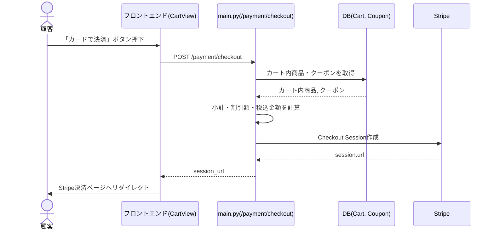
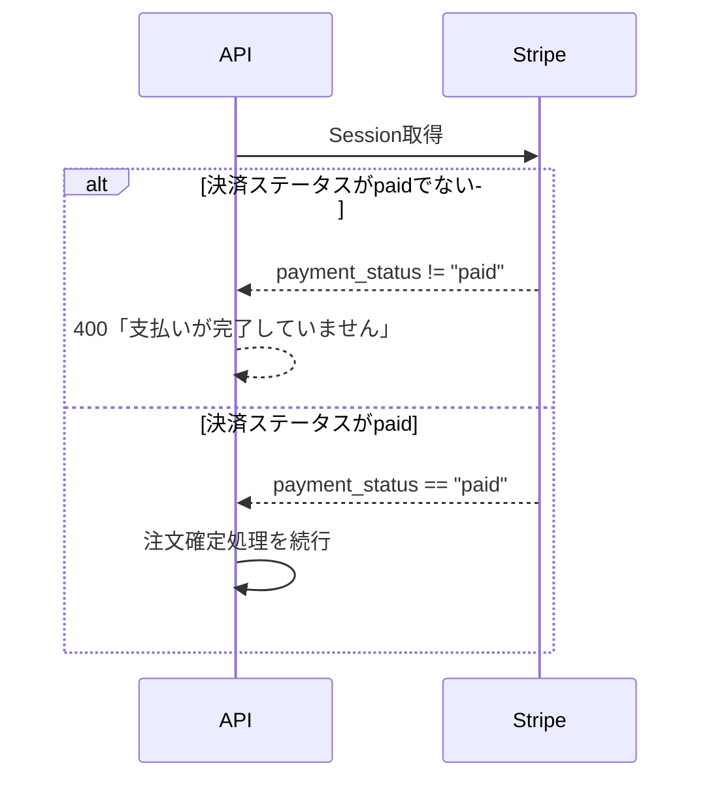

# シーケンス図 記載ルール・テンプレート

対象ドキュメント: `docs/deliverables/internal_design/03_sequence_diagram.md`

このファイルはシーケンス図を作成する際の共通ルールをまとめたものです。`01_use_cases.md`のユースケースのうち、複数のコンポーネント(フロントエンド・API・DB・外部サービス)が絡む処理について、内部的な呼び出し順序を可視化します。すべてのユースケースについて作る必要はなく、内部処理が複雑なものに絞って作成します。

## 1. 記法のベース

- 図の種類は、[[../../README|docs/README.md]] 全体ルールに従い **UMLシーケンス図(Sequence Diagram)** とする(OMG UML 2.5.1 Specification, 17.8 Interactions に準拠)
- 作図フォーマットは **Mermaid sequenceDiagram** を用いる(Mermaidのネイティブ記法がそのままUMLシーケンス図に対応する)

## 2. 基本フォーマット

## 3. 記載ルール

- 登場するオブジェクトは、実装上の実体(モジュール名・テーブル名・外部サービス名)と一致させる。抽象的な「システム」ではなく `main.py(/payment/checkout)` のように具体的に書く
- 分岐(エラー発生時)は、`alt`/`opt` を使って表現する
- 対象は「内部処理が複雑で、可視化する価値があるユースケース」に限定する(すべてのAPIエンドポイントを網羅する必要はない)

## 4. 後続ドキュメントへの接続

- シーケンス図に登場するモジュール・テーブルは、`02_module_design.md`・`01_table_definition.md`と対応させる

## 5. ファイル内の構成順序

`03_sequence_diagram.md` 内では、対象としたユースケースIDごとに見出しを立てる(例: `## UC-002: クレジットカードで支払う`)。

## 6. 参考文献(ソース)

- OMG, "Unified Modeling Language (UML) Specification", Version 2.5.1, 17.8 Interactions — https://www.omg.org/spec/UML/2.5.1/
  - シーケンス図(メッセージ、対話フレーム`alt`/`opt`)の概念の出典
- Mermaid公式ドキュメント「Sequence diagrams」 — https://mermaid.js.org/syntax/sequenceDiagram.html
  - 具体的な構文リファレンス
