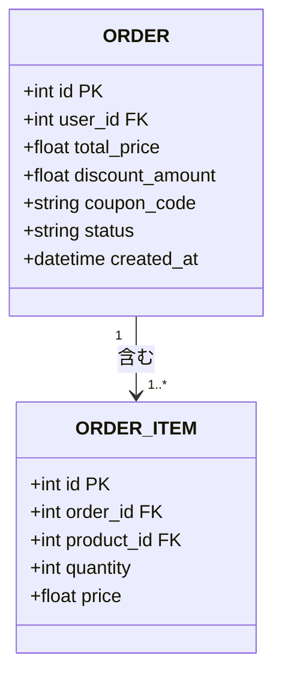

# テーブル定義書 記載ルール・テンプレート

対象ドキュメント: `docs/deliverables/internal_design/01_table_definition.md`

このファイルはテーブル定義書を作成する際の共通ルールをまとめたものです。`04_conceptual_er.md`(概念クラス図)の各エンティティを、実装(`backend/app/models.py`)の物理テーブル設計に落とし込みます。概念ER図では扱わなかった属性(カラム)・型・主キー/外部キー・制約・インデックスをここで定義します。

## 1. 記法のベース

- 図の種類は、[[../../README|docs/README.md]] 全体ルールに従い **UMLクラス図(Class Diagram)** とする。概念ER図(`04_conceptual_er.md`)と異なり、この段階では属性(カラム)・主キー/外部キーを明示する
- 作図フォーマットは **Mermaid classDiagram** を用いる
- 属性の型・制約は、実装(SQLAlchemyモデル)と完全に一致させる。実装にない制約を新たに作らない

## 2. 基本フォーマット

### 2.1 物理ER図(クラス図)



- 属性の先頭に可視性記号(`+`)を付ける(UMLクラス図の慣例。本プロジェクトでは全属性publicとして扱う)
- 主キーは `PK`、外部キーは `FK` を型の後ろに注記する

### 2.2 テーブル定義表

```markdown
### ORDER テーブル

**元になったエンティティ**: ORDER(`04_conceptual_er.md`)

| カラム名 | 型 | PK/FK | NULL許可 | デフォルト | 説明 |
|---|---|---|---|---|---|
| id | INTEGER | PK | NOT NULL | 自動採番 | 注文ID |
| user_id | INTEGER | FK → users.id | NOT NULL | なし | 注文したユーザー |
| total_price | FLOAT | | NOT NULL | なし | 合計金額(税込) |
| discount_amount | FLOAT | | NOT NULL | 0 | 割引額 |
| coupon_code | VARCHAR | | NULL可 | なし | 適用されたクーポンコード |
| status | VARCHAR | | NOT NULL | "pending" | 注文状態 |
| created_at | DATETIME | | NOT NULL | 現在時刻 | 作成日時 |
```

## 3. 記載ルール

- カラムの型・NULL許可・デフォルト値は、実装(`backend/app/models.py`のSQLAlchemyカラム定義)から転記する。ドキュメント側で新たな制約を考案しない
- 「元になったエンティティ」欄で `04_conceptual_er.md` の対応エンティティを明記し、トレーサビリティを確保する
- インデックスが実装で明示的に貼られている場合のみ「インデックス」欄を追加する。実装にないインデックスを提案する場合は、テーブル定義表とは別に「改善提案」として明記し、確定事項と区別する

## 4. 後続ドキュメントへの接続

- テーブル定義は、実装のマイグレーションファイル・ORMモデル定義と同期させる基準になる

## 5. ファイル内の構成順序

`01_table_definition.md` 内では、まず物理ER図(全体)を1つ示し、その後にテーブルごとの定義表を並べる。

## 6. 参考文献(ソース)

- OMG, "Unified Modeling Language (UML) Specification", Version 2.5.1, 11章 Classification — https://www.omg.org/spec/UML/2.5.1/
  - クラス図における属性・可視性記号の出典
- Mermaid公式ドキュメント「Class diagrams」 — https://mermaid.js.org/syntax/classDiagram.html
  - クラスボックス内に属性を記載する構文リファレンス
