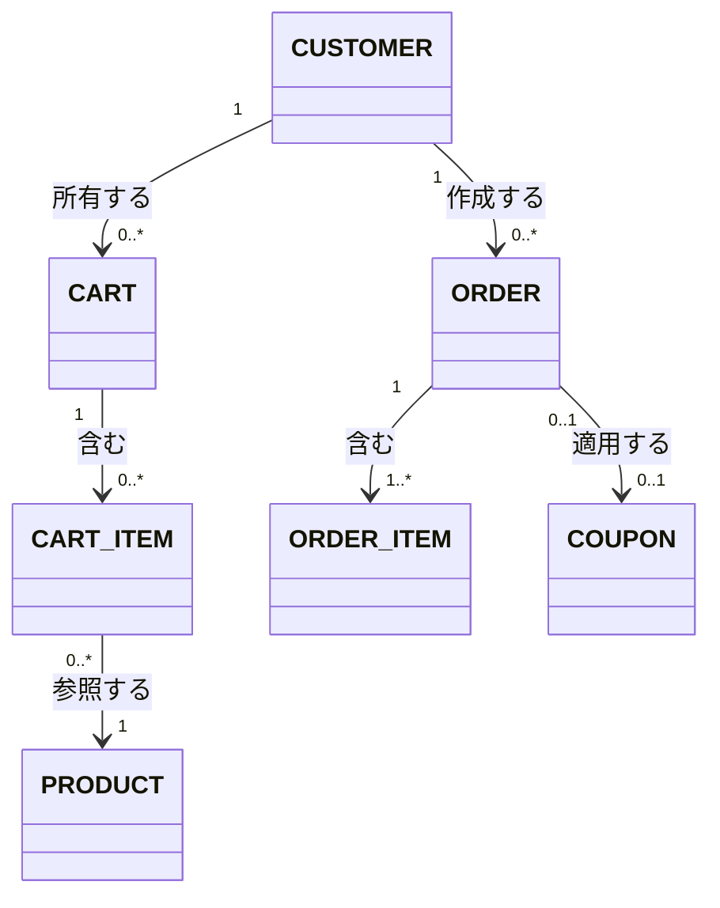

# 概念ER図 記載ルール・テンプレート

対象ドキュメント: `docs/deliverables/requirements/04_conceptual_er.md`

このファイルは概念ER図を作成する際の共通ルールをまとめたものです。概念ER図は、完成済みの `01_use_cases.md` の「関連する概念エンティティ」欄、および `02_user_stories.md` の受け入れ条件に登場する名詞から抽出して作成します。この段階では主キー・外部キー・型などの物理設計は行わず、**業務上のエンティティと関係性のみ**を表現します(それらは内部設計フェーズのテーブル設計で扱う)。

## 1. 記法のベース

- エンティティと関係の考え方は **Peter Chen** の Entity-Relationship Model(ER図の原典)に準拠する
- 図の種類・記法は **UMLクラス図(Class Diagram)によるドメインモデル** とする(OMG UML 2.5.1 Specification, 11章 Classification に準拠)。crow's foot記法は用いず、UMLの**多重度(Multiplicity)表記**(`1`, `0..*`, `1..*`, `0..1` 等)を用いる
- 作図フォーマットは **Mermaid classDiagram** を用いる(コードとして差分管理でき、レビューしやすいため)

## 2. 基本フォーマット



- 多重度は関連線の両端に付ける(`"1"`, `"0..*"` 等)。crow's footの記号(`||`, `o{`等)は使わない
- ラベル(`所有する` 等)には、業務上の関係性を動詞で記載する
- この段階では属性(カラム)・操作(メソッド)を持たないクラスとして扱う(空のクラスボックスを明示的に描かず、関連線とエンティティ名のみで表現してよい)

## 3. エンティティの記載ルール

- エンティティ名は英語の名詞・単数形・大文字スネークケースで統一する(例: `ORDER_ITEM`)。実際のDBテーブル名と一致させる必要はないが、対応が追いやすいよう類似させる
- この段階では属性(カラム)は書かない。属性が必要になった場合は内部設計フェーズのテーブル定義書に記載する
- 概念エンティティは、ユースケースの「関連する概念エンティティ」欄・User Storyの受け入れ条件に登場した名詞から抽出する。抽出元にない名詞を新たに作らない

## 4. 関係の記載ルール

- 関係は業務上意味のあるものだけを書く(すべての組み合わせを網羅しない)
- 多対多の関係が業務上重要な意味を持つ場合(例: クーポンと注文)は、中間エンティティを起こさずシンプルに多重度`"0..*" --> "0..*"`で表現してよい。中間テーブルの設計は内部設計フェーズで行う

## 5. 後続ドキュメントへの接続

- 概念ER図のエンティティは、外部設計フェーズのAPI仕様・内部設計フェーズのテーブル定義書の起点になる

## 6. ファイル内の構成順序

`04_conceptual_er.md` 内では、機能領域ごとに図を分けず、対象システム全体で1つの概念ER図として統合する(エンティティ間の関係が機能領域をまたぐことが多いため)。機能領域が非常に多い場合のみ、領域ごとの図を補助的に追加してよい。

```markdown
## 概念ER図(全体)

\`\`\`mermaid
classDiagram
    ...
\`\`\`

## エンティティ一覧

| エンティティ名 | 概要 | 元になったドキュメント |
|---|---|---|
| CUSTOMER | 顧客 | US-001 |
```

## 7. 参考文献(ソース)

- Peter Chen, "The Entity-Relationship Model – Toward a Unified View of Data" (1976)
  - エンティティ・関係という概念モデリングの考え方そのものの原典(表記法自体はUMLクラス図に置き換えている)
- OMG, "Unified Modeling Language (UML) Specification", Version 2.5.1, 11章 Classification — https://www.omg.org/spec/UML/2.5.1/
  - クラス図・多重度(Multiplicity)表記の出典
- Mermaid公式ドキュメント「Class diagrams」 — https://mermaid.js.org/syntax/classDiagram.html
  - Mermaidでの多重度表記の具体的な構文リファレンス
