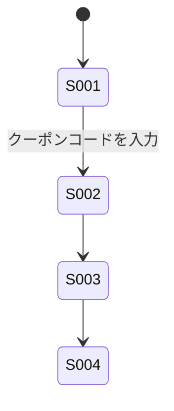

# 画面一覧 記載ルール・テンプレート

対象ドキュメント: `docs/deliverables/requirements/05_screen_list.md`

このファイルは画面一覧を作成する際の共通ルールをまとめたものです。画面一覧は、完成済みの `01_use_cases.md` の「関連する画面」欄、および `02_user_stories.md` の受け入れ条件(顧客が操作する場面)から抽出して作成します。この段階では画面のレイアウト・項目定義までは行わず、**画面の存在と役割、画面間の遷移**のみを整理します(レイアウト・項目定義は外部設計フェーズの画面設計書で扱う)。

## 1. 記法のベース

- 画面一覧表の形式は、要件定義実務で広く使われる整理表をベースにする(特定の単一の公開規格はない)
- 画面遷移の可視化は **UML状態遷移図(State Machine Diagram)** とする(OMG UML 2.5.1 Specification, 14章 State Machines に準拠)。画面を状態(State)、画面遷移操作をトランジション(遷移)として表現する
- 作図フォーマットは **Mermaid stateDiagram-v2** を用いる(Mermaidのネイティブ記法がそのままUML状態遷移図に対応するため)

## 2. 基本フォーマット

### 2.1 画面一覧表

```markdown
| 画面ID | 画面名 | 概要 | 主なアクター | 元になったドキュメント |
|---|---|---|---|---|
| S-001 | カート画面 | カート内商品の確認・数量変更を行う | 顧客 | US-001 |
| S-002 | クーポン入力画面 | クーポンコードを入力し適用結果を確認する | 顧客 | UC-001 |
| S-003 | 注文確認画面 | 小計・割引・消費税・合計金額を確認する | 顧客 | US-003 |
| S-004 | 決済画面(Stripe) | クレジットカード情報を入力し決済する | 顧客 | UC-002 |
```

### 2.2 画面遷移図



## 3. 項番ルール

- `S-XXX` の3桁連番
- 同じ画面が複数のユースケース/User Storyから参照される場合は、画面一覧表では1行にまとめ、「元になったドキュメント」列を複数列挙する

## 4. 記載ルール

- 「概要」列は画面の目的を1文で書く。項目・ボタン名などのレイアウト詳細は書かない(外部設計フェーズで扱う)
- 外部サービスが提供する画面(例: Stripeの決済画面)も、自システムの業務フロー上に現れる場合は一覧に含め、「主なアクター」または備考欄でその旨を明記する
- 画面遷移図は「顧客が実際にたどる代表的な経路」を示すものとし、すべての分岐(エラー画面への遷移等)を網羅しなくてよい。代表的な例外遷移のみ、遷移ラベル(トリガー/ガード条件)を付けて補助的に示す

## 5. 後続ドキュメントへの接続

- 画面一覧の各画面は、外部設計フェーズの画面設計書(レイアウト・入力項目・バリデーション)の起点になる

## 6. ファイル内の構成順序

`05_screen_list.md` 内では、業務フロー図・ユースケースと同じ機能領域の見出しでまとめる。

```markdown
## 商品購入業務

### 画面一覧
(表)

### 画面遷移図
(Mermaid図)
```

## 7. 参考文献(ソース)

- 本テンプレートは、特定の単一の公開規格ではなく、要件定義実務で一般的に用いられる「画面一覧+画面遷移図」の整理方法をベースにしている
- OMG, "Unified Modeling Language (UML) Specification", Version 2.5.1, 14章 State Machines — https://www.omg.org/spec/UML/2.5.1/
  - 状態遷移図(状態・トランジション・初期疑似状態)の概念・記号の出典
- Mermaid公式ドキュメント「State diagrams」 — https://mermaid.js.org/syntax/stateDiagram.html
  - 画面遷移図の記法リファレンス
